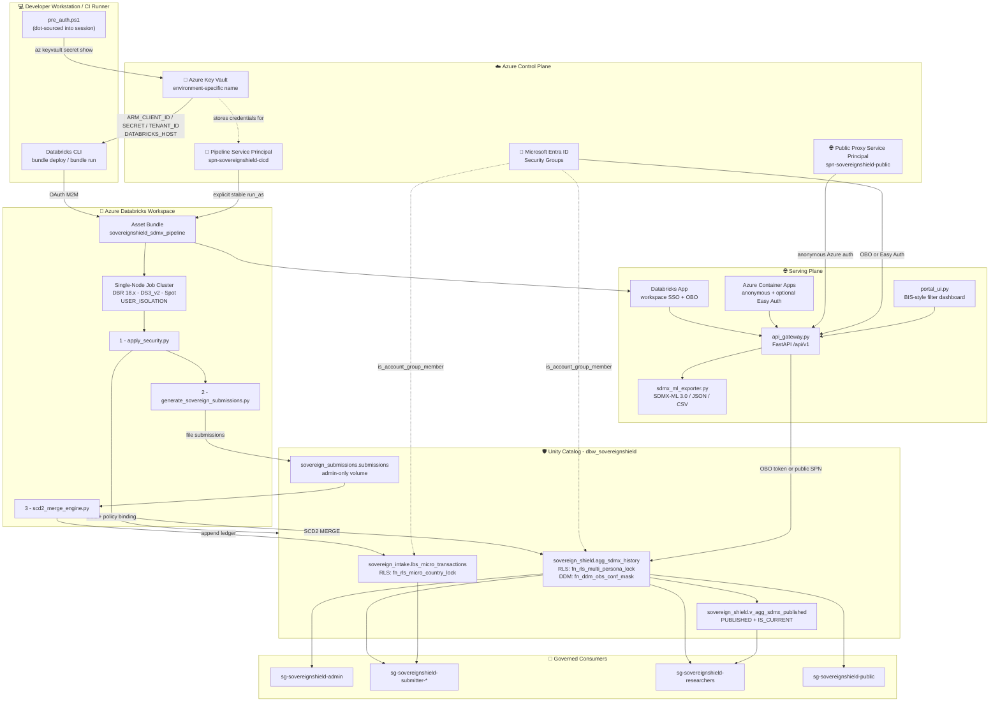

# SovereignShield

Synthetic-first delivery and governed access for SDMx statistical submissions.

> **What this is:** a working reference implementation exploring how **Azure Databricks and Unity Catalog** can express the security obligations of **international statistical data exchange** as platform-level constraints — the submission of confidential national banking statistics to an international body (BIS Locational Banking Statistics) under the **SDMx 3.0** standard. It complements, rather than replaces, the mature SDMx tooling institutions already operate.

> **Independent Reference Architecture Notice:**  
> This publication and associated reference implementations were developed in a personal capacity using synthetic data fixtures and publicly available international statistical standards (SDMx 3.0, BIS Locational Banking Statistics). This work is not affiliated with, sponsored by, or representative of the Bank of Canada, the Federal Reserve System, the Bank for International Settlements, or any official statistical institution.


## Executive Summary

Every quarter, national central banks transmit confidential banking statistics to international organisations — the Bank for International Settlements, the IMF, the UN Statistics Division — encoded in **SDMx**, the standard for Statistical Data and Metadata (ISO 17369). That exchange carries three simultaneous obligations: national data sovereignty, cell-level confidentiality, and arithmetic consistency with a rulebook the submitting agency does not own.

Institutions already uphold these obligations rigorously today, using specialised open-source SDMx software (such as the SDMX Reference Infrastructure), dedicated application layers, and strict operational protocols developed over many years. That work is mature, and this project does not try to replace it.

SovereignShield asks an adjacent architectural question: *what happens if the same obligations are moved out of the application layer entirely and expressed as constraints of the cloud data platform itself?*

**Scope:** this study applies group-based query-time entitlements to synthetic statistical submissions. Unity Catalog uses Databricks account-group membership; provisioning reconciles selected Entra identities, not continuous Entra deprovisioning. The gateway caches identity metadata briefly. Logical country segregation is not physical data residency, and masking alone does not prevent statistical inference from published totals.

The following responsibilities are deliberately separated:

| Obligation | Enforcement | Boundary |
| --- | --- | --- |
| **Jurisdictional entitlement** | Own-country rows plus public foreign observations, enforced by table RLS | Supported UC query paths; privileged ownership remains trusted |
| **Measure entitlement** | Mask keyed on `OBS_CONF` and reporting country; explicit `F` reveal, otherwise withhold | Not secondary suppression or inference protection |
| **Publication integrity** | Input validation and atomic country/period/aggregation verdict; rejected rows remain audit-only | Base-table SELECT exists; the gateway/view adds current-state selection |

Table policies apply on supported Unity Catalog query paths independently of an application's filter predicates. Runtime/access-mode limitations, privileged direct-storage access, gateway integrity and exports remain explicit trust boundaries. Dynamic views also support caller-aware membership functions; choosing the base table is this application's design, not a platform requirement.

The rulebook is read as metadata, but its interpreter is code that needs review. The implementation evaluates 21 within-dataset arithmetic checks and explicitly reports six cross-collection checks as unsupported. The pinned DSD/codelist contract is refreshed deliberately, not from unreviewed `latest` metadata. Terraform state and plans contain sensitive credentials even when current source contains no credential literal.

> **Status:** the September 2026 synthetic release was deployed and live-tested on Azure, including decimal history, policy bindings, atomic replacement/replay, real persona SQL checks and public exports. After the user confirmed testing complete, the workload was torn down and cleanup verified; both cloud portals are now inactive. See the [live deployment record](docs/LIVE_DEPLOYMENT_2026_09_15.md) for evidence, recovery fixes and retained resources. Historical screenshots document an earlier revision; this is not production accreditation. Existing legacy environments still require an approved migration.

> **Decision material:** [Executive brief](docs/EXECUTIVE_BRIEF.md), [full whitepaper](docs/whitepaper/Bridging_Public_Dissemination_and_Protected_Data.md), and [technical publication plan](docs/LINKEDIN_POST.md).

> **Authorship:** Developed by Botlhale Mosweu in a personal capacity. Community participation is welcome under the [Apache License 2.0](LICENSE). Copyright attribution is recorded in [NOTICE](NOTICE); the reference implementation does not imply a support contract, institutional approval, or production certification.

---

## System Architecture

![Policy as a Metastore Object — four horizontal bands. A promotion plane runs pull request to offline tests to review to merge to a short-lived OIDC token. An ownership boundary splits Terraform (infrastructure and access) from the pipeline (data and policy) either side of a divider reading "one writer per object". A data plane routes validated submissions to a history table and failures to an audit-only quarantine, with the prior published record staying live. A consumption band shows the dissemination gateway choosing an identity but never choosing rows. All four connect into a policy enforcement point in Unity Catalog resolving five personas, ending with "no group — zero rows, fails closed".](docs/sovereign-shield_technical_vision.jpg)

Service credentials are resolved from Azure Key Vault rather than tracked as
literals, compute is ephemeral and single-node, and every consumer is resolved
to an Entra ID security group at query time by Unity Catalog.



**Trust boundary summary**

| Boundary | Enforced by | Guarantee |
| --- | --- | --- |
| Secret → Session | Key Vault and OIDC federation; authenticated operator for local administration | No deployment secret needed for CI federation; state, plans and runtime tokens remain sensitive |
| Session → Workspace | OIDC workload identity federation via Asset Bundles | Automated deployment uses a scoped service principal; human administration remains an explicit client responsibility |
| Workspace → Data | Unity Catalog RLS / DDM | Policy travels with the table, not the query engine |
| Data → Consumer | Entra ID group resolution | Sovereignty evaluated per-row, per-caller, at runtime |
| Internet → Data | Portal runs as the caller, or as a public-tier SPN | The gateway selects an identity; it never selects rows |

---

## Architecture Stack

* **Compute Engine:** Azure Databricks Runtime 18.x
* **Storage:** Delta Lake (SCD2 Historization)
* **Central Governance:** Unity Catalog (`USER_ISOLATION` Shared Compute)
* **Infrastructure as Code:** Terraform (identity, workspace, catalog, warehouse, gateway) + Databricks Asset Bundles (tables, policy functions, jobs)
* **Promotion:** GitHub Actions with OIDC workload identity federation — no client secret in repository settings
* **Processing Framework:** PySpark & Spark SQL
* **Dissemination:** Databricks Apps — FastAPI gateway and Tailwind portal in a single process; Azure Container Apps for the anonymous deployment
* **Standards Layer:** `pysdmx` for SDMx 3.0 XML and DSD resolution; BIS consistency checks parsed at runtime from `docs/reference_standards/checks_lbs.xls`

> **Design note — Terraform or Bicep.** Terraform is the primary declarative engine here because it spans Entra ID, Azure and Databricks in a single dependency graph. For the **Azure control plane alone**, Azure Bicep is interchangeable: resource groups, Key Vault, the Databricks workspace, the access connector and Container Apps all have direct Bicep equivalents, and an organisation standardised on Bicep loses nothing by using it for those. What Bicep cannot express is the Databricks provider layer — catalog, schema, grants and the SQL warehouse — which would remain Terraform or move to the Databricks CLI. The ownership boundary between infrastructure and the data/policy plane is unaffected by that choice.

## Five-Minute Local Evaluation

No Azure subscription, no Databricks workspace, no credentials. The security model
is verifiable offline, which is the whole point of the delivery pattern.

```powershell
git clone https://github.com/botlhale/sovereign-shield.git
cd sovereign-shield

python -m venv .venv
.venv\Scripts\pip install -r requirements.txt

# The persona matrix, SDMx validation, contractor isolation and secret assertions
.venv\Scripts\python.exe -m pytest tests/ --no-header
```

The default suite runs offline. Tests marked `live` require a real workspace and
tests marked `stress` require an explicit opt-in.

```powershell
# Generate a 100k-row multi-jurisdiction, multi-cadence corpus
.venv\Scripts\python.exe src/generate_stress_test_data.py --rows 100000 --frequencies "A,S,Q,M"

# Run the scale benchmarks against it
.venv\Scripts\python.exe -m pytest tests/test_scale_and_stress.py --stress
```

**The exercise worth doing.** Open [src/uc_query.py](src/uc_query.py), find
`_apply_persona`, and delete the segment-9 re-check from the masking logic. Re-run
the suite. Exactly one test should fail. If none does, you have reproduced the
defect this repository exists to prevent — see
[docs/technical_guide.md § Pass 8](docs/technical_guide.md).

---

## Project Structure

```text
.
├── databricks.yml                          # Asset Bundle configuration and deployment rules
├── steps_terraform.md                      # Detailed Terraform deployment path
├── steps_scripts.md                        # Imperative quickstart path
├── .github/
│   ├── workflows/promote.yml               # OIDC promotion: verify -> plan -> apply -> bundle
│   └── skills/                             # Single source of truth for agents and reviewers
├── docs/                                   # Guides, reference, whitepaper, diagrams
│   └── reference_standards/checks_lbs.xls  # BIS LBS consistency checks (parsed at runtime)
├── terraform/                              # Infrastructure & access-control plane
│   └── modules/
│       ├── identity/                       # Entra groups, SPNs, OIDC federation, Key Vault
│       ├── databricks_workspace/           # Workspace, storage credential, secret scope, cluster policy
│       ├── unity_catalog_governance/       # Catalog, schema, additive grants, SQL warehouse
│       └── dissemination_gateway/          # Container Apps host for the anonymous tier
├── tests/                                  # Offline persona, SDMx, isolation, secret and scale assertions
├── sh/                                     # Turnkey orchestration and focused operational helpers
└── src/
    ├── unity_catalog_triple_lock.sql       # Data & policy plane: DDL, RLS, DDM, quarantine view
    ├── unity_catalog_grants.sql            # Access-control plane (Terraform owns this in IaC mode)
    ├── apply_security.py                   # Idempotent Spark SQL executor for the DDL
    ├── generate_sovereign_submissions.py   # Sovereign-isolated SDMx 3.0 XML submission generator
    ├── generate_stress_test_data.py        # High-volume, multi-cadence corpus for scale testing
    ├── sdmx_rule_validator.py              # Dynamic BIS rule engine + atomic batch quarantine
    ├── scd2_merge_engine.py                # Micro-to-macro aggregation and Delta SCD2 state machine
    ├── local_pandas_scd2.py                # Local pandas/delta-rs SCD2 fixture (no Spark required)
    ├── sdmx_ml_exporter.py                 # SDMX-ML 3.0 / SDMX-JSON 2.0.0 / SDMX-CSV 2.0.0 writer
    ├── uc_query.py                         # Persona-agnostic query layer over the governed history
    ├── api_gateway.py                      # Public Dissemination Gateway; dual-mode identity resolution
    ├── portal_ui.py                        # BIS-style portal router
    └── templates/portal.html               # Tailwind filter dashboard and export centre
```

Full file-by-file commentary: [docs/technical_guide.md](docs/technical_guide.md).

## Infrastructure as Code and Secret Injection

Current source checks prohibit credential literals and sensitive local configuration in tracked files. Historical source contained a bootstrap password, which the author reports is no longer used; this release does not rewrite history or claim a current incident. Terraform-managed passwords and vault values remain in sensitive state and plans. Restrict their access, retention and logging.

### Terraform is the primary path

```powershell
cd terraform
cp backend.hcl.example backend.hcl              # your state storage account
cp terraform.tfvars.example terraform.tfvars    # subscription_id, tenant_id
terraform init -backend-config="backend.hcl"
terraform apply
```

The staged Terraform path provisions Entra identities, Key Vault, the Databricks
workspace, Unity Catalog storage, three schemas, the submissions volume, and the
SQL warehouse. Container Apps is optional and enabled only after its image exists.

**There is no Terraform variable that carries a credential**, and that is
enforced rather than asserted: `tests/test_secret_decoupling.py` fails the build
if a secret-shaped Terraform variable is declared, or if a module output exposes
a `.value`. Only pointers are permitted — `public_client_secret_id` holds a Key
Vault resource id, never a secret.

Credentials reach their consumers three ways, none of which is a literal:

| Consumer | Mechanism |
| --- | --- |
| GitHub Actions | OIDC workload identity federation — no client secret in repository settings |
| Container Apps | `keyvaultref:...,identityref:...` resolved by the platform at start-up |
| Databricks jobs | Key Vault-backed secret scope, which stores a pointer rather than a copy |

The 90-day `time_rotating` resource performs due rotation on a subsequent Terraform apply, not on an independent schedule. Key Vault references avoid source changes, but consumer refresh, overlapping validity where supported, and health checks must be verified. Easy Auth registrations and token-store SAS credentials have separate lifecycles.

| Key Vault Secret | Purpose |
| --- | --- |
| `spn-client-id` | SPN application ID → `ARM_CLIENT_ID` |
| `spn-client-secret` | SPN secret → `ARM_CLIENT_SECRET` |
| `spn-tenant-id` | Entra tenant → `ARM_TENANT_ID` |
| `databricks-workspace-url` | Target workspace → `DATABRICKS_HOST` |
| `public-spn-client-id` / `public-spn-client-secret` | Anonymous dissemination proxy |

### Orchestration and focused helpers

`sh/sovereignshield_up.ps1` and `sh/sovereignshield_down.ps1` are the supported
operator entry points. They orchestrate Terraform, Databricks Asset Bundles,
account-level identity wiring, the ingestion pipeline, both portal hosts, and
readiness checks in dependency order. Terraform remains authoritative for the
infrastructure and access-control resources it manages.

Some focused operations remain script-owned because no provider expresses them:

* `sh/databricks_account_setup.ps1` — Databricks **account**-level groups, workspace assignment and persona SQL entitlements. `is_account_group_member()` resolves account scope, and the Terraform Databricks provider addresses the workspace.
* `sh/kv_spn_remediation.sh` — deliberate, destructive credential rotation on demand.

### Session authentication for focused helper scripts

```powershell
. .\sh\pre_auth.ps1
```

The leading `.` executes the script **in the current session scope**. Invoking it conventionally (`.\sh\pre_auth.ps1`) sets the variables inside a child scope destroyed the moment the script returns, leaving the CLI unauthenticated — a failure mode that presents confusingly as "the script ran fine but deploy still 401s."

The script discovers the vault by prefix rather than hardcoding a name (the suffix is randomised at creation), fails loudly on a missing secret rather than exporting an empty credential, and `.Trim()`s every value — `az ... -o tsv` appends a newline, and an unstripped secret produces an opaque authentication rejection rather than a parse error.

## Deployment and Execution

Full sequence, including prerequisites, recovery, verification, pause, and teardown:
**[One-command operations](docs/AUTOMATION_RUNBOOK.md)**.

```powershell
./sh/sovereignshield_up.ps1 `
    -AccountId "<databricks-account-guid>" `
    -TenantDomain "<tenant-domain>"
```

The detailed manual paths remain available for architecture review and recovery:
[Terraform](steps_terraform.md) and [imperative helpers](steps_scripts.md). In CI,
[.github/workflows/promote.yml](.github/workflows/promote.yml) runs credential-free
verification for PRs and pushes. Explicit manual `plan`/`deploy` operations on
reviewed `main` require a protected environment with independent reviewers.
Planning is privileged, not read-only. CI handles steady-state Terraform/bundle
promotion; the complete script-owned Container Apps rollout remains an `up` operation.

## Teardown

Pause compute while retaining data, identities, and infrastructure:

```powershell
./sh/sovereignshield_down.ps1 -Mode Pause
```

Preview the complete workload teardown without changing resources:

```powershell
./sh/sovereignshield_down.ps1 -Mode Workload -WhatIf
```

Execute the ordered teardown only after reviewing the preview:

```powershell
./sh/sovereignshield_down.ps1 -Mode Workload -ConfirmWorkloadDestruction
```

The script removes policy-bound Unity Catalog objects before their schemas,
destroys bundle and Azure resources through their owning paths, and fails if any
Terraform state entry or workload resource remains. It preserves the remote-state
backend and Databricks account identities for reliable reconstruction. See the
[operations runbook](docs/AUTOMATION_RUNBOOK.md#workload-teardown) for boundaries
and recovery behavior.

## How the Guarantees Are Enforced

Four pillars carry the architecture. Each is a link into the detail rather than a
summary of it — the full implementation narrative is in
**[docs/technical_reference.md](docs/technical_reference.md)**.

### 1. Zero-Access Contractor Pattern

The specialist you need for confidential data work is, by definition, someone who
should not have the data. So the build happens against a **Minimal Viable Synthetic
Dataset** specified by the client, promotion uses reviewed workload identity,
and offboarding follows the institution's identity and ownership checklist.

→ [Onboarding playbook](docs/ENTERPRISE_ONBOARDING_PLAYBOOK.md) ·
[Contractor workflow](.github/skills/contractor_zero_trust_workflow.md)

### 2. Triple-Lock Security

Entitlement is a property of the table, not of the application. A row filter, a
column mask and a curated view are attached to catalog objects and evaluated per
caller, per row, at query time.

| | Lock 1 — RLS | Lock 2 — DDM | Lock 3 — Quarantine view |
| --- | --- | --- | --- |
| **Object** | `fn_rls_multi_persona_lock` | `fn_ddm_obs_conf_mask` | `v_agg_sdmx_published` |
| **Granularity** | Row | Cell | Result set |
| **Threat** | Cross-border leakage | Confidential value disclosure | Unvalidated data published |

Five personas resolve against Entra ID. The fifth matters most: **a principal in no
group sees zero rows.** Public is an explicit group, not a fall-through default,
which is why off-boarding a contractor and enforcing sovereignty between two
nations are the same mechanism.

→ [Triple-Lock detail](docs/technical_reference.md) ·
[Persona matrix](.github/skills/persona_security_matrix.md)

### 3. Public Dissemination Gateway

One service decides *which identity* a query runs as. Unity Catalog decides *what
that identity may see*. The gateway handles elevated bearer tokens and returned
data, so its integrity remains trusted. A compromised gateway can misuse those
tokens or disclose results already authorized to an elevated caller.

→ [Gateway and SDMx serialization](docs/technical_reference.md)

### 4. SDMx 3.0 Conformance

Real SDMX-ML 3.0, SDMX-JSON 2.0.0 and SDMX-CSV 2.0.0 messages, serialised with
`pysdmx` and a pinned BIS LBS component/codelist contract. The standard feeds
contain only current published observations; rejected filings use a separate audit CSV.
Measures use an explicit three-decimal reference profile. Standards changes require review.
Sample downloads from the deployed portal are in [`demo/sdmx/`](demo/sdmx) — the same
22 observations in all three standard formats, mutually equivalent observation-for-observation.

→ [Validation engine](.github/skills/sdmx_lbs_validation.md)

---

## Documentation

Routed by what you are trying to establish.

| If you are… | Start here | Then |
| --- | --- | --- |
| **Reading the code** | [Technical guide](docs/technical_guide.md) — an eight-pass reading order | [Technical reference](docs/technical_reference.md) |
| **Assessing the security model** (CISO / risk) | [Persona security matrix](.github/skills/persona_security_matrix.md) | [Triple-Lock detail](docs/technical_reference.md) · [Test suite](tests/test_persona_access_matrix.py) |
| **Evaluating the business case** (SLT) | [Executive vision](docs/executive_vision.md) — case, governance posture, positioning | [Whitepaper](docs/whitepaper/Bridging_Public_Dissemination_and_Protected_Data.md) |
| **Deploying it** (platform / DevOps) | [One-command operations](docs/AUTOMATION_RUNBOOK.md) | [Terraform runbook](steps_terraform.md) · [Script quickstart](steps_scripts.md) |
| **Sizing it for production** | [Scaling blueprint](docs/technical_guide.md) | [Cluster policy](terraform/modules/databricks_workspace/compute.tf) |
| **Engaging a contractor** | [Onboarding playbook](docs/ENTERPRISE_ONBOARDING_PLAYBOOK.md) | [Contractor workflow](.github/skills/contractor_zero_trust_workflow.md) |
| **Consuming the API** | [Technical vision](docs/technical_vision.md) — data model, cadences, endpoints | [Gateway detail](docs/technical_reference.md) |
| **Checking SDMx conformance** (statistical audit) | [SDMx LBS validation](.github/skills/sdmx_lbs_validation.md) | [Sample exports](demo/sdmx) · [MVSD specification](.github/skills/mvsd_specification.md) |
| **Looking at diagrams** | [Architecture diagrams](docs/ARCHITECTURE_DIAGRAMS.md) | [Executive view](docs/executive_vision.md) · [Technical view](docs/technical_vision.md) |
| **Presenting it** | [Persona demo script](docs/PERSONA_DEMO_SCRIPT.md) | [Executive vision](docs/executive_vision.md) · [Public write-up](docs/LINKEDIN_POST.md) |
| **Running it end to end** | [One-command operations](docs/AUTOMATION_RUNBOOK.md) | [Terraform runbook](steps_terraform.md) |
| **Explaining deployed resources** | [Resource provenance](docs/RESOURCE_PROVENANCE.md) | [Technical reference](docs/technical_reference.md) |
| **Contributing or reporting a concern** | [Contribution guide](CONTRIBUTING.md) | [Security policy](SECURITY.md) · [Code of Conduct](CODE_OF_CONDUCT.md) |

---


## Operational Model

[`databricks.yml`](databricks.yml) runs security DDL before generating or merging
data, making task order a security property. Terraform owns infrastructure and
access-control resources; the Asset Bundle and SQL own data-plane objects and
policy bindings. The cluster policy fixes `USER_ISOLATION` while allowing the
compute envelope to scale independently.

The [operations runbook](docs/AUTOMATION_RUNBOOK.md) owns prerequisites and
recovery. The [resource provenance guide](docs/RESOURCE_PROVENANCE.md) explains
why each deployed object exists, who creates it, and who removes it.

---

## Safe Engagement and Clean Handover

Specialist platform work is frequently delivered by people who should not hold the
data they are governing. Institutions manage this well today with NDAs, supervised
environments and access reviews. SovereignShield explores how much of that burden
the platform can support: specialists build and test the demonstrated controls
without real data, while production access, risk acceptance and offboarding remain
institutional responsibilities.

**Why the build never needs real data.** Submissions are generated, not sourced. The
rulebook is a published standards artifact. The deliverable is reviewable DDL,
code and tests. A `0.60` dominance threshold is a synthetic policy illustration,
not complete statistical disclosure control. Production tuning and assurance
require institution-specific evidence.

**Continuity and offboarding:** the job uses an explicit service-principal `run_as`
and shared bundle path rather than the contractor's identity. Review Entra and
Databricks account memberships, sessions/tokens, Azure RBAC, vault access,
GitHub access, and delegated ownership. Rotate credentials that were exposed to
the departing person and verify consumer refresh. Group removal alone does not
revoke every route or privileged ownership.

**Where this model stops** — the part reviewers should press on — is documented
honestly in the playbook, along with the full three-phase framework and acceptance
checklist.

→ **[Enterprise onboarding playbook](docs/ENTERPRISE_ONBOARDING_PLAYBOOK.md)** ·
[Contractor workflow](.github/skills/contractor_zero_trust_workflow.md)

[Apache-2.0 License](LICENSE) · [Security Policy](SECURITY.md) · [Contributing](CONTRIBUTING.md)
---
