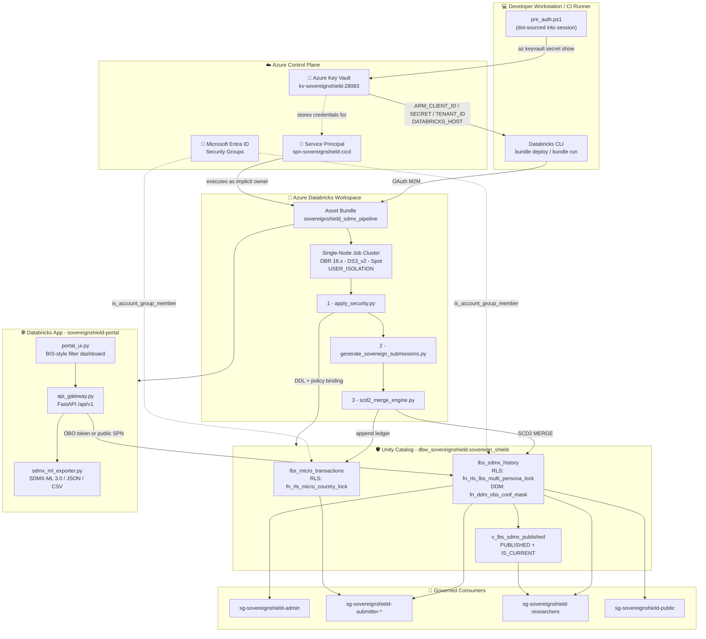

# Project SovereignShield: Zero-Trust Governance for SDMx 3.0 Submissions to International Bodies

> **What this is:** a working reference implementation exploring how **Azure Databricks and Unity Catalog** can express the security obligations of **international statistical data exchange** as platform-level constraints — the submission of confidential national banking statistics to an international body (BIS Locational Banking Statistics) under the **SDMx 3.0** standard. It complements, rather than replaces, the mature SDMx tooling institutions already operate.

## 📖 Executive Summary

Every quarter, national central banks transmit confidential banking statistics to international organisations — the Bank for International Settlements, the IMF, the UN Statistics Division — encoded in **SDMx**, the standard for Statistical Data and Metadata (ISO 17369). That exchange carries three simultaneous obligations: national data sovereignty, cell-level confidentiality, and arithmetic consistency with a rulebook the submitting agency does not own.

Institutions already uphold these obligations rigorously today, using specialised open-source SDMx software (such as the SDMX Reference Infrastructure), dedicated application layers, and strict operational protocols developed over many years. That work is mature, and this project does not try to replace it.

SovereignShield asks an adjacent architectural question: *what happens if the same obligations are moved out of the application layer entirely and expressed as constraints of the cloud data platform itself?*

**Zero Trust is a network and application security model. This project re-imagines it for statistical submissions.** In this domain the perimeter is not a VPC — it is a national border, and a legal one. "Never trust, always verify" therefore resolves to a concrete mechanism: every consumer is re-authorised against Entra ID at query time, and entitlement is evaluated from the SDMx key itself.

Three properties follow, and each is expressed in Unity Catalog rather than in pipeline code:

| Obligation | Enforcement | Bypassable by application code? |
| --- | --- | --- |
| **Sovereignty** — a jurisdiction sees only its own rows | Row filter on `L_REP_CTY`, segment 9 of the SDMx key | No — attached to the table object |
| **Confidentiality** — protected observations never leave | Column mask keyed on `OBS_CONF` **and** the reporting jurisdiction | No — attached to the column |
| **Integrity** — nothing internally inconsistent is published | Atomic per-country-quarter validation against the BIS rulebook | No — the curated view is the only researcher path |

Because policy lives in the metastore, it is enforced identically through PySpark, a SQL warehouse, a BI tool, an ad-hoc JDBC session — or the public web portal and REST API described below. There is no code path that can forget to apply it, because it is not in the code path at all.

The validation rulebook is treated as **metadata, not code** — an approach the SDMx community has long advocated: BIS consistency checks are parsed from the published workbook at runtime, so a rulebook revision requires no deployment. Routine operator intervention in production is correspondingly reduced — credentials are hydrated from Azure Key Vault into session scope and never persisted, and all DDL is applied by an automated, version-controlled pipeline.

> **Status:** a complete, deployed, end-to-end reference architecture on Azure, running the genuine BIS LBS rulebook and real SDMx 3.0 message structures against realistic **synthetic** submissions. It is not connected to live reporting data, and it is an independent piece of work — not a production system of, nor endorsed by, any central bank or international organisation. It is published for scrutiny, and critique from SDMx practitioners is genuinely welcome.

---

## 🗺️ System Architecture

Credentials never leave Azure Key Vault as literals, compute is ephemeral and single-node, and every consumer is resolved to an Entra ID security group at query time by Unity Catalog.



**Trust boundary summary**

| Boundary | Enforced by | Guarantee |
| --- | --- | --- |
| Secret → Session | Azure Key Vault + dot-sourced `pre_auth.ps1` | No credential literal exists in git or on disk |
| Session → Workspace | SPN OAuth M2M via Asset Bundles | No human identity holds production DDL rights |
| Workspace → Data | Unity Catalog RLS / DDM | Policy travels with the table, not the query engine |
| Data → Consumer | Entra ID group resolution | Sovereignty evaluated per-row, per-caller, at runtime |
| Internet → Data | Portal runs as the caller, or as a public-tier SPN | The gateway selects an identity; it never selects rows |

---

## 🏗️ Modernized Architecture Stack

* **Compute Engine:** Azure Databricks (Runtime 18.x LTS)
* **Storage:** Delta Lake (SCD2 Historization)
* **Central Governance:** Unity Catalog (`USER_ISOLATION` Shared Compute)
* **Orchestration:** Databricks Asset Bundles (CI/CD via Azure Service Principal)
* **Processing Framework:** PySpark & Spark SQL
* **Dissemination:** Databricks Apps — FastAPI gateway and Tailwind portal in a single process; Azure Container Apps for the anonymous deployment
* **Standards Layer:** `pysdmx` for SDMx 3.0 XML and DSD resolution; BIS consistency checks parsed at runtime from `docs/reference_standards/checks_lbs.xls`

## 📂 Project Structure

```text
.
├── databricks.yml                          # Asset Bundle configuration and deployment rules
├── requirements.txt                        # Task-scoped Python dependencies (pysdmx, xlrd, ...)
├── Dockerfile                              # Portal image for the Azure Container Apps deployment
├── docs/
│   └── reference_standards/
│       └── checks_lbs.xls                  # BIS LBS consistency checks (parsed at runtime)
├── sh/                                     # One-time Azure provisioning (NOT part of the pipeline)
│   ├── pre_auth.ps1                        # Dot-sourced Key Vault -> session credential loader
│   ├── kv_spn_create.sh                    # Provisions Key Vault + CI/CD and public-proxy SPNs
│   ├── kv_spn_remediation.sh               # Rotates the SPN and refreshes stored secrets
│   ├── databricks_create.sh                # Workspace and metastore bootstrap
│   ├── grp_users_create.sh                 # Entra ID security groups and persona assignment
│   ├── container_apps_deploy.ps1           # Anonymous public deployment to Azure Container Apps
│   └── container_apps_deploy.sh            # Bash equivalent of the above
└── src/
    ├── app.yaml                            # Databricks App runtime and entrypoint
    ├── requirements.txt                    # Portal-only dependencies (no PySpark)
    ├── apply_security.py                   # Idempotent Spark SQL executor for the Triple-Lock DDL
    ├── unity_catalog_triple_lock.sql       # DDL, multi-persona RLS, DDM, and the Quarantine View
    ├── generate_sovereign_submissions.py   # Sovereign-isolated SDMx 3.0 XML submission generator
    ├── sdmx_rule_validator.py              # Dynamic BIS rule engine + atomic batch quarantine
    ├── scd2_merge_engine.py                # Micro-to-macro aggregation and Delta SCD2 state machine
    ├── local_pandas_scd2.py                # Local pandas/delta-rs SCD2 prototype (no Spark required)
    ├── sdmx_ml_exporter.py                 # SDMX-ML 3.0 / SDMX-JSON 2.0.0 / SDMX-CSV 2.0.0 writer
    ├── uc_query.py                         # Persona-agnostic query layer over the governed history
    ├── api_gateway.py                      # FastAPI gateway; dual-mode identity resolution
    ├── portal_ui.py                        # BIS-style portal router
    └── templates/
        └── portal.html                     # Tailwind filter dashboard and export centre

```

## 🔐 Infrastructure-as-Code & Key Vault Authentication

SovereignShield holds a hard constraint: **no credential literal ever enters the repository, the shell history, or a configuration file.** Secrets exist only as process-scoped environment variables, hydrated on demand from Azure Key Vault.

### One-Time Provisioning

`sh/kv_spn_create.sh` provisions the trust root in `rg-sovereignshield` (`canadacentral`) — it creates the CI/CD Service Principal, creates the vault, and writes the resulting credentials straight into it. The secret values are piped from `az ad sp create-for-rbac` into `az keyvault secret set` and are never echoed. `sh/kv_spn_remediation.sh` performs the same flow as a **rotation**: it deletes the existing app registration, mints fresh credentials, and overwrites the stored secrets.

| Key Vault Secret | Purpose |
| --- | --- |
| `spn-client-id` | SPN application ID → `ARM_CLIENT_ID` |
| `spn-client-secret` | SPN secret → `ARM_CLIENT_SECRET` |
| `spn-tenant-id` | Entra tenant → `ARM_TENANT_ID` |
| `databricks-workspace-url` | Target workspace → `DATABRICKS_HOST` |

### Session Authentication — The Dot-Sourcing Pattern

Authentication is established by **dot-sourcing** the loader, which is what makes this pattern work at all:

```powershell
. .\sh\pre_auth.ps1
```

The leading `.` executes the script **in the current session scope** rather than in a child process. Invoking it conventionally (`.\sh\pre_auth.ps1`) would set the variables inside a short-lived child scope that is destroyed the moment the script returns, leaving the Databricks CLI unauthenticated — a failure mode that presents confusingly as "the script ran fine but deploy still 401s."

Internally the script sets `$ErrorActionPreference = "Stop"` (so a vault miss aborts rather than silently exporting an empty credential) and hydrates four variables the Databricks CLI reads natively:

```powershell
$env:DATABRICKS_HOST   = (az keyvault secret show --vault-name $KeyVaultName --name "databricks-workspace-url" --query value -o tsv).Trim()
$env:ARM_CLIENT_ID     = (az keyvault secret show --vault-name $KeyVaultName --name "spn-client-id"            --query value -o tsv).Trim()
$env:ARM_CLIENT_SECRET = (az keyvault secret show --vault-name $KeyVaultName --name "spn-client-secret"        --query value -o tsv).Trim()
$env:ARM_TENANT_ID     = (az keyvault secret show --vault-name $KeyVaultName --name "spn-tenant-id"            --query value -o tsv).Trim()
```

The `.Trim()` calls are load-bearing: `az ... -o tsv` appends a trailing newline, and an unstripped secret produces an opaque authentication rejection rather than a parse error.

> **Note:** the vault is named `kv-sovereignshield-28083` — `kv_spn_create.sh` generates the suffix via `$RANDOM`, so the name is environment-specific rather than a fixed `-dev` suffix. Update `$KeyVaultName` in `pre_auth.ps1` if you re-provision.

Because the credentials are session-scoped environment variables, the identical flow works unchanged in a CI runner by substituting Key Vault for the platform's native secret store — no code path in the pipeline reads a credential directly.

## 🚀 Deployment & Execution

SovereignShield enforces Zero-Trust by requiring all deployments and pipeline executions to be orchestrated natively via Databricks Asset Bundles using a designated CI/CD Service Principal.

**1. Authenticate the session (dot-sourced):**

```powershell
. .\sh\pre_auth.ps1

```

**2. Sync to Azure Databricks Workspace:**

```bash
databricks bundle deploy -t dev

```

*(Note: To ensure the entire `src/` directory syncs seamlessly and respects the repository structure, `databricks.yml` intentionally omits explicit `.yml` `include:` blocks).*

**3. Trigger the Pipeline:**

```bash
databricks bundle run sovereignshield_sdmx_pipeline -t dev

```

## 🛡️ Core Technical Implementations & Zero-Trust Design Patterns

### 1. Compute Isolation & Cost Optimization

Unity Catalog will not evaluate RLS or DDM on `SINGLE_USER` compute — that mode permits direct memory access that could bypass the policy engine. The execution cluster is therefore pinned to `data_security_mode: USER_ISOLATION`, and the cost profile is tuned underneath that constraint rather than around it.

| Setting | Value | Rationale |
| --- | --- | --- |
| `spark_version` | `18.x-scala2.13` | Latest LTS — required for single-node `USER_ISOLATION` support |
| `num_workers` | `0` | Single Node: driver-only, no worker fleet to provision or pay for |
| `custom_tags.ResourceClass` | `SingleNode` | Signals the single-node profile to the Databricks control plane |
| `spark.master` | `local[*, 4]` | Executes in-driver with 4 retry attempts |
| `node_type_id` | `Standard_DS3_v2` | Stays clear of restrictive `DSv5` family core quotas |
| `availability` | `SPOT_WITH_FALLBACK_AZURE` | Spot pricing with automatic on-demand fallback if evicted |
| `data_security_mode` | `USER_ISOLATION` | Non-negotiable prerequisite for RLS/DDM enforcement |

The workload is governance-bound rather than compute-bound — volumes are modest and the expensive work is policy evaluation — so a scale-out cluster would add cost and startup latency without reducing runtime. Spot eviction is safe here because the pipeline is fully idempotent: a re-run reproduces the same end state.

* **Immutable Execution:** Scripts are executed via `spark_python_task`, which targets the synchronized `src/` workspace directory, stripping away the overhead and vulnerability of intermediate Python `.whl` compilation.

### 2. Dynamic Asset Execution in PySpark

A `spark_python_task` entry script is executed by Databricks via `exec(compile(source, filename, 'exec'))`. This creates two distinct hazards that must both be handled:

* `__file__` is **never bound**, so anchoring paths to it raises `NameError`.
* The working directory is **not** the bundle root, so `os.getcwd()` alone is equally unreliable.

Note that only the *entry script* is affected. Imported modules (such as `sdmx_rule_validator`) are loaded through the normal import machinery and do have `__file__`.

`apply_security.resolve_sql_path()` therefore walks an ordered list of candidates, exploiting the fact that the path handed to `compile()` survives inside the code object:

```python
module_file = globals().get("__file__")          # local runs and imports
frame = inspect.currentframe()                   # frame.f_code.co_filename == the real workspace path
sys.argv[0]                                      # some task launchers
os.path.join(os.getcwd(), "src"), os.getcwd()    # last-resort fallbacks
```

Resolution is deliberately **lazy** (inside a function, not at module import). Evaluated at import time, the failure would fire before `main()` could ever apply a fallback.

### 3. SDMx Observation Semantics

The pipeline honours two SDMx conventions that are easy to get wrong and that materially change validation behaviour:

* **Values are signed.** LBS positions are legitimately negative as well as positive. A negative observation is never, by itself, a validation failure.
* **Zeros are not reported.** A position that nets to exactly zero is dropped after aggregation rather than published as a `0` observation.

Because values are signed, the disclosure-control dominance rule is computed on **absolute** contributions (`|bank| / Σ|bank|`). A signed share would divide by zero on offsetting positions and could exceed `1`.

### 4. The Zero-Trust Triple-Lock Security Matrix

Security is centralised at the Unity Catalog **metastore** level rather than in the pipeline code — the same obligations application layers enforce today, relocated one layer down. Because the policy is attached to the object rather than the query, it applies identically whether the caller arrives via PySpark, a SQL warehouse, Power BI, or an ad-hoc JDBC connection. There is no code path that can "forget" to apply it.

| | **Lock 1 — RLS** | **Lock 2 — DDM** | **Lock 3 — Quarantine View** |
| --- | --- | --- | --- |
| **Object** | `fn_rls_lbs_multi_persona_lock`<br/>`fn_rls_micro_country_lock` | `fn_ddm_obs_conf_mask` | `v_lbs_sdmx_published` |
| **Binding** | `WITH ROW FILTER ... ON (TIME_SERIES_CODE, BATCH_STATUS, OBS_CONF)`<br/>`ON (reporting_country)` | `OBS_VALUE DOUBLE MASK ... USING COLUMNS (OBS_CONF, TIME_SERIES_CODE)` | `CREATE OR REPLACE VIEW` |
| **Granularity** | Row | Cell | Result set |
| **Threat addressed** | Cross-border leakage, unpublished-state leakage | Confidential value disclosure | Unvalidated data reaching publication |
| **Effect** | Non-matching rows disappear | `OBS_VALUE` → `NULL` | `QUARANTINE` / superseded rows invisible |

#### Lock 1 — Multi-Column Row-Level Security (Sovereignty)

`fn_rls_lbs_multi_persona_lock` evaluates **three columns simultaneously** — the SDMx key, the batch lifecycle state, and the confidentiality flag. Filtering on the key alone would be insufficient the moment the data became publicly reachable: a public visitor asking for Canadian series would receive Canada's quarantined and confidential rows as readily as its published ones.

Segment 9 of the 11-dimension composite key is the reporting jurisdiction:

```text
FREQ . L_MEASURE . L_POSITION . L_INSTR . L_DENOM . L_CURR_TYPE
     . L_PARENT_CTY . L_REP_BANK_TYPE . L_REP_CTY . L_CP_SECTOR . L_CP_COUNTRY
                                            ▲
                                       segment 9  →  e.g.  Q.S.C.B.CAD.D.CA.A.CA.B.5J
```

The persona matrix the filter implements:

| Entra ID group | Visible rows |
| --- | --- |
| `sg-sovereignshield-admin` | `1 = 1` — every jurisdiction, every lifecycle state |
| `sg-sovereignshield-submitter-ca` / `-us` | **Own** segment-9 rows in full, including `QUARANTINE` and `C`/`N`; **other** jurisdictions only where `BATCH_STATUS = 'PUBLISHED' AND OBS_CONF = 'F'` |
| `sg-sovereignshield-researchers` | `BATCH_STATUS = 'PUBLISHED'`, all jurisdictions — confidential values arrive masked |
| `sg-sovereignshield-public` | `BATCH_STATUS = 'PUBLISHED' AND OBS_CONF = 'F'` |
| *no recognised membership* | `FALSE` — zero rows |

Four implementation details are load-bearing:

* **`try_element_at`, never `element_at`.** Under ANSI mode an out-of-range index raises `INVALID_ARRAY_INDEX`. Because a row filter is evaluated on *every row of every query*, one malformed key would abort **all** access to the table — converting a data-quality defect into a total outage. `try_element_at` returns `NULL`, and a `coalesce` turns that into `FALSE`, so the predicate fails **closed**.
* **Tiers compose with `OR`, not `CASE`.** A `CASE` expression stops at its first matching branch, so a Bank of Canada analyst who is also a researcher would be silently downgraded to whichever branch happened to be written first. Composing the tiers as a disjunction makes entitlement additive — a principal receives the union of their memberships.
* **The public tier is a group, not an absence.** The fail-closed default returns zero rows, so "unauthenticated" cannot be a fall-through case. The portal's proxy service principal is an explicit member of `sg-sovereignshield-public`, which means the anonymous entitlement is auditable in Entra ID like any other.
* **Defense in depth on the raw ledger.** `fn_rls_micro_country_lock` applies sovereign isolation to `lbs_micro_transactions.reporting_country`, and grants neither researchers nor the public tier any access at all. Protecting only the aggregate would leave the institution-level source fully exposed.

#### Lock 2 — Dynamic Data Masking (Confidentiality)

`fn_ddm_obs_conf_mask(obs_val DOUBLE, obs_conf STRING, time_series_code STRING)` is bound via `USING COLUMNS (OBS_CONF, TIME_SERIES_CODE)`, letting the mask branch on *different* columns than the one it redacts. Observations flagged Confidential (`C`) or Non-publishable (`N`) resolve to `NULL` for unprivileged readers.

* **Why the key is an input.** Without `TIME_SERIES_CODE` the function knows a value is confidential but not *whose* it is, so any submitter membership would unmask every jurisdiction's restricted cells — a Bank of Canada analyst reading Federal Reserve confidential positions. The mask therefore repeats the segment-9 test rather than trusting the group name alone.
* **Why `NULL` and not `'xxx'`:** a masking function must return the column's own type, and `OBS_VALUE` is a `DOUBLE`. A string sentinel is not representable.
* **Privilege ordering:** administrators and the owning submitter are evaluated *before* the confidentiality branch, so an entitled reader always sees the true value.
* **Structural density preserved:** the row still exists with all its dimensions intact, so researcher joins and dimensional counts remain correct — only the metric is withheld. The portal surfaces this explicitly, reporting how many values a query had withheld rather than silently returning blanks.

#### Lock 3 — Quarantine View Isolation (Integrity)

Researchers hold **no grant on the base tables**. Their sole entry point is `v_lbs_sdmx_published`, which gates on both publication state and temporal currency:

```sql
CREATE OR REPLACE VIEW v_lbs_sdmx_published AS
SELECT * FROM lbs_sdmx_history
WHERE BATCH_STATUS = 'PUBLISHED' AND IS_CURRENT = true;
```

Both predicates are required. `BATCH_STATUS` alone would expose superseded historical versions; `IS_CURRENT` alone would expose active-but-rejected data.

#### Supporting Guarantees

* **Target Catalog:** Uses the pre-provisioned workspace catalog (`dbw_sovereignshield`), avoiding the need to grant Metastore Admin rights to the Service Principal.
* **Non-Destructive, Idempotent DDL:** `unity_catalog_triple_lock.sql` runs as the *first* task of *every* execution, so it must never drop the historical tables — doing so silently erases the entire SCD2 lineage. The script uses `CREATE TABLE IF NOT EXISTS` and a detach → replace → re-attach sequence, because Unity Catalog refuses to replace a function bound to a live row filter or column mask. Statements that legitimately fail on one lifecycle path (fresh create vs. re-apply) are annotated `-- @tolerate-failure` and skipped; every other failure aborts the deployment so the platform is never left partially secured.
* **Absolute SPN Ownership:** The deployment pipeline executes via CI/CD, so the Service Principal assumes ownership of all created tables, views, and functions, stripping direct governance from individual developers.

> **Deployment prerequisite:** the pipeline Service Principal **must** be a member of `sg-sovereignshield-admin`. Ownership does not exempt a principal from a row filter. The SCD2 engine reads the target table to locate records to expire; if RLS hid those rows, the merge would treat every row as new — silently duplicating history and never closing prior versions. This fails without raising an error.

### 5. The Atomic Batch Quarantine Engine

BIS statistical submissions are accepted or rejected **as an indivisible unit**. Partial publication is not merely undesirable — it is incoherent: the aggregates that reconcile depend on the components that did not, so publishing the passing subset would emit an internally contradictory dataset.

`SDMxRuleValidator` parses the official consistency checks from `docs/reference_standards/checks_lbs.xls` at runtime — rules are **metadata, not code** — then evaluates them and applies the verdict atomically per `(reporting_country, date_scope)`:

| Batch outcome | `QUALITY_STATUS` | `BATCH_STATUS` | `FAILED_RULE_ID` |
| --- | --- | --- | --- |
| **Any** record in the country-quarter fails | `FAIL` on **every** row | `QUARANTINE` | Sorted union of all violated check codes |
| All records pass | `PASS` | `PUBLISHED` | `NULL` |

The validator is the single source of truth for these three columns; no downstream stage overrides them. There is no manual approval step and no intermediate `UNDER_REVIEW` state.

**Failure isolation is per-jurisdiction.** Grouping on `(reporting_country, date_scope)` means a Canadian reconciliation break quarantines Canada's quarter and nothing else — the US and UK submissions in the same run publish normally. Sovereign failure domains do not cascade.

#### Prior-State Preservation

The critical property: **a rejected revision never degrades what consumers can already see.** The merge engine splits the incoming batch on `BATCH_STATUS` before touching the target.

| Incoming | Prior active record | Row written | Visible in `v_lbs_sdmx_published` |
| --- | --- | --- | --- |
| `PUBLISHED` (changed) | Expired → `IS_CURRENT = false` | `IS_CURRENT = true` | The new value |
| `PUBLISHED` (unchanged) | Untouched | None | Unchanged |
| `QUARANTINE` | **Untouched — remains `IS_CURRENT = true`** | Audit row, `IS_CURRENT = false`, `VALID_TO = VALID_FROM` | **The last valid value** |

Quarantined rows are excluded from both the expire-merge *and* the scoped logical delete. A failed resubmission therefore degrades to **stale data, never to missing data** — the rejection is fully recorded for audit and diagnosis, while the published series continues uninterrupted.

Replay is safe: a `left_anti` join on natural key + `version_hash` prevents a re-run from stacking duplicate audit rows.

#### Demonstrable Behaviour

`run_pipeline()` executes two cycles in sequence so the guarantee is directly observable rather than asserted:

| Cycle | CA | US | GB |
| --- | --- | --- | --- |
| `baseline` | 9 rows `PUBLISHED` | 3 `PUBLISHED` | 3 `PUBLISHED` |
| `revision` | 9 rows `QUARANTINE` (`LBS_CC01`, `LBS_CC:04`) | 3 `PUBLISHED` | 3 `PUBLISHED` |

After both cycles, Canada's baseline observation remains active and unmodified, and `v_lbs_sdmx_published` continues to serve 15 rows.

### 6. SCD2 Historization Mechanics

The merge against `lbs_sdmx_history` runs in four stages, keyed on `(TIME_SERIES_CODE, DATE, IBS_AGG)`:

1. **Expire changed records** *(published only)* — matches where `target.version_hash != source.version_hash`, setting `IS_CURRENT = false` and `VALID_TO = current_timestamp()`.
2. **Insert new active records** *(published only)* — written with `IS_CURRENT = true` and `VALID_TO = 9999-12-31T00:00:00`, an explicit end-of-time sentinel rather than `NULL` so range predicates need no special-casing.
3. **Append quarantine audit rows** — recorded with `IS_CURRENT = false` and `VALID_TO = VALID_FROM`, deliberately bypassing stage 1.
4. **Scoped logical delete** — closes series that existed previously but are absent from the current submission.

Three details prevent subtle corruption:

* **`version_hash` sentinel.** The payload fingerprint coalesces each component against `\u0000NULL`, not `""`. With an empty-string default, a genuine `NULL` and an empty value would hash identically and a real revision could be missed entirely.
* **Post-insert re-read.** Stage 4 re-reads the target rather than reusing the pre-insert snapshot, which would otherwise immediately expire the rows just written in stage 2.
* **Scope restriction.** Stage 4 is confined to the `(reporting_country, DATE)` pairs present in the *published* portion of the batch. Without it, submitting Canada's quarter would logically delete every other jurisdiction's series.

### 7. The Public Data Portal & SDMx REST Gateway

The locks above are only interesting if something actually exercises them from outside the workspace. `src/api_gateway.py` is a single FastAPI process that serves both the REST API under `/api/v1` and a BIS-style filter dashboard at `/`, deployed as a Databricks App.

**The gateway chooses an identity. It never chooses rows.** There is no persona branch anywhere in the serving code: the SQL it builds is deliberately naive about confidentiality and lifecycle state, and Unity Catalog narrows the result. If the gateway were compromised outright, the metastore would still refuse to hand a quarantined or confidential observation to an unentitled caller.

| Caller | Identity used | How it arrives |
| --- | --- | --- |
| Signed-in workspace user | Their own OAuth token | `X-Forwarded-Access-Token`, injected by the Databricks Apps runtime |
| Direct API client | Their own OAuth token | `Authorization: Bearer` |
| Anonymous visitor | `spn-sovereignshield-public` | The app's own service principal credentials |

Token validation is delegated rather than reimplemented: the gateway resolves the token against the workspace SCIM `me` endpoint, so an expired, revoked, or forged token fails there. No JWT signature verification is hand-rolled, and the token itself is never cached — only a SHA-256 digest of it, keyed to a short-lived identity lookup.

#### Endpoints

| Route | Purpose |
| --- | --- |
| `GET /api/v1/search` | Filter by `parent_country`, `reporting_country`, `counterpart_sector`, `counterpart_country`, `currency`, `position`, `instrument`, `date_from`, `date_to` |
| `GET /api/v1/facets` | Distinct code values for the filter cards — already persona-scoped, so a visitor cannot discover that a code exists if the filter hides every row carrying it |
| `GET /api/v1/export/sdmx-ml` | SDMX-ML 3.0 structure-specific message |
| `GET /api/v1/export/sdmx-json` | SDMX-JSON 2.0.0 data message |
| `GET /api/v1/export/csv` | SDMX-CSV 2.0.0, or `?format=tidy` for a plain analyst CSV |
| `GET /api/v1/whoami` | The security context the portal banner renders |
| `GET /api/v1/health` | Catalog connectivity, backend mode, and structure availability |

Every caller-supplied value is bound as a query parameter, and code values are additionally constrained to `[A-Za-z0-9_]{1,12}` before they reach the warehouse — parameter binding already prevents injection, the pattern check keeps malformed input from being blamed on the metastore.

#### SDMx 3.0 Serialization

`src/sdmx_ml_exporter.py` replaces the flat CSV export with the formats a statistical portal is expected to speak, all reported against the BIS Data Portal dataflow `BIS:WS_LBS_D_PUB(1.0)`.

* **SDMX-ML 3.0.** SDMX 3.0.0 **removed** the Generic Data format, so `StructureSpecificData` is the only XML data message the standard still defines; the `output_type` argument exists for forward compatibility and rejects anything else rather than silently emitting a 2.1-era payload. Serialization runs through `pysdmx`, which writes against the published schemas, and the emitted document is round-tripped through the reader before it is returned — an invalid message is caught here, not by the receiving institution.
* **Degraded mode.** The BIS structure endpoint is a live third-party HTTP dependency. It is fetched once and cached for the life of the process, and a dependency-free ElementTree writer stands behind it so an export never fails because BIS is having a bad morning. Messages produced that way are flagged `Test` so a consumer can tell they were written without structure validation.
* **SDMX-JSON 2.0.0** for browsers and **SDMX-CSV 2.0.0** for tabular consumers — the latter carrying the standard's `STRUCTURE,STRUCTURE_ID,ACTION` prefix so a file is self-describing rather than depending on an out-of-band agreement about column order.

A masked observation is serialized as an **absent** value, never as zero. Under SDMx semantics those mean entirely different things, and conflating them would turn a confidentiality control into a data-quality defect.

#### Deploying the portal

```bash
databricks bundle deploy -t dev --var="warehouse_id=<sql-warehouse-id>"
databricks bundle run sovereignshield_portal -t dev
```

The bundle uploads `./src` as the app source, so `src/app.yaml` and `src/requirements.txt` travel with the modules they launch. The app's dependency set is deliberately separate from the repository root manifest: the portal has no use for PySpark, Delta or the Excel rulebook parsers, and installing them would add hundreds of megabytes to every deployment.

The app's own service principal must be a member of `sg-sovereignshield-public`. Without it the fail-closed default returns zero rows and the portal renders empty for every anonymous visitor.

### 8. Genuinely Anonymous Access via Azure Container Apps

A Databricks App always sits behind workspace SSO. Its "public" tier is therefore an *authenticated visitor holding no sovereign entitlement* — which proves the persona matrix, but not the anonymous case that a real dissemination portal has to survive.

`sh/container_apps_deploy.ps1` (and its Bash equivalent) closes that gap by running the **same image** on Azure Container Apps with external ingress and no login:

```powershell
./sh/container_apps_deploy.ps1 -KeyVaultName kv-sovereignshield-28083 `
    -DatabricksHost adb-<workspace-id>.8.azuredatabricks.net `
    -WarehouseId <sql-warehouse-id>
```

Nothing about the security model changes — only who can knock. The row filter remains the sole arbiter of what is returned, and the container holds no entitlement of its own.

| Concern | How the deployment handles it |
| --- | --- |
| Credentials | Key Vault references (`keyvaultref:...,identityref:system`) resolved by the platform at start-up. No secret value is passed on a command line, written to a file, or echoed. |
| Image build | `az acr build` — built in Azure, so no local Docker daemon and no image pushed from a workstation |
| Container privileges | Runs as an unprivileged UID with only the four serving modules and the template directory copied in. The ingestion job, the synthetic data, and the BIS rulebook workbook are not in the serving path and are not in the image. |
| Elevated personas | `-EnableEntraSignIn` adds Container Apps built-in authentication with `--unauthenticated-client-action AllowAnonymous`, so anonymous visitors are served the public tier and `/.auth/login/aad` elevates on demand. The forwarded `X-MS-TOKEN-AAD-ACCESS-TOKEN` is a carrier the gateway already understands. |

> **The one manual step.** The Entra token forwarded by built-in authentication must be issued for the **AzureDatabricks** resource (`2ff814a6-3304-4ab8-85cb-cd0e6f879c1d`), which means adding `scope=openid profile 2ff814a6-.../user_impersonation` to the login parameters. Miss it and every signed-in visitor silently stays on the public tier — the failure is invisible, because falling back to the public persona is exactly what the gateway is supposed to do when it has no usable token. The script prints the instruction rather than pretending the CLI covers it.

The deployment finishes by printing the check worth running first:

```bash
curl -s "https://<fqdn>/api/v1/search?limit=5" | jq '.observations[] | {BATCH_STATUS, OBS_CONF}'
```

Every observation returned to an anonymous caller must carry `BATCH_STATUS=PUBLISHED` and `OBS_CONF=F`. Anything else means the proxy principal picked up a group membership it should not have.

## 📝 Bundle Configuration (`databricks.yml`)

The orchestration matrix that binds the Zero-Trust architecture. Task order matters: the security layer is provisioned **before** any data is written, so no table ever exists unprotected.

```yaml
bundle:
  name: sovereignshield_bundle

targets:
  dev:
    default: true
    mode: development
    workspace:
      host: https://adb-<workspace-id>.xx.azuredatabricks.net

    resources:
      jobs:
        sovereignshield_sdmx_pipeline:
          name: "[DEV] SovereignShield SDMx Ingestion & Validation"
          tasks:
            # Step 1: Provision / refresh the Triple-Lock infrastructure
            - task_key: setup_triple_lock_schema
              job_cluster_key: sovereign_cluster
              spark_python_task:
                python_file: "src/apply_security.py"

            # Step 2: Generate the sovereign SDMx 3.0 submissions
            - task_key: generate_synthetic_data
              depends_on:
                - task_key: setup_triple_lock_schema
              job_cluster_key: sovereign_cluster
              spark_python_task:
                python_file: "src/generate_sovereign_submissions.py"
              libraries:
                - requirements: requirements.txt

            # Step 3: Micro-to-macro ingestion, validation, and SCD2 merge
            - task_key: run_scd2_merge
              depends_on:
                - task_key: generate_synthetic_data
              job_cluster_key: sovereign_cluster
              spark_python_task:
                python_file: "src/scd2_merge_engine.py"
              libraries:
                - requirements: requirements.txt

          job_clusters:
            - job_cluster_key: sovereign_cluster
              new_cluster:
                spark_version: "18.x-scala2.13"
                node_type_id: "Standard_DS3_v2"
                num_workers: 0 # STRICTLY NO WORKERS
                data_security_mode: USER_ISOLATION
                custom_tags:
                  ResourceClass: SingleNode
                spark_conf:
                  spark.databricks.cluster.profile: singleNode
                  spark.master: local[*, 4]
                azure_attributes:
                  availability: SPOT_WITH_FALLBACK_AZURE

```

---

## 🔑 Operational Prerequisites

1. **SPN group membership** — add `spn-sovereignshield-cicd` to `sg-sovereignshield-admin`. Object ownership does not exempt a principal from a row filter; without this the merge engine reads an empty target and silently duplicates history.
2. **Key Vault access** — the deploying identity needs `get` on secrets in `kv-sovereignshield-28083`. The vault was created with `--enable-rbac-authorization false`, so access is granted via **access policies**, not Azure RBAC role assignments.
3. **Session authentication** — always **dot-source** the loader (`. .\sh\pre_auth.ps1`). Running it as a child process sets the variables in a scope that is discarded on return.
4. **Credential hygiene** — `sh/` contains provisioning aids, not pipeline code. Add it to `.gitignore` and keep secrets exclusively in Key Vault. Rotate with `sh/kv_spn_remediation.sh`, which deletes the existing app registration and refreshes every stored secret.
5. **Entra ID groups** — `sg-sovereignshield-admin`, `sg-sovereignshield-submitter-<cc>`, `sg-sovereignshield-researchers`, and `sg-sovereignshield-public` must exist before the Triple-Lock DDL runs; the security functions resolve membership at query time via `is_account_group_member`.
6. **Public portal principal** — `sh/kv_spn_create.sh` provisions `spn-sovereignshield-public` and adds it to `sg-sovereignshield-public`. It is created with **no Azure RBAC role assignment at all**: its entire entitlement is the row filter. Add it to the Databricks account as a service principal, and confirm the group membership synchronised — otherwise the fail-closed default leaves the public portal showing nothing, which looks like an outage rather than a policy decision.
7. **SQL warehouse** — the portal reads through a warehouse passed as `--var="warehouse_id=..."` at deploy time. The warehouse grants no entitlement of its own; it is the engine the row filter is evaluated in.

---

## 🤝 Safe Engagement & Clean Handover

Specialist platform work is frequently delivered by people who should not hold the data they are governing — external architects, contractors, or a vendor team. Institutions manage this well today, with NDAs, supervised environments, and access reviews. SovereignShield explores how much of that burden the platform itself can absorb: **the specialist never needs access to real data at any point**, and **removing them afterwards is a small set of administrative actions rather than an audit exercise**.

This is a deliberate architectural property, not a process wrapper.

### Why the build never requires real data

| Property | Consequence for the engagement |
| --- | --- |
| Submissions are **generated**, not sourced | `generate_sovereign_submissions.py` produces realistic SDMx 3.0 messages with the correct 11-dimension key structure, confidentiality flags, and deliberate rule breaks. The engineer develops and demonstrates against these. |
| Rules are **published metadata** | BIS consistency checks come from `checks_lbs.xls`, a public standards artifact. No proprietary rule logic has to be disclosed to the builder. |
| Security is **declarative DDL** | The deliverable is `unity_catalog_triple_lock.sql` — policy expressed as catalogue objects. It is written and reviewed without ever executing against a real row. |
| Deployment is **a manifest** | `databricks.yml` reproduces the entire pipeline in the enterprise's own workspace. Nothing is configured by hand, so nothing depends on the builder's environment. |
| Credentials are **hydrated, never stored** | `pre_auth.ps1` reads secrets from Key Vault into session scope at run time. The repository — the thing actually handed over — contains no credential material of any kind. |

The only tuned constant in the system is the disclosure-dominance threshold (`0.60`), and that is a **policy decision, not a value learned from data**. Nothing in the build is calibrated against real submissions, which is precisely what makes the synthetic-only engagement honest rather than a technicality.

### The handover

The enterprise receives a Git repository and deploys it with its own service principal, into its own workspace, against its own catalogue. Because every security control is attached to Unity Catalog objects rather than embedded in application logic, the controls activate identically on real data on the first run — there is no "productionisation" phase in which the security model is re-implemented, and therefore no phase in which it can be re-implemented incorrectly.

### The cut-off

Revocation is three actions, none of which touch the delivered code:

1. **Rotate the service principal** — `sh/kv_spn_remediation.sh` deletes the existing app registration and writes fresh credentials to Key Vault under the same secret names. Any copy the builder retained is dead immediately. The pipeline continues working with **no code change**, because `pre_auth.ps1` resolves secrets by *name*, never by value.
2. **Remove the Key Vault access policy** for the builder's identity. Without it, `pre_auth.ps1` fails at the first `az keyvault secret show` — they cannot hydrate a session at all.
3. **Remove the builder from every Entra ID group.** This is the elegant part: **no bespoke off-boarding logic exists or is needed.** `fn_rls_lbs_multi_persona_lock` grants rows only on positive group membership and fails closed on no match. A former builder who somehow retained a valid login resolves to zero groups, and therefore to **zero rows** — the exact mechanism that stops Canada seeing UK data stops them seeing any data.

> The security property worth internalising: off-boarding a person and enforcing sovereignty between two nations are **the same code path**. There is no separate revocation feature that could rot, be forgotten, or be tested less rigorously than the primary one.

### What this model does not cover

Honest boundaries, since this is the part reviewers should press on:

* The builder necessarily knows the **design**. That is intentional — the security depends on group membership and catalogue policy, not on the architecture being secret.
* Someone must hold admin rights to run the rotation. This model shrinks the trusted set to the enterprise's own administrators; it does not eliminate it.
* If a future requirement genuinely needs calibration against real distributions, that work sits **after** handover and inside the enterprise boundary. It is not a task that can be contracted out under this model.

---

## 🎤 Presentation & Communication Assets

Material for explaining the architecture to different audiences — useful for conference submissions, internal review, and public write-ups.

| Asset | Contents |
| --- | --- |
| [docs/ARCHITECTURE_DIAGRAMS.md](docs/ARCHITECTURE_DIAGRAMS.md) | Live-renderable Mermaid diagrams (system topology, atomic quarantine sequence, triple-lock enforcement path, safe-engagement lifecycle) plus two generic text-to-image prompts |
| [docs/slt_image_prompt.md](docs/slt_image_prompt.md) | Executive pack — one-shot image prompt and a read-aloud narrative in plain language |
| [docs/architects_image_prompt.md](docs/architects_image_prompt.md) | Technical pack — denser isometric image prompt and a narrative covering design rationale and failure modes |
| [docs/LINKEDIN_POST.md](docs/LINKEDIN_POST.md) | Public write-up, long and short versions, with image selection rationale |

> **Attribution discipline.** BIS and SDMx are referenced as typeset text throughout, never as reproduced logos, and dissemination targets are drawn generically. When publishing externally, state plainly that this is independent work running on synthetic data — accurate scoping is what makes the technical claims credible to the standards community.