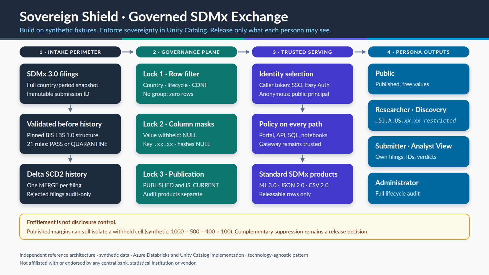

# Sovereign Shield

[](LICENSE)
[](https://learn.microsoft.com/azure/databricks/data-governance/unity-catalog/filters-and-masks/)
[](https://sdmx.org/)
[](requirements.txt)
[](terraform/)
[](SECURITY.md#statistical-reconstruction-challenge)

**How can engineers and AI coding agents build the controls that protect confidential statistics without ever seeing the data?**

Sovereign Shield is an open, educational reference architecture that answers that question
for one case: governed SDMx 3.0 exchange on Azure Databricks. Builders, whether in-house
engineers, contractors or AI coding agents, develop and test against synthetic fixtures
that match the official BIS Locational Banking Statistics structure. Unity Catalog
policies attached to the governed table then decide, per caller, per row and per cell,
what each persona may see. Production uses the same code and policies; only identities,
memberships and data change. The code, evidence and limits are public so practitioners
can study, reproduce and challenge the pattern; it is not a product or a service offering.

> **Independent Reference Architecture Notice:**  
> This publication and associated reference implementations were developed in a personal capacity using synthetic data fixtures and publicly available international statistical standards (SDMx 3.0, BIS Locational Banking Statistics). They are shared for educational purposes and reflect only the author's views. This work is not affiliated with, sponsored by, or representative of the Bank of Canada, the Federal Reserve System, the Bank for International Settlements, or any official statistical institution.

## The Problem: the Contractor Dilemma

Central banks and statistical agencies hold data under statutory confidentiality: reports
from individual institutions may be used for statistical purposes and released only when
no contributor can be identified. The engineering that enforces those obligations, from
Unity Catalog policy design and Delta Lake history engines to SDMx serialization and
infrastructure as code, is increasingly delivered by systems integrators, contractors and
AI agents.

Granting those builders production access to construct the controls that protect production
data is a contradiction. Denying all access stalls delivery. Institutions bridge the gap
today with vetting, NDAs, supervised environments and access reviews. Those controls remain
necessary, but the people building the controls can still end up looking at the data.

## The Pattern: Build Without Seeing

1. **Contract, not data.** The data owner approves structure metadata only: DSD `BIS:BIS_LBS(1.0)`,
   pinned codelists, 21 validation rules and a persona matrix. Builders generate synthetic
   SDMx filings that exercise every lifecycle state and persona branch.
2. **Policies travel with the table.** Row filters and column masks are bound to the governed
   Delta table and resolve per caller at query time on every supported path: portal, API, SQL
   and notebooks. The same SQL runs in synthetic staging and production; no code changes are needed.
3. **Prove it offline.** More than 230 credential-free tests assert the persona matrix, masks,
   atomic history and SDMx conformance. Live checks repeat the matrix with temporary identities.
4. **Hand over and revoke.** The institution imports a reviewed release, configures its own
   identities and state, accepts synthetic staging, approves production and offboards the
   builders. See the [engagement playbook](docs/ENTERPRISE_ONBOARDING_PLAYBOOK.md).

The researcher persona is a **Sovereign Discovery Gateway**: researchers learn that a restricted
series exists, so they can approach the submitting central bank, but they receive neither the
value nor the exact coordinates (`Q.S.C.A.USD.D.5J.A.US.xx.xx`). Access to restricted cells is
reserved for a conceptual [Secure Data Enclave](docs/whitepaper/Bridging_Public_Dissemination_and_Protected_Data.md#the-secure-data-enclave-conceptual-future-state).

## Lessons Worth Reusing

The platform matters less than these transferable lessons, each backed by a test or a
documented limit in this repository:

1. **Treat AI coding agents as external contractors.** They get the approved contract and
   synthetic fixtures, never production records, secrets in prompts or standing access
   ([provider workflow](.github/skills/contractor_least_privilege_workflow.md)).
2. **Bind entitlements to the data, not the channel.** A table policy applies on every supported
   query path; the design question for each new channel, an AI assistant included, is which
   identity it queries with ([perimeter identity](docs/whitepaper/Bridging_Public_Dissemination_and_Protected_Data.md#the-perimeter-identity-problem)).
3. **Masking a value is not enough.** Exact coordinates, record hashes and filter probes can
   re-identify what a mask hides, so the same reveal rule must govern each of them
   ([Discovery Gateway](docs/whitepaper/Bridging_Public_Dissemination_and_Protected_Data.md#the-sovereign-discovery-gateway)).
4. **Latest submitted is not current accepted.** A rejected revision must never withdraw
   correct published data, and analysts need to see both states ([Analyst View](.github/skills/persona_security_matrix.md#analyst-view)).
5. **Entitlement is not disclosure control.** Published margins can still reconstruct a
   withheld cell; suppression is a release decision ([open challenge](SECURITY.md#statistical-reconstruction-challenge)).

## Architecture



Live-renderable Mermaid views of the components, ownership, ingestion sequence and
disclosure controls are in [Architecture Diagrams](docs/ARCHITECTURE_DIAGRAMS.md).

## Quickstart: a 5-Minute Developer Run

No Azure subscription, workspace or credentials are required.

**Linux / macOS**

```bash
git clone https://github.com/botlhale/sovereign-shield.git
cd sovereign-shield
python3 -m venv .venv
source .venv/bin/activate
pip install -r requirements.txt
```

**Windows (PowerShell)**

```powershell
git clone https://github.com/botlhale/sovereign-shield.git
cd sovereign-shield
python -m venv .venv
.venv\Scripts\Activate.ps1
pip install -r requirements.txt
```

Then, from the activated environment on either platform:

```bash
pytest                                                   # offline persona, SDMx, history and policy tests
python sh/local_demo.py --persona public --persona researcher   # generate fixtures, print governed views
python sh/local_demo.py --serve researcher               # browse http://127.0.0.1:8000 as the researcher fixture
```

`local_demo.py` generates synthetic SDMx-ML filings, validates them, loads a local Delta
history and applies the policy mirror. `--persona` accepts `public`, `researcher`,
`submitter-ca`, `submitter-us` and `admin`. `--serve` labels a local fixture for the portal
and refuses to start when Databricks connection variables are set. A local history written
before the `L_REP_CTY` policy anchor is refused; `--migrate-legacy` preserves it under `legacy/`
and replays the archived arrivals into the current contract. For scale fixtures, run
`python src/generate_stress_test_data.py --rows 100000` and `pytest --stress`.

**Try breaking it.** Remove the segment-9 check from `_apply_persona` in
[src/uc_query.py](src/uc_query.py) and rerun `pytest`: the dual-membership test fails because
a Canadian submitter who is also a researcher would read US restricted values.

## Persona Security Matrix

| Persona | Rows | Restricted values | Series key of a restricted row | Downloads |
| --- | --- | --- | --- | --- |
| **Public** | Published, explicitly free (`F`) | Never present | Never present | Releasable rows |
| **Researcher** (Discovery Gateway) | Every published row | `restricted` (NULL, never zero) | **Coordinate-masked**: segments 10-11 become `xx.xx`; lineage hashes NULL | Releasable rows only, identical to the public product |
| **Regional submitter** (Analyst View) | Own rows in every lifecycle state; foreign published `F` | Own in full | Own exact | Own plus foreign public; audit CSV for own rejections |
| **Administrator** | Every row and state | Visible | Exact | Everything, including audit |
| No recognized group | Zero rows | n/a | n/a | n/a |

Synthetic fixture outcomes: public 13 rows; researcher 22 rows with 9 restricted and
coordinate-masked; CA submitter 14 (18 with quarantine); US submitter 17 (21); administrator
22 (44). The **Analyst View** lets a submitter reconcile the latest filing it expects the
receiver to hold with actual submission IDs, timestamps, values and verdicts: the latest
submitted filing can be rejected while an earlier accepted version stays published.

## What Is Implemented

| Capability | Where |
| --- | --- |
| SDMx-ML 3.0 intake against pinned BIS LBS 1.0, 21 workbook rules, whole-filing quarantine | [sdmx_rule_validator.py](src/sdmx_rule_validator.py) |
| Submission-aware Delta history: one MERGE per filing, replay is a no-op, rejected filings audit-only | [submission_history.py](src/submission_history.py) |
| Triple-Lock: account-group row filter; value, coordinate and lineage masks; publication state | [unity_catalog_triple_lock.sql](src/unity_catalog_triple_lock.sql) |
| Content-addressed policy deployment that never detaches protection and verifies bindings | [apply_security.py](src/apply_security.py) |
| Two hosts: Databricks App (SSO, on-behalf-of) and Container Apps (anonymous plus Easy Auth) | [api_gateway.py](src/api_gateway.py) |
| SDMx-ML 3.0, SDMx-JSON 2.0 and SDMx-CSV 2.0 exports through pysdmx; separate audit CSV | [sdmx_ml_exporter.py](src/sdmx_ml_exporter.py) |
| Terraform foundation, Asset Bundle pipeline and one-command lifecycle | [terraform/](terraform/), [databricks.yml](databricks.yml), [sh/](sh/) |

## Deploy

| Starting point | Entry point | Guide |
| --- | --- | --- |
| Empty subscription (PowerShell on Windows, or `pwsh` on Linux) | `sh/sovereignshield_up.ps1` / `sh/sovereignshield_down.ps1` | [Operations runbook](docs/AUTOMATION_RUNBOOK.md) |
| Existing Azure and Databricks estate (bash) | `scripts/sovereign_up_custom.sh` / `scripts/sovereign_down_custom.sh` | [Bring your own estate](docs/AUTOMATION_RUNBOOK.md#bring-your-own-azure-estate) |

The greenfield reference cycle took about **75 minutes** to bring up, including prerequisite
setup, **30 minutes** to tear down and **US$10** or less in Azure charges. These are observed
synthetic results, not an SLA or price ceiling ([measurement scope](docs/RELEASE_EVIDENCE.md#reference-evaluation-metrics)).
The custom scripts attach to existing resources, create only the missing delta, tag what
they create and record it in `.sovereign_provisioned_manifest.json`, so teardown removes
nothing it did not create.

## Limits and Open Challenges

- **Entitlement is not disclosure control.** Published margins can reconstruct a withheld cell:
  the fixture contains `1000 - 400 - 500 = 100`. Coordinate masking hides the counterparty
  and closes filter-probe and hash side channels; it does not stop margin differencing across
  visible dimensions. Complementary suppression remains a release decision. Restrict or remove
  the Researcher role where row presence makes inference trivial
  ([challenge](SECURITY.md#statistical-reconstruction-challenge)).
- **Scope.** The modeled international exchange accepts SDMx files only. Synthetic bank
  micro-transactions are educational fixtures showing how observations and confidentiality
  flags are calculated; they are not an intake requirement or a system deliverable.
- **Trust boundaries.** Logical segregation is not physical residency. The gateway, privileged
  operators, Terraform state and downloaded files remain trusted or sensitive.
- **Portability.** The pattern is technology-agnostic; Azure and Databricks are the demonstrated
  implementation. Terraform boundaries support AWS, GCP, Microsoft Fabric and open-source
  adaptations, each needing equivalent identity, policy and history tests.

## Documentation

| Goal | Read |
| --- | --- |
| Get the eight-page overview | [Executive Brief](docs/EXECUTIVE_BRIEF.md) |
| Understand the architecture and evidence | [White Paper](docs/whitepaper/Bridging_Public_Dissemination_and_Protected_Data.md) · [Architecture diagrams](docs/ARCHITECTURE_DIAGRAMS.md) |
| Review the code | [Technical guide](docs/technical_guide.md) · [Technical reference](docs/technical_reference.md) |
| Assess security | [Persona matrix](.github/skills/persona_security_matrix.md) · [Triple-Lock contract](.github/skills/triple_lock_security.md) · [Solution audit](docs/solution_audit.md) |
| Check SDMx conformance | [Validation contract](.github/skills/sdmx_lbs_validation.md) · [Synthetic dataset contract](.github/skills/mvsd_specification.md) |
| Deploy, recover or tear down | [Operations runbook](docs/AUTOMATION_RUNBOOK.md) · [Resource provenance](docs/RESOURCE_PROVENANCE.md) |
| Learn the delivery and handover model | [Engagement playbook](docs/ENTERPRISE_ONBOARDING_PLAYBOOK.md) · [Provider workflow](.github/skills/contractor_least_privilege_workflow.md) |
| Present or share the material | [Persona demo script](docs/PERSONA_DEMO_SCRIPT.md) · [Publication plan](docs/LINKEDIN_POST.md) · [Release guide](docs/PUBLICATION_AND_RELEASE.md) · [Image prompts](docs/figures/gemini_image_prompts.md) |
| Verify measured results | [Release evidence](docs/RELEASE_EVIDENCE.md) |

## Background

The design draws on hands-on experience implementing group-based row-level security for
regulatory returns on a commercial cloud platform, modernizing an international banking
statistics pipeline to produce SDMx 3.0 output, and time in the SDMx community around pysdmx
and the BIS data portal. Three recurring requests shaped it: executives who want masking that
no developer can bypass, data holders who partner with researchers, and reporting analysts who
need to know which of several submissions the international organization actually holds.
International organizations often favour open-source SDMx stacks; this project asks what the
same guarantees look like on a commercial lakehouse. It integrates known techniques, does
not claim global novelty, and records what worked, what failed and what remains open so
others can learn from it.

## Learn, Challenge and Collaborate

The repository exists to exchange practice. Useful ways to take part:

- **Challenge it.** Attempt the synthetic [reconstruction challenge](SECURITY.md#statistical-reconstruction-challenge)
  or remove a control and check that a test fails.
- **Port it.** Adapt the pattern to Microsoft Fabric, AWS, GCP or an open-source stack with
  equivalent identity, policy and history tests, and share what had to change.
- **Review or extend it.** Peer review of the disclosure reasoning, SDMx validation or
  delivery model is welcome, as are proposals for co-authoring, talks and research collaboration.

Use a feature request for public technical proposals, private vulnerability reporting for new
weaknesses, and a [LinkedIn message to the author, Botlhale Mosweu](https://www.linkedin.com/in/botlhale-ntsimane-mosweu-17653a7),
for other collaboration enquiries.

## AI-Assisted Development

Generative AI accelerated scaffolding, SDMx structure mapping, fixture generation and
documentation. Architecture, mathematical disclosure rules and security controls were designed,
validated and audited by senior engineering. See the [AI-assisted SDLC disclosure](CONTRIBUTING.md#ai-assisted-software-development-life-cycle).

## Contributing, Security and License

Contributions are welcome under the [contribution guide](CONTRIBUTING.md) and
[Code of Conduct](CODE_OF_CONDUCT.md). Report vulnerabilities privately through the
[security policy](SECURITY.md). Licensed under [Apache 2.0](LICENSE); attribution is in
[NOTICE](NOTICE). Developed by Botlhale Mosweu in a personal capacity and shared for education;
no service offering, support contract, institutional approval or production certification is implied.
