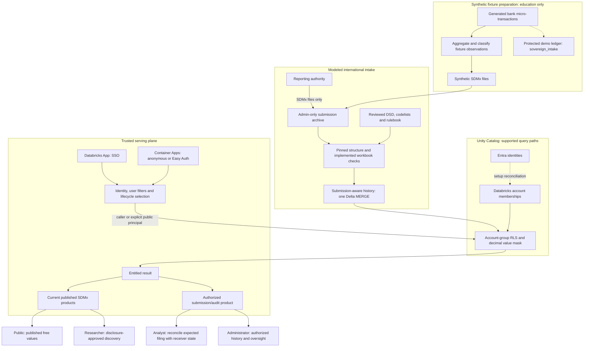
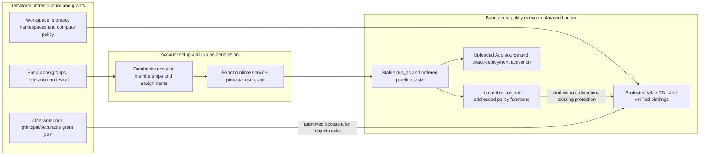
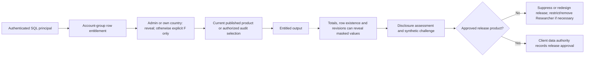
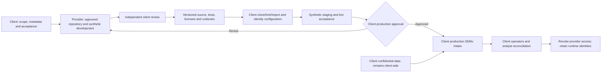

# SovereignShield Architecture Diagrams

These Mermaid diagrams specify the current reference data flow and its ownership
boundaries. Technology and institution names are plain text, not endorsements.
The deployment uses synthetic observations and logical jurisdictional segregation.
For implementation details see [the technical reference](technical_reference.md).

The [publication figure sources](figures/README.md) provide matching SVG/PNG
schematics and a source/image integrity manifest for the Executive Brief and
White Paper. Portal screenshots have a separate [capture inventory](../demo/README.md).

## Live-Renderable Diagrams

### 1.1 System Component Architecture

The international intake contract is **SDMx files only**. Synthetic bank
micro-transactions are educational artifacts showing the calculation of realistic
observations; the separate demo ledger is not a client intake requirement or
system deliverable. It has no production micro-to-macro ingestion arrow.



The gateway handles tokens and results and therefore remains trusted. UC policies
enforce row/value entitlements independently of the gateway's filter predicates.
Published feeds select current accepted data; the underlying row filter does not
itself enforce `IS_CURRENT`. Raw storage and privileged control-plane access need
separate protection.

### 1.1a Ownership Boundary



Normal policy deployment never detaches row filters or masks. Changing a grant
pair through multiple owners is prohibited. Stable runtime identities do not
automatically migrate object ownership or remove human administration rights.

### 1.2 Data Ingestion and Atomic Quarantine Sequence

```mermaid
sequenceDiagram
    autonumber
    participant AUTH as Reporting authority or synthetic generator
    participant ARCH as Protected SDMx archive
    participant VAL as Contract and arithmetic validator
    participant HIST as Submission-aware Delta history
    participant PUB as Current published product
    participant ANALYST as Own-jurisdiction analyst
    AUTH->>ARCH: Full country/period/aggregation SDMx snapshot and immutable ID
    ARCH->>VAL: Submitted observations, source digest and message metadata
    VAL-->>HIST: PASS / PUBLISHED with coverage notes
    HIST->>HIST: One MERGE: close exact current scope and insert snapshot
    Note over HIST: Current VALID_TO is NULL; genuine zero is retained
    HIST-->>PUB: Accepted current observations, subject to entitlements
    AUTH->>ARCH: Later filing with a named arithmetic failure
    ARCH->>VAL: New immutable submission
    VAL-->>HIST: FAIL / QUARANTINE and observation/batch feedback
    HIST->>HIST: One MERGE: insert audit-only rows, leave accepted state unchanged
    HIST-->>PUB: Prior accepted publication remains current
    ANALYST->>HIST: Authorized published / all / quarantine query
    HIST-->>ANALYST: IDs, timestamps, actual values and validation outcomes
    Note over ANALYST: Reconcile expected latest filing with receiver state
    ARCH->>HIST: Replay same ID and content
    HIST-->>ARCH: No duplicate rows or new history commit
```

An accepted smaller replacement retires omitted keys in its own scope. A new
identical filing is retained as a distinct submission; replay of the same message
is not. Older accepted arrivals are audit-only. The synthetic baseline contains
22 published observations and its revision 22 quarantined observations across
CA, US and GB. The ledger and macro history are separate transactions.

### 1.3 Entitlement and Information Disclosure



This is a conceptual control map, not a physical SQL execution order or an
implemented disclosure-control engine. RLS/DDM does not stop statistical inference.
Community tests of the [open challenge](../SECURITY.md#statistical-reconstruction-challenge)
must use synthetic data. Removing researcher discovery alone does not repair
reconstruction possible from public totals.

### 1.4 Safe Engagement: Build, Hand Over, Approve and Revoke



No production records, provider credentials or sandbox state cross with the
repository transfer. The client accepts production adaptations, disclosure,
residency, recovery and operating cost. Offboarding covers groups, sessions,
tokens, RBAC, vault, GitHub, ownership and retained exports. See the
[engagement specification](ENTERPRISE_ONBOARDING_PLAYBOOK.md) and the detailed
[image prompt](ENGAGEMENT_WORKFLOW_IMAGE_PROMPT.md).

## Evaluation and Extensibility

Successful reference provisioning and teardown measured approximately **75 minutes
up including prerequisites**, **30 minutes down**, and **US$10 or less in Azure
charges for deploy/test/teardown**. See [measurement scope](RELEASE_EVIDENCE.md#reference-evaluation-metrics).
These diagrams are not production performance or pricing guarantees.

The pattern is technology-agnostic. Terraform enables provider/module extensions
to AWS, GCP, Microsoft Fabric and open-source stacks; equivalent identity, policy,
storage and lifecycle adapters must be implemented and verified. These diagrams
show the Azure/Databricks implementation, not an already deployed multi-cloud estate.

## Export Guidance

Render Mermaid in GitHub or a compatible extension/tool. Support in VS Code,
Confluence, Notion and slide software depends on the renderer or plugin; it is
not universally built in. For slides/print, export a reviewed diagram as SVG or
high-resolution PNG and verify text, arrows and color contrast. Use the current
Mermaid specifications to replace older conceptual artwork when its embedded
labels conflict with this contract.