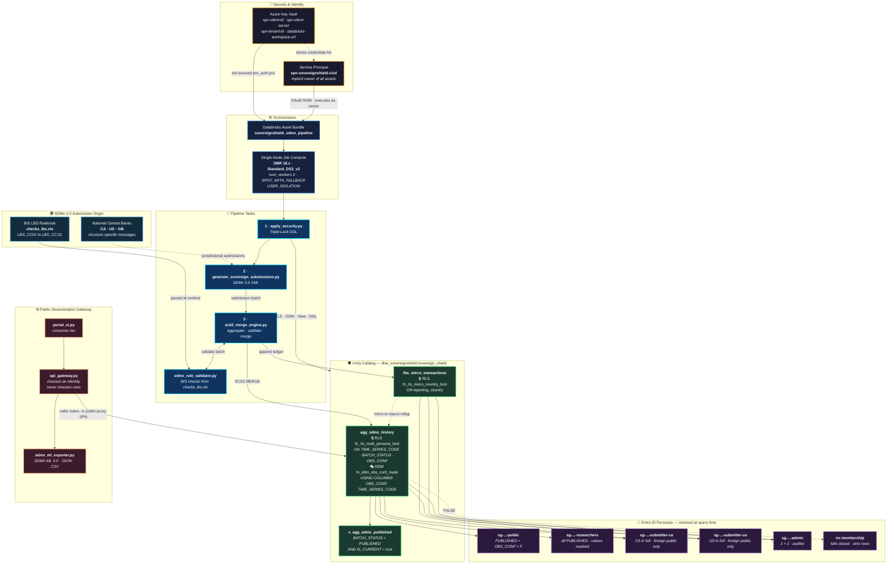
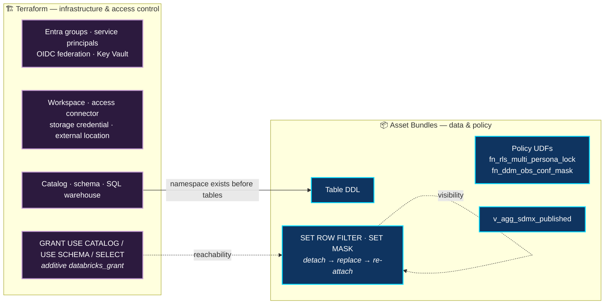
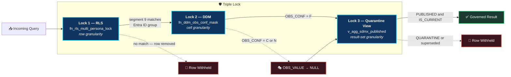

# SovereignShield Architecture Diagrams

> **Disclaimer.** An independent reference architecture, inspired by the design of
> public statistical portals such as the BIS Data Explorer. Not affiliated with or
> endorsed by the Bank for International Settlements or any central bank, and
> operating on **100% synthetic mock data**. BIS and SDMx appear as typeset text
> only, never as reproduced logos.

*Rendered from [`technical_vision.md`](technical_vision.md). The Mermaid diagrams
below decompose the same system — use this one to orient an audience, and those
to answer the follow-up questions.*

These live-renderable Mermaid.js diagrams document how Azure Databricks and
Unity Catalog carry the security obligations of SDMx 3.0 statistical
submissions. GitHub, VS Code, Notion, Confluence, and most slide tooling render
them natively.

> All diagrams reflect the implemented system — object names, function names, and rule identifiers are taken from source, not illustrative.

> **On standards-body marks:** BIS and SDMx are referenced throughout as **typeset text**, never as reproduced logos, and dissemination targets are drawn generically. These visuals are intended for public posting; a rendered institutional logo beside this project's name would assert an affiliation that does not exist.

---

## Live-Renderable Diagrams

### 1.1 System Component Architecture

End-to-end topology from secret storage through governed consumption. Note that the **security layer is provisioned before any data is written**, and that both the raw ledger and the macro history carry row filters.

**Reading the diagram**

| Element | Significance |
| --- | --- |
| `NCB → T2` | Submissions originate per jurisdiction — sovereignty is a property of the input, not a later annotation |
| `RULEBOOK → VAL` | The BIS rulebook is read at runtime; a standards revision needs no redeployment |
| `KV → DAB` | Credentials are hydrated into session scope at deploy time; no literal is ever stored |
| `T1` runs first | No table exists un-governed, even momentarily |
| Filters on **both** tables | Protecting only the aggregate would leave the raw ledger exposed |
| `API → MACRO`, not `API → VIEW` | A Unity Catalog view resolves group membership against the **view owner**, so per-caller entitlement has to be evaluated against the base table |
| `MACRO → NONE` dashed | The fail-closed default. Off-boarding and inter-sovereign isolation are the same code path |

**The Zero-Trust identity boundary**

Every arrow from `MACRO` to a persona is the *same* query against the *same*
table. Nothing in the gateway, the portal or the exporter narrows it. The
difference in what each persona receives is produced entirely inside the
metastore, which is why the boundary holds across PySpark, a SQL warehouse, a BI
tool and the public REST API without being re-implemented for any of them.

---

### 1.1a Ownership boundary — who writes which object

Two declarative systems, disjoint by design. Terraform reports drift on anything
it owns; the bundle re-applies its own objects on every run. An object written
by both would oscillate, and a Terraform apply could detach a live row filter
mid-query.

> **The grant decides reachability; the row filter decides visibility.** Trying
> to express sovereignty through grants instead would need one securable per
> jurisdiction and still could not mask a single cell.

---

### 1.2 Data Ingestion & Atomic Quarantine Sequence

The defining behaviour of the platform: a failed revision is **fully recorded for audit yet cannot degrade what consumers already see**. The prior published record stays active.

```mermaid
sequenceDiagram
    autonumber
    participant SUB as 🏦 Reporting Agent
    participant GEN as generate_sovereign_submissions.py
    participant ENG as scd2_merge_engine.py
    participant VAL as sdmx_rule_validator.py
    participant XLS as checks_lbs.xls
    participant HIST as agg_sdmx_history
    participant VIEW as v_agg_sdmx_published
    participant RES as 🔬 Researcher

    Note over SUB,VIEW: CYCLE 1 — BASELINE (clean submission)

    SUB->>GEN: Submit CA micro-transactions for 2026-Q1
    GEN->>ENG: SDMx 3.0 batch
    ENG->>ENG: Normalize codes, roll up to 11-dimension key
    ENG->>VAL: Aggregated macro batch
    VAL->>XLS: Parse BIS consistency checks at runtime
    XLS-->>VAL: LBS_CC01 to LBS_CC:21
    VAL-->>ENG: PASS — BATCH_STATUS = PUBLISHED
    ENG->>HIST: Insert 9 rows, IS_CURRENT = true, VALID_TO = 9999-12-31
    RES->>VIEW: SELECT
    VIEW-->>RES: ✅ CA baseline visible

    Note over SUB,VIEW: CYCLE 2 — REVISION (all jurisdictions fail independently)

    SUB->>GEN: Resubmit CA 2026-Q1 with revised figures
    GEN->>ENG: SDMx 3.0 batch
    ENG->>VAL: Aggregated macro batch
    VAL->>VAL: Evaluate aggregate vs components, tolerance 1e-4

    rect rgb(60, 20, 20)
        Note over VAL: CA · LBS_CC01<br/>US · LBS_CC01<br/>GB · LBS_CC02, LBS_CC:04
        VAL->>VAL: Group by (L_REP_CTY, DATE) and apply verdict atomically
        VAL-->>ENG: FAIL — 22 revision rows QUARANTINE<br/>4 offending observations attributed
    end

    ENG->>ENG: Split incoming batch on BATCH_STATUS

    rect rgb(20, 45, 30)
        Note over ENG,HIST: Prior-state preservation
        ENG--xHIST: Stage 1 expire — SKIPPED for quarantined rows
        ENG->>HIST: Stage 2b append audit rows<br/>IS_CURRENT = false, VALID_TO = VALID_FROM
        ENG--xHIST: Stage 3 logical delete — quarantined keys excluded
        Note over HIST: ✅ Baseline rows remain IS_CURRENT = true
    end

    RES->>VIEW: SELECT
    VIEW-->>RES: ✅ Still serving the last valid baseline

    Note over SUB,VIEW: Failure degrades to stale data, never to missing data

    SUB->>HIST: Query own jurisdiction (RLS scoped to CA)
    HIST-->>SUB: 🔍 QUARANTINE rows with FAILED_RULE_ID for diagnosis
```

**Guarantees demonstrated**

| Guarantee | Mechanism |
| --- | --- |
| All-or-nothing acceptance | Verdict grouped by `(L_REP_CTY, DATE)` — one failure quarantines the whole country-quarter |
| Blast-radius containment | US and GB batches in the same run publish normally |
| Continuity of service | Quarantined rows bypass the expire-merge, so the baseline stays `IS_CURRENT = true` |
| Auditability | Rejection persisted with `FAILED_RULE_ID`, visible to the owning submitter |
| Replay safety | `left_anti` join on key + `version_hash` blocks duplicate audit rows |

---

### 1.3 Optional — Triple-Lock Enforcement Path

A compact supporting visual for security-focused slides.

---

### 1.4 Safe Engagement — Build on Synthetic, Hand Over, Revoke

How an external specialist builds and proves the platform **without ever holding real data**, and how the institution severs that access in three administrative actions without modifying the delivered code.

```mermaid
graph LR
    subgraph BUILD["🧪 Phase 1 — Build (external specialist)"]
        SYN["Synthetic submissions<br/><i>generate_sovereign_submissions.py</i>"]
        RULES["Public BIS rulebook<br/><i>checks_lbs.xls</i>"]
        DDL["Declarative security<br/><i>unity_catalog_triple_lock.sql</i>"]
        BUNDLE["Deployment manifest<br/><i>databricks.yml</i>"]
    end

    subgraph HANDOVER["📦 Phase 2 — Handover"]
        REPO["Git repository<br/><b>zero credentials inside</b>"]
    end

    subgraph PROD["🏛️ Phase 3 — Enterprise runs it on real data"]
        OWNSPN["Enterprise service principal"]
        OWNCAT["Enterprise Unity Catalog"]
        REAL["Real submissions"]
    end

    subgraph REVOKE["🔒 Phase 4 — Cut-off (no code change)"]
        R1["1 · Rotate SPN<br/><i>kv_spn_remediation.sh</i>"]
        R2["2 · Drop Key Vault access policy"]
        R3["3 · Remove from Entra ID groups"]
    end

    SYN --> DDL
    RULES --> DDL
    DDL --> BUNDLE
    BUNDLE --> REPO
    REPO --> OWNSPN
    OWNSPN --> OWNCAT
    REAL --> OWNCAT
    OWNCAT --> R1
    R1 --> R2
    R2 --> R3
    R3 --> ZERO["🚫 Builder resolves to<br/><b>zero groups → zero rows</b><br/><i>same path that enforces sovereignty</i>"]

    classDef build fill:#132c3d,stroke:#5dade2,stroke-width:2px,color:#fff
    classDef hand fill:#16213e,stroke:#3498db,stroke-width:2px,color:#fff
    classDef prod fill:#1b3a2f,stroke:#2ecc71,stroke-width:2px,color:#fff
    classDef rev fill:#3a1520,stroke:#e74c3c,stroke-width:2px,color:#fff

    class SYN,RULES,DDL,BUNDLE build
    class REPO hand
    class OWNSPN,OWNCAT,REAL prod
    class R1,R2,R3,ZERO rev
```

**Why this holds**

| Property | Why it survives the handover |
| --- | --- |
| No real data in the build | Submissions are generated; the public rulebook supplies the checks. Nothing is calibrated against live distributions |
| No credentials in the deliverable | `pre_auth.ps1` resolves secrets by *name* at run time, so the repository never contains a value to leak |
| No re-implementation risk | Controls are Unity Catalog objects, so they activate on real data on the first run — there is no "productionisation" pass that could get the security wrong |
| No bespoke off-boarding path | Row filters grant on positive group membership and fail closed. Zero groups yields zero rows, using the same code path that separates jurisdictions |

## Export Guidance

| Target | Approach |
| --- | --- |
| **GitHub / Confluence / Notion** | Paste the Mermaid blocks directly — rendered natively |
| **PowerPoint / Google Slides** | Render at [mermaid.live](https://mermaid.live), export SVG, then insert (SVG stays crisp when scaled) |
| **PDF / print** | Export SVG rather than PNG; the `classDef` colours are tuned for dark backgrounds, so invert for light-theme print |
| **VS Code preview** | Built-in Markdown preview renders Mermaid without an extension |

> When editing the diagrams, keep object and function names synchronized with `src/unity_catalog_triple_lock.sql` and `src/scd2_merge_engine.py`. These visuals are cited in executive material, so drift between the diagram and the deployed system is a correctness problem, not a cosmetic one.
