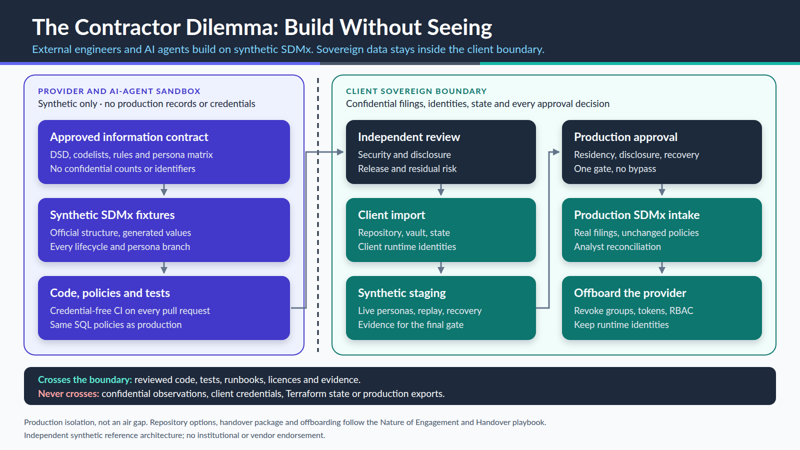
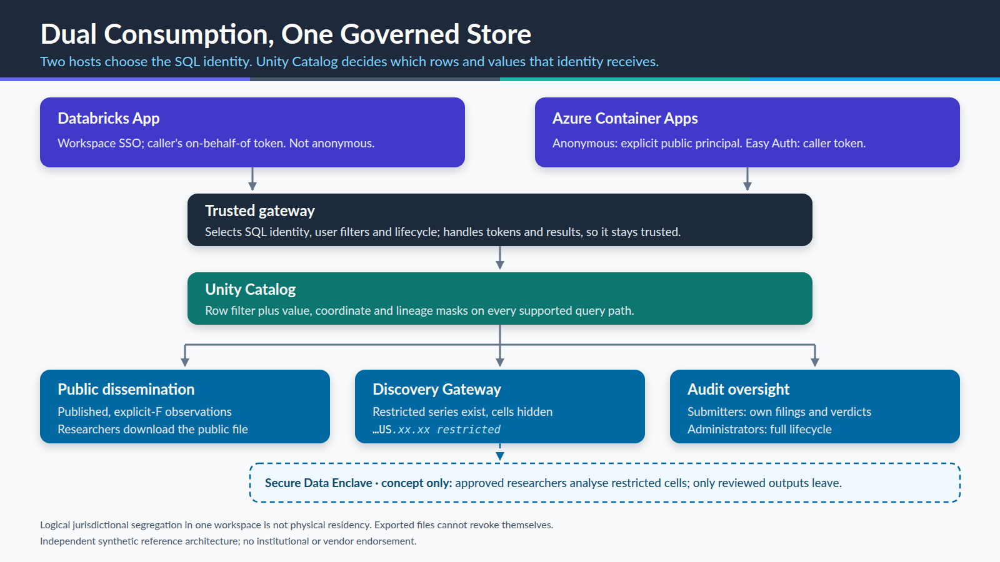
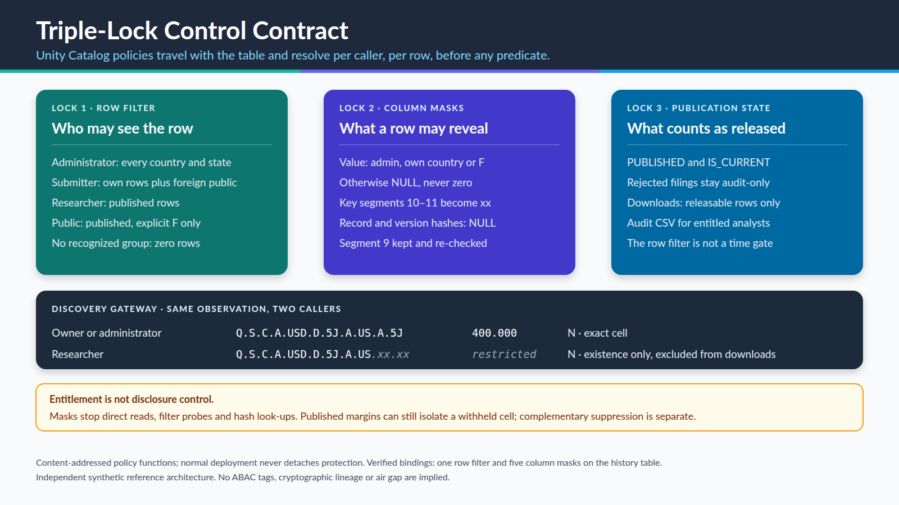
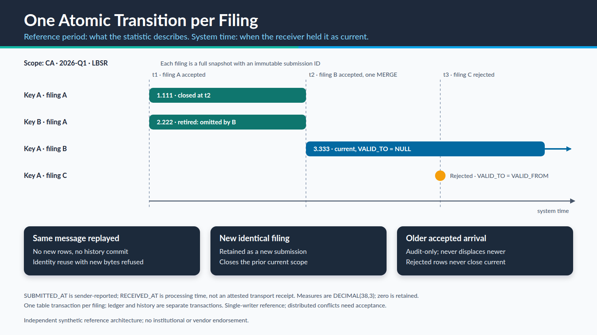
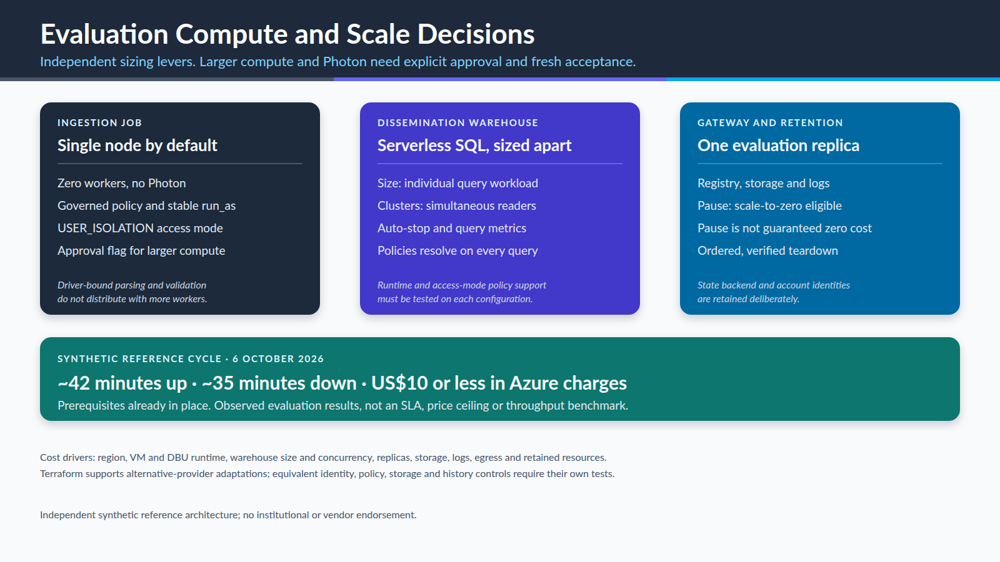
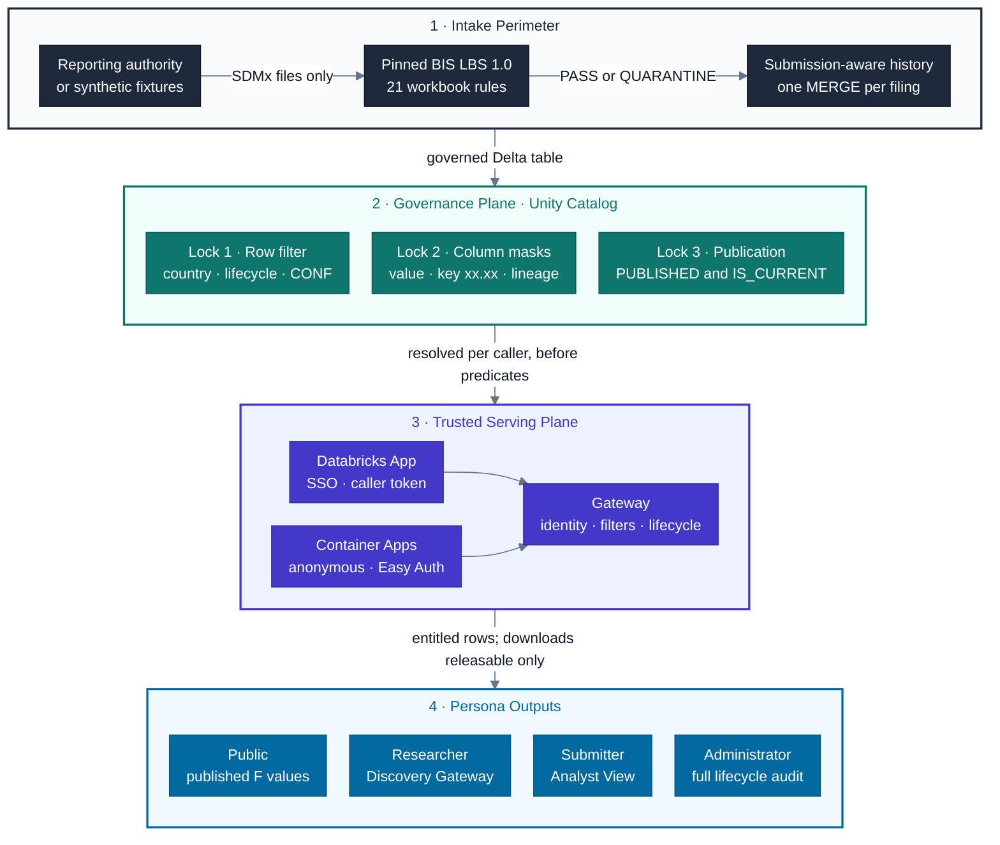
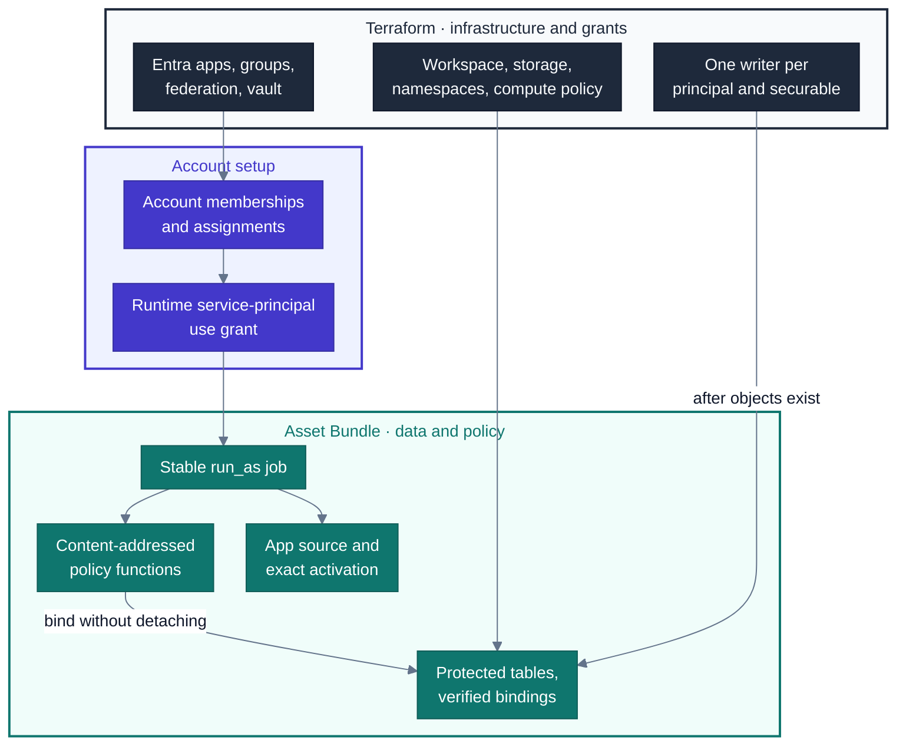
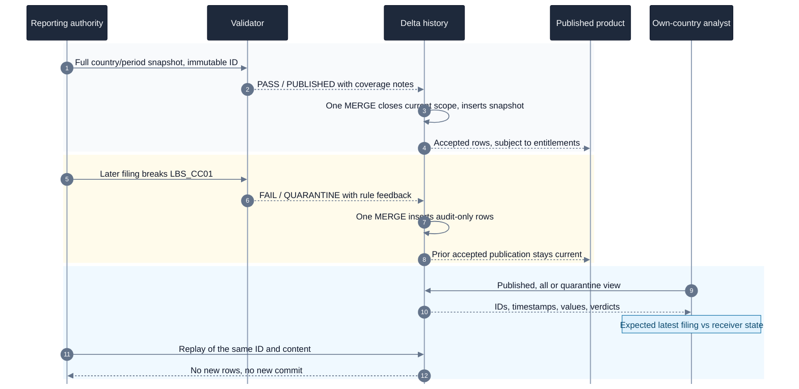
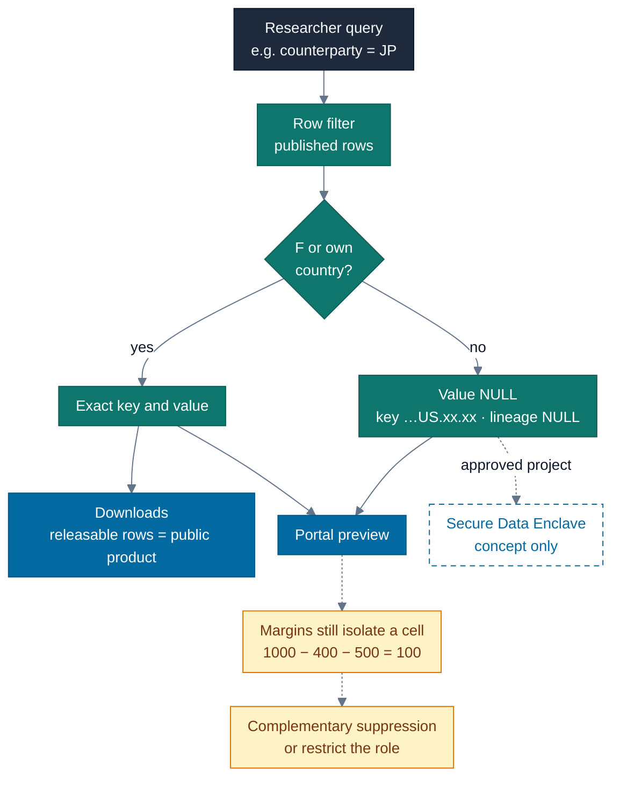
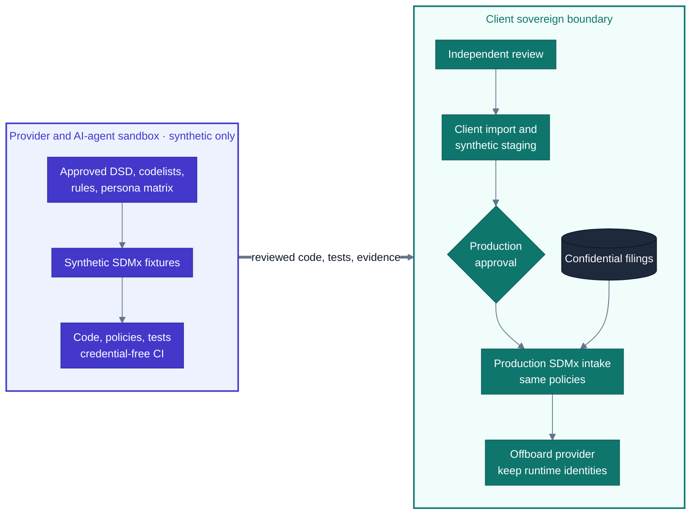

# Architecture Diagrams

Mermaid views of the reference implementation. Every node and plane carries an
explicit fill and text colour, so the diagrams read the same in GitHub light and
dark mode. Colours encode planes: slate for intake, teal for Unity Catalog
governance, indigo for the trusted serving plane, sky for persona outputs and
amber for disclosure risk. Detail lives in the [technical reference](technical_reference.md).

## Publication Figures

The White Paper and Executive Brief use these schematics. Sources, rendering and
digests are described in [the figure sources](figures/README.md); screenshots have a
separate [capture inventory](../demo/README.md).

| | |
| --- | --- |
|  |  |
|  |  |
|  |  |

## 1. System Components

The international intake contract is SDMx files only. Synthetic bank
micro-transactions are educational fixtures and have no production path.

```mermaid
%%{init: {"theme": "base", "themeVariables": {"fontFamily": "Inter, Segoe UI, Helvetica, Arial, sans-serif", "fontSize": "14px", "lineColor": "#64748B", "primaryTextColor": "#0F172A", "edgeLabelBackground": "#FFFFFF", "clusterBkg": "#F8FAFC", "titleColor": "#0F172A"}, "flowchart": {"nodeSpacing": 22, "rankSpacing": 34, "padding": 8, "curve": "basis", "subGraphTitleMargin": {"top": 6, "bottom": 8}}}}%%
flowchart TB
    subgraph INTAKE["1 · Intake Perimeter"]
        direction LR
        SRC["Reporting authority<br/>or synthetic fixtures"] -->|SDMx files only| VAL["Pinned BIS LBS 1.0<br/>21 workbook rules"]
        VAL -->|PASS or QUARANTINE| HIST["Submission-aware history<br/>one MERGE per filing"]
    end
    subgraph GOV["2 · Governance Plane · Unity Catalog"]
        direction TB
        RLS["Lock 1 · Row filter<br/>country · lifecycle · CONF"]
        MASK["Lock 2 · Column masks<br/>value · key xx.xx · lineage"]
        PUB["Lock 3 · Publication<br/>PUBLISHED and IS_CURRENT"]
    end
    subgraph SERVE["3 · Trusted Serving Plane"]
        direction LR
        APP["Databricks App<br/>SSO · caller token"] --> GW["Gateway<br/>identity · filters · lifecycle"]
        ACA["Container Apps<br/>anonymous · Easy Auth"] --> GW
    end
    subgraph OUT["4 · Persona Outputs"]
        direction TB
        P1["Public<br/>published F values"]
        P2["Researcher<br/>Discovery Gateway"]
        P3["Submitter<br/>Analyst View"]
        P4["Administrator<br/>full lifecycle audit"]
    end
    INTAKE -->|governed Delta table| GOV
    GOV -->|resolved per caller, before predicates| SERVE
    SERVE -->|entitled rows; downloads releasable only| OUT

    classDef slate fill:#1E293B,stroke:#0F172A,color:#F8FAFC
    classDef teal fill:#0F766E,stroke:#115E59,color:#FFFFFF
    classDef indigo fill:#4338CA,stroke:#3730A3,color:#FFFFFF
    classDef sky fill:#0369A1,stroke:#075985,color:#FFFFFF
    class SRC,VAL,HIST slate
    class RLS,MASK,PUB teal
    class APP,ACA,GW indigo
    class P1,P2,P3,P4 sky
    style INTAKE fill:#F8FAFC,stroke:#1E293B,stroke-width:2px,color:#1E293B
    style GOV fill:#F0FDFA,stroke:#0F766E,stroke-width:2px,color:#0F766E
    style SERVE fill:#EEF2FF,stroke:#4338CA,stroke-width:2px,color:#4338CA
    style OUT fill:#F0F9FF,stroke:#0369A1,stroke-width:2px,color:#0369A1
```

The gateway handles tokens and results and remains trusted; Unity Catalog enforces
row and value entitlements independently of its predicates. Published feeds select
current accepted data; the row filter itself is not a time gate.

## 2. Ownership Boundary

One writer per object: Terraform owns infrastructure and grants, account setup owns
memberships and run-as permission, the bundle owns data, policies and the App.

```mermaid
%%{init: {"theme": "base", "themeVariables": {"fontFamily": "Inter, Segoe UI, Helvetica, Arial, sans-serif", "fontSize": "14px", "lineColor": "#64748B", "primaryTextColor": "#0F172A", "edgeLabelBackground": "#FFFFFF"}, "flowchart": {"nodeSpacing": 28, "rankSpacing": 30, "padding": 8, "curve": "basis", "subGraphTitleMargin": {"top": 6, "bottom": 8}}}}%%
flowchart TB
    subgraph TF["Terraform · infrastructure and grants"]
        ID["Entra apps, groups,<br/>federation, vault"]
        INFRA["Workspace, storage,<br/>namespaces, compute policy"]
        GRANTS["One writer per<br/>principal and securable"]
    end
    subgraph ACCT["Account setup"]
        MEMBERS["Account memberships<br/>and assignments"] --> RUNAS["Runtime service-principal<br/>use grant"]
    end
    subgraph BUNDLE["Asset Bundle · data and policy"]
        JOB["Stable run_as job"] --> FUNCS["Content-addressed<br/>policy functions"]
        JOB --> APPSRC["App source and<br/>exact activation"]
        FUNCS -->|bind without detaching| TABLES["Protected tables,<br/>verified bindings"]
    end
    ID --> MEMBERS
    RUNAS --> JOB
    INFRA --> TABLES
    GRANTS -->|after objects exist| TABLES

    classDef slate fill:#1E293B,stroke:#0F172A,color:#F8FAFC
    classDef indigo fill:#4338CA,stroke:#3730A3,color:#FFFFFF
    classDef teal fill:#0F766E,stroke:#115E59,color:#FFFFFF
    class ID,INFRA,GRANTS slate
    class MEMBERS,RUNAS indigo
    class JOB,FUNCS,TABLES,APPSRC teal
    style TF fill:#F8FAFC,stroke:#1E293B,stroke-width:2px,color:#1E293B
    style ACCT fill:#EEF2FF,stroke:#4338CA,stroke-width:2px,color:#4338CA
    style BUNDLE fill:#F0FDFA,stroke:#0F766E,stroke-width:2px,color:#0F766E
```

Normal deployment never detaches a row filter or mask. Stable runtime identities do
not migrate object ownership or remove human administration rights automatically.

## 3. Ingestion and Atomic Quarantine

```mermaid
%%{init: {"theme": "base", "themeVariables": {"fontFamily": "Inter, Segoe UI, Helvetica, Arial, sans-serif", "fontSize": "14px", "actorBkg": "#1E293B", "actorBorder": "#0F172A", "actorTextColor": "#F8FAFC", "actorLineColor": "#94A3B8", "signalColor": "#64748B", "signalTextColor": "#0F172A", "noteBkgColor": "#E0F2FE", "noteTextColor": "#0C4A6E", "noteBorderColor": "#0369A1", "sequenceNumberColor": "#FFFFFF"}, "sequence": {"actorMargin": 36, "messageMargin": 26, "boxMargin": 6, "noteMargin": 8, "mirrorActors": false}}}%%
sequenceDiagram
    autonumber
    participant AUTH as Reporting authority
    participant VAL as Validator
    participant HIST as Delta history
    participant PUB as Published product
    participant ANA as Own-country analyst
    rect rgb(248, 250, 252)
    AUTH->>VAL: Full country/period snapshot, immutable ID
    VAL-->>HIST: PASS / PUBLISHED with coverage notes
    HIST->>HIST: One MERGE closes current scope, inserts snapshot
    HIST-->>PUB: Accepted rows, subject to entitlements
    end
    rect rgb(255, 251, 235)
    AUTH->>VAL: Later filing breaks LBS_CC01
    VAL-->>HIST: FAIL / QUARANTINE with rule feedback
    HIST->>HIST: One MERGE inserts audit-only rows
    HIST-->>PUB: Prior accepted publication stays current
    end
    rect rgb(240, 249, 255)
    ANA->>HIST: Published, all or quarantine view
    HIST-->>ANA: IDs, timestamps, values, verdicts
    Note over ANA: Expected latest filing vs receiver state
    AUTH->>HIST: Replay of the same ID and content
    HIST-->>AUTH: No new rows, no new commit
    end
```

A smaller accepted replacement retires omitted keys in its own scope. A new identical
filing is a distinct submission; an older accepted arrival is audit-only.

## 4. Discovery Gateway and Disclosure

```mermaid
%%{init: {"theme": "base", "themeVariables": {"fontFamily": "Inter, Segoe UI, Helvetica, Arial, sans-serif", "fontSize": "14px", "lineColor": "#64748B", "primaryTextColor": "#0F172A", "edgeLabelBackground": "#FFFFFF"}, "flowchart": {"nodeSpacing": 22, "rankSpacing": 32, "padding": 8, "curve": "basis"}}}%%
flowchart TB
    REQ["Researcher query<br/>e.g. counterparty = JP"] --> RLS["Row filter<br/>published rows"]
    RLS --> GATE{"F or own<br/>country?"}
    GATE -->|yes| EXACT["Exact key and value"]
    GATE -->|no| MASKED["Value NULL<br/>key …US.xx.xx · lineage NULL"]
    EXACT --> DL["Downloads<br/>releasable rows = public product"]
    EXACT --> PORTAL["Portal preview"]
    MASKED --> PORTAL
    MASKED -.->|approved project| ENCLAVE["Secure Data Enclave<br/>concept only"]
    PORTAL -.-> RISK["Margins still isolate a cell<br/>1000 − 400 − 500 = 100"]
    RISK -.-> DECIDE["Complementary suppression<br/>or restrict the role"]

    classDef slate fill:#1E293B,stroke:#0F172A,color:#F8FAFC
    classDef teal fill:#0F766E,stroke:#115E59,color:#FFFFFF
    classDef sky fill:#0369A1,stroke:#075985,color:#FFFFFF
    classDef warn fill:#FEF3C7,stroke:#D97706,color:#78350F
    classDef concept fill:#FFFFFF,stroke:#0369A1,stroke-dasharray:5 4,color:#0369A1
    class REQ slate
    class RLS,GATE,EXACT,MASKED teal
    class DL,PORTAL sky
    class RISK,DECIDE warn
    class ENCLAVE concept
```

Masks resolve before predicates, so the counterparty filter cannot match a masked
row. This is a control map, not an execution plan. It enforces entitlements; it does
not establish statistical disclosure control ([open challenge](../SECURITY.md#statistical-reconstruction-challenge)).

## 5. The Contractor Dilemma Boundary

```mermaid
%%{init: {"theme": "base", "themeVariables": {"fontFamily": "Inter, Segoe UI, Helvetica, Arial, sans-serif", "fontSize": "14px", "lineColor": "#64748B", "primaryTextColor": "#0F172A", "edgeLabelBackground": "#FFFFFF"}, "flowchart": {"nodeSpacing": 22, "rankSpacing": 34, "padding": 8, "curve": "basis", "subGraphTitleMargin": {"top": 6, "bottom": 8}}}}%%
flowchart LR
    subgraph SANDBOX["Provider and AI-agent sandbox · synthetic only"]
        direction TB
        CONTRACT["Approved DSD, codelists,<br/>rules, persona matrix"] --> FIX["Synthetic SDMx fixtures"] --> CODE["Code, policies, tests<br/>credential-free CI"]
    end
    subgraph CLIENT["Client sovereign boundary"]
        direction TB
        REVIEW["Independent review"] --> STAGE["Client import and<br/>synthetic staging"] --> GATE{"Production<br/>approval"}
        GATE --> PROD["Production SDMx intake<br/>same policies"]
        DATA[("Confidential filings")] --> PROD
        PROD --> EXIT["Offboard provider<br/>keep runtime identities"]
    end
    SANDBOX ==>|reviewed code, tests, evidence| CLIENT

    classDef indigo fill:#4338CA,stroke:#3730A3,color:#FFFFFF
    classDef teal fill:#0F766E,stroke:#115E59,color:#FFFFFF
    classDef slate fill:#1E293B,stroke:#0F172A,color:#F8FAFC
    class CONTRACT,FIX,CODE indigo
    class REVIEW,STAGE,GATE,PROD,EXIT teal
    class DATA slate
    style SANDBOX fill:#EEF2FF,stroke:#4338CA,stroke-width:2px,color:#4338CA
    style CLIENT fill:#F0FDFA,stroke:#0F766E,stroke-width:2px,color:#0F766E
```

Confidential observations, client credentials, Terraform state and production exports
never cross into the sandbox. The client-facing sequence with rework paths is in the
[engagement playbook](ENTERPRISE_ONBOARDING_PLAYBOOK.md#engagement-workflow).

## Rendering

GitHub renders these blocks natively; other tools need a Mermaid renderer. For slides
or print, use the publication PNGs, or export a reviewed diagram as SVG and check text,
arrows and contrast. AI-generated artwork is never the architectural authority; see
the [image prompts guide](figures/gemini_image_prompts.md).
