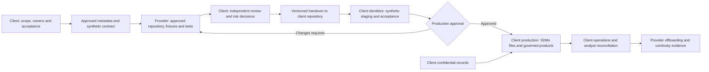

# Nature of Engagement and Handover

**Audience:** client sponsor, enterprise data and information architects, data
authority, security reviewer, procurement, platform owner and external provider.

SovereignShield supports an external technical consulting engagement in which
the provider develops against an approved synthetic information contract and
the client retains control of production data, identities, infrastructure and
release decisions. An independent reference repository is an implementation
starting point, not a production service or an automatic right to client access.

The companion Executive Brief and White Paper share the title **Bridging Public
Dissemination and Protected Data: A Zero-Trust SDMx Architecture on Azure Databricks**.
The [Executive Brief](EXECUTIVE_BRIEF.md) supports the investment decision;
the [White Paper](whitepaper/Bridging_Public_Dissemination_and_Protected_Data.md)
describes the controls and evidence.

## 1. Engagement Contract

Before technical access, the parties agree a statement of work covering scope,
deliverables, milestones, fees, acceptance evidence, intellectual-property and
licensing rights, publication approval, confidentiality, support and exit terms.
Provider identity and employment are separate: the client's repository is not an
employer's repository unless that employer is the contracted client. Employer
equipment, credentials, private code or records require explicit authorization
and must not be assumed available for an independent engagement.

### Roles and Accountabilities

| Role | Accountable Decisions and Deliverables |
| --- | --- |
| Client sponsor and procurement | Business outcome, budget, contractual scope, ownership and acceptance authority |
| Client information/data authority | SDMx structures, sender agreements, meanings, classification, disclosure control, retention and publication approval |
| Client platform owner | Subscription/account, network, metastore, runtime identities, state backend, operational controls and production deployment |
| Client security and independent reviewer | Threat model, access review, evidence acceptance, residual risk and promotion approval |
| External technical provider | Architecture, code, synthetic fixtures, tests, documentation, defect correction and knowledge transfer within the agreed scope |
| Client operations team | Monitoring, incident response, backup/restore, patching, cost oversight and ownership after acceptance |

Augmenta Systems (13668754 Canada Inc.) is the project steward. Individual
authorship, company stewardship, contractual work-product ownership and third-party
licenses are distinct; none implies employer or institutional endorsement.

## 2. Client Prerequisites and Access

| Client Provides or Approves | Provider Receives |
| --- | --- |
| Versioned DSD/dataflow, codelists, sender-country mapping, reporting units, period rules and snapshot/revision semantics | Approved metadata and synthetic examples, not confidential observations |
| Entitlement matrix, classification policy, disclosure decisions, expected validation feedback and analyst reconciliation cases | Implementable test expectations and named decision owners |
| Approved repository, workstation policy, dependency sources, artifact license review and collaboration rules | Repository access limited to the engagement; no implied employer-repository access |
| Evaluation budget, region, quota, residency and network requirements | Either credential-free local development or explicitly approved synthetic-only sandbox access |
| Existing Azure subscription/tenant, Databricks account and regional Unity Catalog metastore, remote Terraform state backend and configuration | Non-secret identifiers and client-run deployment support; secrets remain in client-controlled stores |
| Authorized administrators for resource provisioning, scoped RBAC assignments, Entra apps/groups/consent, Databricks account membership and run-as permissions | Time-bounded assistance where needed, not standing production administrator rights |
| Existing human persona accounts and independent deployment reviewers | Named test users; passwords are entered directly by their holders, not shared with the provider or repository |

The local test path needs no cloud credentials. If live synthetic evaluation is
part of the engagement, use a segregated sandbox and the least privileges needed
for the agreed tasks. Client administrators perform privileged bootstrap and
consent operations where delegation is inappropriate. Record expiry, access
reviews and resource scope. Do not grant tenant-wide administration solely for
developer convenience.

Terraform state and plans can contain credentials. The client owns access,
encryption, locking, retention, auditing and recovery for the backend. Public
proxy credentials and authentication session stores require separate runtime
governance even when CI deployment uses OIDC.

## 3. Information Contract and Synthetic Development

The international exchange modeled here accepts **SDMx files only**. Synthetic
bank micro-transactions are educational artifacts illustrating how realistic
observations, aggregation and confidentiality flags are calculated. The generator
and protected demo ledger are optional evaluation fixtures, not a required
institutional intake interface or system deliverable. Domestic granular-data
collection is a separate client concern.

The client approves structure and disclosure-safe metadata before transfer.
Generate fixtures independently of production records; do not sample or perturb
confidential rows as a shortcut. Generation alone does not make sensitive
metadata, exact cardinalities or production-derived distributions safe to share.

Required cases include multiple jurisdictions, restricted and free observations,
genuine zeros, three-place measures, malformed format/code cases, structurally
valid arithmetic failures, smaller accepted replacements, rejected revisions,
same-message replay, new identical filings and late arrivals. The **Analyst View**
must reconcile expected latest submissions with actual receiver state and
distinguish a rejected latest filing from the current accepted publication.

The Researcher persona is conditional on disclosure approval. Published totals,
row presence, dimensions and revision differences can reconstruct restricted
values. Apply the [reconstruction challenge and release criteria](../SECURITY.md#statistical-reconstruction-challenge);
restrict or remove the role if observation existence makes inference trivial.

### Repository Options

| Option | Appropriate Use | Boundary |
| --- | --- | --- |
| Provider-controlled independent repository | Approved reusable reference implementation and synthetic-only development | Client confidential metadata, records, credentials and internal issues stay outside the repository |
| Client-controlled repository from inception | Proprietary requirements, sensitive metadata or client-mandated controls | Client owns access, branches, reviews, runners, logs and release history; provider works through scoped pull requests |
| Reviewed import into a client repository | Transition from the public reference to client-specific development | Import an approved version with provenance, licenses and history review; do not copy credentials, state or local configuration |

Upstream contributions from a client fork require client approval. Repository
visibility and fork relationships may expose metadata; choose a reviewed import
instead where the client requires an independent private history. Preserve required
notices and attribution whichever transfer mechanism is used.

### Local Setup

From a client-approved workstation and repository location:

```powershell
git clone https://github.com/botlhale/sovereign-shield.git
cd sovereign-shield
python -m venv .venv
.venv\Scripts\python.exe -m pip install -r requirements.txt
.venv\Scripts\python.exe -m pytest tests/
```

Use an approved commit or release, record dependency versions, and configure the
existing repository's development environment rather than generating a new
project scaffold. The pandas/delta-rs backend is a test mirror, not a substitute
for live Unity Catalog enforcement or production storage security.

## 4. Build and Independent Acceptance

The provider implements the approved contract through pull requests. Credential-free
checks cover input validation, exact decimals, submission history, persona
expectations, policy-deployment failures and secret handling. An independent
client reviewer accepts the change before privileged promotion.

Cloud promotion is an explicit reviewed operation, not an automatic effect of
cloning, opening a PR or merging arbitrary code. GitHub environment protection
and repository-scoped OIDC federation require client configuration. Current
bundle-only CI does not replace the full two-host lifecycle in the operations
runbook. Terraform owns infrastructure and grants; the bundle/policy executor
owns jobs, table DDL and protected policy bindings. Assign one writer to each
managed object or principal/securable grant pair.

The reference architecture has completed live Azure provisioning and teardown.
The evaluation measured approximately **75 minutes for bring-up including
prerequisites**, **30 minutes for teardown**, and **US$10 or less in Azure charges
for deploy/test/teardown**. These establish the cost of a bounded synthetic
evaluation, not engagement fees, production capacity or a universal price limit.
See [measurement scope](RELEASE_EVIDENCE.md#reference-evaluation-metrics).

## 5. Handover and Client-Controlled Deployment

1. **Freeze the deliverable.** Identify the approved commit/tag, tested dependencies,
   architecture decisions, licenses, known limitations, evidence and support terms.
   Produce a release manifest and verify that source, artifacts and history contain
   no client data, operational secrets or unapproved third-party material.
2. **Transfer the repository.** The client clones, forks or imports the reviewed
   version into its approved organization. Configure reviewers, branch protection,
   environments, runners, issue ownership and upstream-update policy. Repository
   administration becomes client-controlled; a clone is not a deployment.
3. **Configure client environments.** Create or verify the client-owned state
   backend, runtime service principals, OIDC trust, vault, account groups, network,
   metastore, quotas and non-secret configuration. Do not transfer provider tokens,
   Terraform state or sandbox identities into production. Rebind identities and
   workload ownership explicitly.
4. **Deploy and accept a synthetic staging environment.** Client operators follow
   [the operations runbook](AUTOMATION_RUNBOOK.md), validate both hosts, the real
   persona matrix, replay, rejection feedback, current-state selection, policy
   bindings, disclosure cases, rollback and teardown. Stage recovery does not require
   recreating healthy earlier stages.
5. **Approve the production adaptation.** Review residency, private connectivity,
   trusted receipt/sequence semantics, retention, data contracts, backup/restore,
   monitoring, incident response, disclosure control and recurring cost. Apply the
   [legacy migration gate](RELEASE_EVIDENCE.md#mandatory-migration-gate) where needed.
   The supplied synthetic generator must not run as a production submission source;
   removing/replacing demo generation and separating its ledger is an explicit
   implementation task, not an existing production-mode switch.
6. **Deploy and reconcile production under client authority.** Production data
   enters only the approved client environment through its SDMx intake contract.
   Client analysts reconcile sender evidence with receiver history and publication.
   Authorized client personnel approve release and record residual risks.
7. **Transfer operations and exit.** Complete an operator-led deployment/recovery
   exercise, transfer documentation and ownership, revoke provider access, refresh
   any accessible credentials and verify that client-controlled runtime operation
   continues. Record acceptance and any separately contracted support period.

### Handover Package

| Deliverable | Acceptance Evidence |
| --- | --- |
| Reviewed source/release, manifest and licensing inventory | Client can reproduce the approved build and trace every artifact |
| Architecture, data dictionary, persona and information-product contracts | Data authority signs off meanings, latest-state semantics and disclosure decisions |
| Infrastructure and deployment configuration templates | Client controls state, identities, grants and environment-specific settings |
| Test and migration evidence | Local and live results identify commit, environment, commands and unresolved gates |
| Operations, recovery, cost and offboarding runbooks | Client operator performs the procedures without provider credentials |
| Knowledge transfer and support/exit record | Named owners accept responsibility; no implicit ongoing managed-service commitment |

## 6. Offboarding and Continuity

Remove applicable Entra and Databricks memberships, sessions/tokens, Azure RBAC,
vault access, GitHub access and delegated ownership. Review indirect and break-glass
routes, saved exports, local copies and contractual retention. Rotate only
credentials the departing person could access, refresh consumers and verify
continuity. Rotation resources act on an apply; they are not an independent
scheduled service.

Retain client-owned runtime service principals. A person's departure does not
justify deleting the delivered application's identity. A query may correctly be
denied at authentication or return no entitled rows; both require interpretation
against the approved access matrix. Group removal alone is not complete revocation.

## 7. Technology Options

The information and delivery framework is technology-agnostic. Terraform supports
provider/module substitutions for AWS, GCP, Microsoft Fabric and open-source
combinations; identity, query-policy, storage, atomic-history and hosting adapters
require engineering and equivalent acceptance. No platform port is represented
as already implemented. The client selects a stack based on control coverage,
data residency, operating capability, interoperability and total cost.

## Engagement Workflow



The provider boundary receives approved metadata, synthetic fixtures and reviewed
feedback only. Production data does not flow back into the independent repository.
The [image-generation prompt](ENGAGEMENT_WORKFLOW_IMAGE_PROMPT.md) specifies the
equivalent stakeholder diagram.

## Related Material

- [Synthetic information contract](../.github/skills/mvsd_specification.md)
- [Persona and policy contract](../.github/skills/persona_security_matrix.md)
- [Engineer delivery workflow](../.github/skills/contractor_zero_trust_workflow.md)
- [Architecture diagrams](ARCHITECTURE_DIAGRAMS.md)
- [Operations and stage recovery](AUTOMATION_RUNBOOK.md)
- [Persona demonstration and evidence](PERSONA_DEMO_SCRIPT.md)