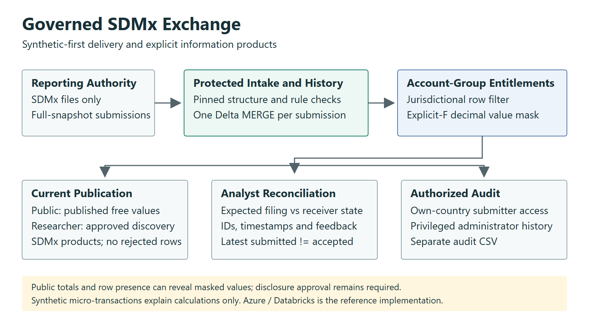

# Bridging Public Dissemination and Protected Data: A Zero-Trust SDMx Architecture on Azure Databricks

**Executive Brief**

## 1. The Decision

**A technology-agnostic delivery and information-governance pattern, demonstrated on Azure and Databricks.**

**Author:** Botlhale Mosweu. **Project steward:** Augmenta Systems (13668754 Canada Inc.). Developed in a personal capacity; no employer, central bank, statistical institution or vendor sponsorship is implied.

Consider a bounded pilot when an organization needs external specialists to implement a governed data workflow without giving them confidential production records. Provide an approved synthetic schema, sample lifecycle cases and an explicit access matrix. Retain production deployment, data-release and risk-acceptance decisions with the institution.

The decision is whether this delivery pattern reduces engagement and handover friction for a specific workload. It is not whether a synthetic demonstration proves production readiness.

## 2. Who Gets What

| Persona | Visible Observations | Measure Access |
| --- | --- | --- |
| Public | Current published, explicitly free | Free values only |
| Researcher | Current published structure across countries | Restricted values withheld unless separately entitled |
| Regional submitter | Own published/rejected filings plus public foreign observations | Own values in full; public foreign values |
| Administrator | All countries and lifecycle history | Full access under privileged governance |

Researcher discovery creates a basis for requesting an agreement with the originating country. It does not confer permission to access a restricted measure. Multiple memberships combine explicitly; offboarding must remove every relevant entitlement and control-plane right.

The **Analyst View** is the regional submitter workflow. Analysts reconcile the latest filing they expect the international organization to hold against actual submission IDs, timestamps, values and validation outcomes. The latest submission and the latest accepted publication are distinct states.

## 3. One Architecture

Synthetic national submissions enter a protected archive. Validation makes a country/period verdict. Delta history separates accepted state from rejected arrivals. Unity Catalog evaluates query-time row and column policies. A gateway serves current SDMx feeds and distinct audit CSVs.

The international intake contract is **SDMx files only**. Synthetic bank micro-transactions are educational fixtures explaining the calculation of realistic observations; they are not a client intake requirement or system deliverable. Domestic granular-data collections are outside this modeled exchange.

The image describes the architecture, not proof of physical country residency or complete confidentiality protection. The demonstrator uses a shared workspace with logical jurisdiction boundaries.

## 4. A Revision That Matters

An accepted CA filing contains two observations: `1.111` and `2.222`. A later accepted full replacement contains only the first, revised to `3.333`.

The replacement closes both previous current records and inserts the new snapshot in one Delta transaction. The omitted observation becomes non-current, while unrelated US observations and other periods remain unchanged.

A rejected replacement does not close accepted records. Its rows retain the submission ID, submitted/received timestamps, failed observation rule and batch rejection reason. Replaying that message adds no duplicate; a genuinely new identical message remains a distinct filing.

Three decimal places are this demonstration's explicit profile, not a universal SDMx rule. Original arrivals preserve the source evidence.

## 5. Evidence and Limits

| Demonstrated on Synthetic Data | Production Acceptance Required |
| --- | --- |
| Local failure injection and live UC policy-binding checks | Legacy migration and independent control acceptance |
| Decimal fidelity, code rejection, official JSON Schema checks | Full provisioning/content constraints and independent rule review |
| Local and live Delta replay and smaller-replacement checks | Distributed conflicts, recovery and production-volume measurements |
| Live persona SQL/API checks, public exports, provisioning and teardown | Institution-specific identity, disclosure and operational acceptance |

**Open challenge:** published totals and the existence of a researcher-visible observation can reveal a masked value. Community reconstruction tests using synthetic data are invited. Restrict or remove the Researcher role if row presence makes inference trivial; public-only totals also require disclosure review. RLS and masking do not replace approved statistical disclosure control.

Detailed methods and unresolved gates are in [Release Evidence](RELEASE_EVIDENCE.md). Historical screenshots are labelled historical, not fresh release results.

## 6. Operating Ownership

**Data authority:** Owns confidentiality classification, allowable use, secondary suppression, sender contracts and release approval.

**Platform owner:** Owns service principals, policies, deployment, backups, observability, access reviews and incident response. Resources must not depend on the contractor's personal identity.

**External specialist:** Builds against synthetic contracts, supplies executable tests and migration evidence, and hands over code and operational knowledge without requiring standing production access.

**Independent reviewer:** Approves promotion and residual risk. PR tests carry no cloud credentials; privileged plans and deployments use a protected manual gate.

Full offboarding reviews groups, sessions, tokens, Azure/vault/GitHub rights and delegated ownership. A group removal is one control, not the whole process.

The [Nature of Engagement and Handover](ENTERPRISE_ONBOARDING_PLAYBOOK.md) assigns repository, permission, acceptance and operational responsibilities from discovery through client-controlled deployment.

## 7. Investment and Roadmap

**Discovery:** Agree the synthetic contract, access matrix, snapshot semantics, residency requirements and evaluation measures. Compare retaining the current system, extending established SDMx tooling, and an Azure-native pilot.

**Bounded pilot:** Fund implementation and independent control review within an agreed time and spending ceiling. Default to single-node evaluation; larger compute and Photon require a separate cost decision. Measure onboarding effort, time to accepted/rejected feedback, replay recovery, query latency, and cost per accepted submission.

**Assurance:** Rehearse protected migration, test the live persona matrix, recovery and offboarding, validate disclosure control, and obtain legal/provenance clearance.

**Reference evaluation:** successful provisioning took approximately **75 minutes including prerequisites**; teardown took **30 minutes**. The deploy/test/teardown cycle cost **US$10 or less in Azure charges**. This is an observed synthetic-workload result, not a production estimate or guaranteed price. [Measurement scope](RELEASE_EVIDENCE.md#reference-evaluation-metrics).

**Technology options:** Terraform module/provider boundaries support AWS, GCP, Microsoft Fabric and open-source alternatives. Identity, policy enforcement, storage and lifecycle adapters must be implemented and acceptance-tested; the Azure/Databricks code is not portable unchanged.

**Operational adoption:** Requires accepted controls, recurring-cost estimates and an accountable client operating team.

## 8. What to Ask Next

Which access and revision cases would your architecture board require before permitting a pilot? Can an external contributor reproduce them without production data? Who accepts the statistical disclosure risk? Who owns the delivered runtime after the engagement ends?

The contribution is a transparent integration and delivery example, complementing SDMx registries, reference infrastructure and pysdmx. It is not a claim that other organizations lack these controls or that this architecture is globally novel.

[Repository](https://github.com/botlhale/sovereign-shield) | [Companion White Paper](whitepaper/Bridging_Public_Dissemination_and_Protected_Data.md) | [Evidence and migration](RELEASE_EVIDENCE.md)

**Independent work:** Synthetic data and public standards only. Not affiliated with, sponsored by, or representative of the Bank of Canada, Federal Reserve System, BIS, or any official statistical institution. This brief is a decision aid, not legal advice, production accreditation, or an offer of institutional endorsement.