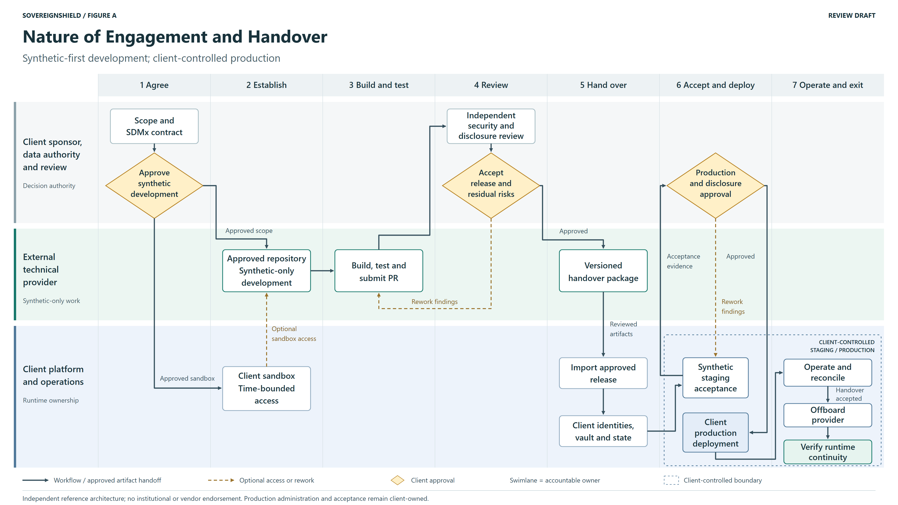
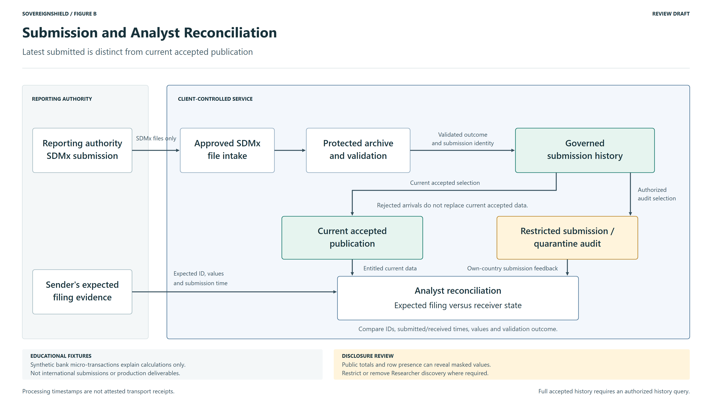

# Engagement Diagrams for Review

These two diagrams implement the revised
[engagement image specification](../../ENGAGEMENT_WORKFLOW_IMAGE_PROMPT.md).
They are manually laid out, editable SVG diagrams with **3840x2160 PNG renders**,
not additional Gemini outputs. Both carry a review-draft label and remain separate
from the six figures currently used in the publications.

## Figure A: Engagement Workflow



[Full-resolution PNG](engagement_workflow.png) | [Editable SVG](engagement_workflow.svg)

Release approval precedes versioned handover and client import. Synthetic staging
supplies evidence to a single production-approval gate; there is no direct
staging-to-production bypass. Client operators accept handover, offboard the
provider and verify runtime continuity. Dashed arrows represent optional sandbox
access or rework, not production-data feedback.

The approved contract covers DSD/codelists, sender and receipt semantics, access,
disclosure, residency and retention. The handover package includes code, licenses,
tests, evidence, runbooks and knowledge transfer. Production identities and state
are client-owned; provider credentials and sandbox state are not transferred.

## Figure B: Submission and Analyst Reconciliation



[Full-resolution PNG](submission_reconciliation.png) | [Editable SVG](submission_reconciliation.svg)

Governed history supplies current accepted publication and restricted submission/
quarantine audit. Analysts consume entitled products and sender-side evidence to
compare expected and actual filing state; they do not produce either product.
The reporting authority and its sender evidence remain distinct from the receiving
client-controlled service. No production data enters a provider development lane.

Synthetic bank micro-transactions are educational calculation fixtures, not an
international intake requirement. Disclosure review remains separate from correct
entitlements: public totals and row existence can reveal restricted values.

## Review and Reproduce

Review the PNGs at full size for text and at the intended slide size for scanning.
The SVGs can be zoomed or edited without raster quality loss. The authoritative
ownership and acceptance sequence remains in
[Nature of Engagement and Handover](../../ENTERPRISE_ONBOARDING_PLAYBOOK.md).

```powershell
.venv\Scripts\python.exe sh/verify_docs.py --render-diagrams --diagram-set review
.venv\Scripts\python.exe -m pytest tests/test_documentation_contract.py
```

The [review manifest](manifest.json) records LF-normalized SVG and binary PNG
SHA-256 digests. Rendering this set does not modify the publication images or their
manifest. Browser/font versions may affect rasterization; the digests identify the
rendered artifact, not a cross-machine pixel-identity guarantee.

Verification covers image dimensions, source/render consistency, exact node/edge
contracts, ownership lanes, text bounds and arrows intersecting unrelated nodes.
Review approval is still required before replacing publication figures. No existing
White Paper or Executive Brief image has been replaced.