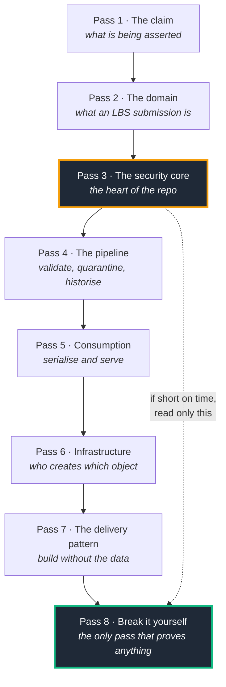

# Technical Guide — how to read this repository

A reading order for someone who wants to understand the system properly, including
the code, rather than deploy it.

**This is not a deployment guide.** [`steps.md`](../steps.md) owns that, and nothing
here duplicates it. You do not need a cloud subscription, credentials, or a
Databricks workspace to complete every pass below — the test suite and the local
Delta mirror run on a laptop, which is itself one of the architectural claims.

---

## Before you start

**Set up once:**

```powershell
python -m venv .venv
.venv\Scripts\pip install -r requirements.txt
.venv\Scripts\python.exe -m pytest tests/ --no-header
```

Expect `59 passed, 2 skipped`. The two skips are the `--live` tests that need a real
workspace. If this passes, every pass in this guide is available to you offline.

**The one idea to hold onto.** Almost every design decision in this repository
follows from a single claim: *entitlement is a property of the table, not of the
application.* When something looks redundant or over-built, ask whether it exists to
keep that claim true. It usually does.

---

## Reading map



If you only have appetite for two passes, do **3** and **8**. Everything else is
supporting structure.

---

## Pass 1 — The claim

Understand what is being asserted before you look at how it is implemented.

| Read | Why |
| --- | --- |
| [README.md § Executive Summary](../README.md) | The three obligations — sovereignty, confidentiality, integrity — and why they conflict |
| [docs/executive_vision.md](executive_vision.md) | The non-technical framing |
| [docs/ARCHITECTURE_DIAGRAMS.md § 1.1 System Component Architecture](ARCHITECTURE_DIAGRAMS.md) | A renderable diagram of the whole system |
| [docs/LINKEDIN_POST.md](LINKEDIN_POST.md) | The condensed argument, including the defect that motivated the test design |

**Question to leave with:** what would "the application is trusted to follow the
rules" look like, and what specifically goes wrong with it?

---

## Pass 2 — The domain

You cannot evaluate the security model without knowing what a *row* means. The
security predicate reads segment 9 of a dot-separated key; that is meaningless until
you know what segment 9 is.

| Read | Why |
| --- | --- |
| [.github/skills/mvsd_specification.md](../.github/skills/mvsd_specification.md) | The Minimal Viable Synthetic Dataset — what the fixture must contain and why |
| [.github/skills/sdmx_lbs_validation.md](../.github/skills/sdmx_lbs_validation.md) | SDMX 3.0 and the BIS LBS structure in brief |
| [data/ca_submission_2026_Q1.xml](../data/ca_submission_2026_Q1.xml) | An actual submission. Read one. |
| [src/generate_sovereign_submissions.py](../src/generate_sovereign_submissions.py) | Docstring first — it explains the CA (clean), US (dirty), GB (three corrupted groups) scenarios |

**Key detail:** `TIME_SERIES_CODE` is a dot-separated SDMX key. Segment 9 is the
reporting country. Segment 9 is the entire basis of sovereign isolation, so it is
worth being certain you can locate it in a real key.

**Question to leave with:** why does §5.2 of the MVSD require confidential rows in
*more than one* jurisdiction?

---

## Pass 3 — The security core

The heart of the repository. Read these four files in this order, as one sitting.

### 3.1 The policy itself

[src/unity_catalog_triple_lock.sql](../src/unity_catalog_triple_lock.sql) — 221 lines,
and the most important file here. The comment block at
[L85](../src/unity_catalog_triple_lock.sql#L85) states the persona matrix; the
function below it implements it.

Read `fn_rls_lbs_multi_persona_lock` closely and notice three things:

1. **Every branch is an `is_account_group_member` call.** There is no `ELSE`. No
   membership means no branch matches, the predicate is `FALSE`, and the caller gets
   zero rows. Public is an explicit group, not a fall-through.
2. **The tiers are composed with `OR`, not `CASE`.** Privileges are additive, so a
   principal holding two memberships gets the union rather than whichever branch the
   optimiser reaches first.
3. **`try_element_at`, not `element_at`.** Under ANSI mode an out-of-range index
   raises and would abort every query against the table. The `coalesce` to `FALSE`
   makes a malformed key *invisible* rather than universally visible.

Then read `fn_ddm_obs_conf_mask` above it, and ask why it re-checks segment 9 when
the row filter has already run. The answer is the subject of Pass 8.

### 3.2 The matrix explained

[.github/skills/persona_security_matrix.md](../.github/skills/persona_security_matrix.md)
— the prose companion. Two passages matter most:

- [L41](../.github/skills/persona_security_matrix.md#L41) — why the public tier is a
  group rather than an absence, and why that makes anonymous entitlement auditable in
  Entra ID like any other.
- [L146](../.github/skills/persona_security_matrix.md#L146) — the mask defect, its
  provenance, and why a single-country corpus cannot detect it.

Also read [.github/skills/triple_lock_security.md](../.github/skills/triple_lock_security.md)
for the three locks as a set.

### 3.3 The mirror

[src/uc_query.py](../src/uc_query.py) — read the module docstring, then
`_apply_persona` at [L452](../src/uc_query.py#L452).

This is a pandas re-implementation of the SQL you just read, used so the security
model can be tested without a workspace. Compare the two line by line. **When they
disagree, the SQL is correct and the mirror is a bug** — the `--live` run exists to
catch exactly that drift.

Note the module docstring's explanation of why reads go to the base table and never
to a view: a Unity Catalog view resolves group membership against the *view owner*,
so filtering in a view would hand every visitor the owner's entitlement.

### 3.4 The proof

[tests/test_persona_access_matrix.py](../tests/test_persona_access_matrix.py) — 261
lines. Read [tests/conftest.py](../tests/conftest.py) first for the `PERSONA_GROUPS`
mapping and the corpus design.

Four tests carry most of the weight:

| Test | What it defends |
| --- | --- |
| [`test_dual_membership_still_masks_foreign_confidential`](../tests/test_persona_access_matrix.py#L140) | The cross-sovereign leak. The only persona that can reach a foreign confidential row is one holding *both* submitter and researcher membership — so this is the only test where the mask, not the row filter, is the control of record |
| [`test_principal_with_no_group_sees_nothing`](../tests/test_persona_access_matrix.py#L253) | Fail-closed. Off-boarding and inter-sovereign isolation are the same code path |
| [`test_malformed_key_fails_closed`](../tests/test_persona_access_matrix.py#L260) | A ragged key becomes invisible, not universally visible |
| [`test_secret_decoupling.py`](../tests/test_secret_decoupling.py) | No credential literal exists anywhere in the repository |

**Question to leave with:** which single test would still pass if you deleted the
column mask entirely? (Answer in Pass 8.)

---

## Pass 4 — The pipeline

How a submission becomes a row, and what happens when it is wrong.

| Read | Why |
| --- | --- |
| [src/sdmx_rule_validator.py](../src/sdmx_rule_validator.py) | Docstring first. The rulebook is parsed at runtime from the published BIS workbook, so a standards revision needs no code change |
| [.github/skills/scd2_engine.md](../.github/skills/scd2_engine.md) | The historisation state machine in prose |
| [src/scd2_merge_engine.py](../src/scd2_merge_engine.py) | The PySpark/Delta engine that runs for real |
| [src/local_pandas_scd2.py](../src/local_pandas_scd2.py) | The laptop fixture for the same state machine |
| [docs/ARCHITECTURE_DIAGRAMS.md § 1.2](ARCHITECTURE_DIAGRAMS.md) | The ingestion and quarantine sequence, rendered |

**The rule that matters most:** validation is atomic at the *batch* level, keyed by
`(reporting country, reporting quarter)`. One violated check quarantines every row in
that country-quarter — not just the offending row. The totals that reconcile depend
on the components that did not, so publishing the clean subset would publish an
inconsistency.

**The failure mode this prevents:** a rejected submission must degrade to *stale*
data, never *missing* data. The previously published figure stays live and the
rejection is recorded for audit. Get this backwards and there is no error — you have
silently deleted a published series.

⚠️ **A trap.** `local_pandas_scd2.py` uses `effective_start_date` / `is_current`
while the macro path and the SQL use `VALID_FROM` / `IS_CURRENT`. This is deliberate
and documented in its docstring; the fixture creates its own tables. Do not
"fix" it.

---

## Pass 5 — Consumption

| Read | Why |
| --- | --- |
| [src/api_gateway.py](../src/api_gateway.py) | Docstring first — the two-tier consumption model |
| [src/sdmx_ml_exporter.py](../src/sdmx_ml_exporter.py) | SDMX-ML 3.0, SDMX-JSON, SDMX-CSV serialisation, with a dependency-free fallback writer |
| [src/portal_ui.py](../src/portal_ui.py) | Only the shell renders server-side |
| [README.md § 7 The Public Data Portal](../README.md) | The portal and REST gateway in context |

**The load-bearing sentence,** from the gateway docstring:

> The gateway decides *which identity* a query runs as; Unity Catalog decides *what
> that identity may see*.

There is no persona filtering anywhere in `api_gateway.py`. That absence is the
design. If this file were fully compromised, the metastore would still refuse to
return a quarantined or confidential observation to an unentitled caller.

**On anonymity:** a Databricks App always sits behind workspace SSO, so the "public"
tier there is an authenticated visitor with no sovereign entitlement. Genuinely
anonymous access needs Azure Container Apps in front —
[README.md § 8](../README.md) and
[terraform/modules/dissemination_gateway](../terraform/modules/dissemination_gateway/main.tf).

---

## Pass 6 — Infrastructure

| Read | Why |
| --- | --- |
| [docs/ENTERPRISE_ONBOARDING_PLAYBOOK.md § Ownership split](ENTERPRISE_ONBOARDING_PLAYBOOK.md) | Read this **before** the Terraform |
| [docs/ARCHITECTURE_DIAGRAMS.md § 1.1a Ownership boundary](ARCHITECTURE_DIAGRAMS.md) | The same boundary, drawn |
| [terraform/main.tf](../terraform/main.tf) | Module composition — start here, only 59 lines |
| [terraform/modules/identity/main.tf](../terraform/modules/identity/main.tf) | Entra groups, service principals, Key Vault |
| [terraform/modules/unity_catalog_governance/](../terraform/modules/unity_catalog_governance/main.tf) | Catalog, schema, and the broad grants |
| [src/apply_security.py](../src/apply_security.py) | Docstring explains the two-script, two-plane split |

**The boundary, stated once:**

- **Terraform owns the infrastructure and access-control plane** — catalogs, schemas,
  storage credentials, external locations, SQL warehouses, Entra ID groups, service
  principals, and broad RBAC (`USE CATALOG`, `USE SCHEMA`, `SELECT`).
- **The bundle and `unity_catalog_triple_lock.sql` own the data and policy plane** —
  table DDL, the policy UDFs, and attaching or detaching row filters and column masks.

Violating this in either direction produces a resource fight where one plane reverts
the other. It is also why teardown must run in a specific order: a leftover row
filter blocks the catalog destroy.

⚠️ **A trap.** The `sh/` scripts are a quickstart, not the deployment path. See
[README.md § The `sh/` scripts are a quickstart](../README.md). If you read them as
the source of truth you will build a mental model the Terraform contradicts.

---

## Pass 7 — The delivery pattern

The claim that is genuinely unusual, and the one most worth interrogating.

| Read | Why |
| --- | --- |
| [.github/skills/contractor_zero_trust_workflow.md](../.github/skills/contractor_zero_trust_workflow.md) | The Skill-Driven Zero-Access Contractor Delivery Pattern |
| [tests/test_contractor_isolation.py](../tests/test_contractor_isolation.py) | The pattern asserted in code |
| [docs/ENTERPRISE_ONBOARDING_PLAYBOOK.md](ENTERPRISE_ONBOARDING_PLAYBOOK.md) | All five phases, including § Where this model stops |
| [.github/workflows/promote.yml](../.github/workflows/promote.yml) | OIDC federation, no stored secret |
| [README.md § Safe Engagement & Clean Handover](../README.md) | The handover and the cut-off |

**The argument:** the specialist you need for confidential data work is, by
definition, someone who should not have the data. So build against a synthetic
dataset specified by the client, hand over, and revoke. Revocation is three
actions — rotate the service principal, drop the Key Vault access, remove the group
memberships — and none of them touch code, because row filters grant only on
*positive* membership.

**Interrogate it here:** read § Where this model stops in the playbook. The pattern
has real limits and they are stated rather than hidden. A model whose limitations are
not documented is a sales pitch.

---

## Pass 8 — Break it yourself

Nothing before this proves anything. This pass does.

### 8.1 The exercise

Open [src/uc_query.py](../src/uc_query.py), find `_apply_persona`, and remove the
segment-9 re-check from the masking logic — make it mask on the confidentiality flag
and group membership alone. This reintroduces the original defect.

Run the suite:

```powershell
.venv\Scripts\python.exe -m pytest tests/test_persona_access_matrix.py --no-header
```

**Exactly one test should fail:**
[`test_dual_membership_still_masks_foreign_confidential`](../tests/test_persona_access_matrix.py#L140).

If more than one fails, you removed too much. If **none** fails, you have reproduced
the more interesting half of the original problem — the first test written for this
defect passed against a completely broken mask, because the row filter had already
removed those rows before the mask ran. The assertion was true for the wrong reason.

Restore the file with `git checkout src/uc_query.py`.

### 8.2 Second exercise

Delete one jurisdiction from the corpus fixture in
[tests/conftest.py](../tests/conftest.py) so only one country has confidential rows.
Reintroduce the same defect. Watch the suite pass.

That is the entire argument for §5.2 of the MVSD specification, and it is more
convincing to watch than to read.

### 8.3 What to take from it

> A test you have never watched fail is a test you have not written.

The corollary is the reason the fixture is specified as carefully as the security
model: a test's coverage is bounded by its data, and a single-jurisdiction fixture
makes a cross-border leak undetectable no matter how well written the assertion is.

---

## Traps and gotchas

Collected so you do not have to rediscover them.

| Trap | Reality |
| --- | --- |
| `Principal.persona` returns `"public"` for a group-less caller ([uc_query.py L283](../src/uc_query.py#L283)) | A *display label only*. The row filter still returns zero rows. Cosmetic, not a leak — `may_see_quarantine` correctly returns `False` |
| "Public means unauthenticated" | Public is the explicit group `sg-sovereignshield-public`. The app's own service principal is a member; that is why anonymous visitors see anything |
| Filtering in a Unity Catalog view | Views resolve membership against the **view owner**. Per-caller entitlement must read the base table |
| RLS appears not to work | Row filters and column masks are not evaluated on `SINGLE_USER` compute. `USER_ISOLATION` is mandatory |
| `*_secret_id` Terraform variables | Pointers, not secrets. Excluded from the secret scanner by design |
| The `sh/` scripts | Quickstart only. Terraform is the deployment path |
| `local_pandas_scd2.py` column names | Intentionally different from the macro path. Documented in its docstring |
| The pipeline SPN in the admin group | Required. The SCD2 engine reads the table to find rows to expire; if the filter hid them, every row would look new and history would silently duplicate |

---

## Where to go next

- **To deploy it:** [steps.md](../steps.md), Stage 0 onward.
- **To present it:** [docs/technical_vision.md § Talking points](technical_vision.md)
  and § Anticipated challenges.
- **For the capability inventory:** [.github/skills/SKILLS.md](../.github/skills/SKILLS.md).
- **To challenge it:** § Where this model stops in the
  [playbook](ENTERPRISE_ONBOARDING_PLAYBOOK.md), and § Anticipated challenges in the
  [technical vision](technical_vision.md). Both exist to be argued with.
