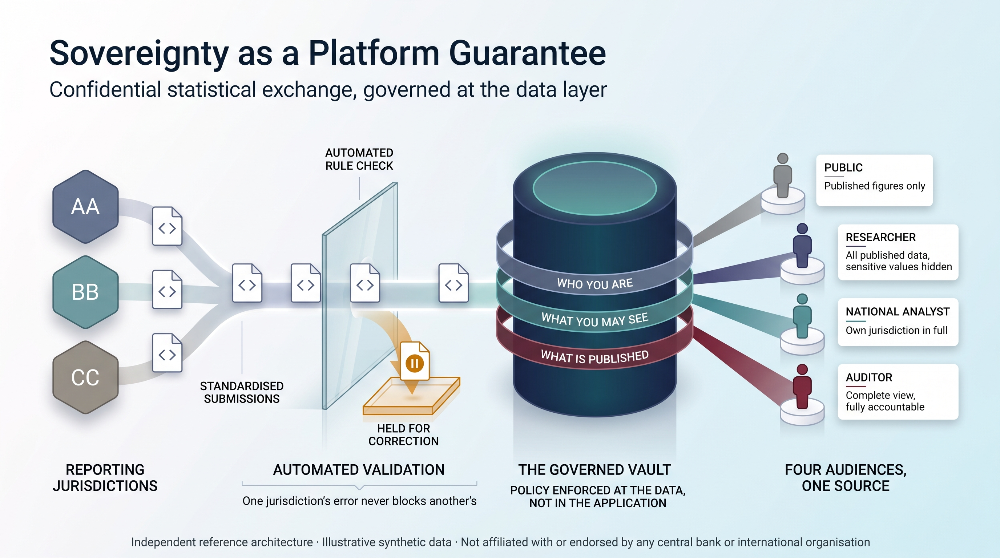
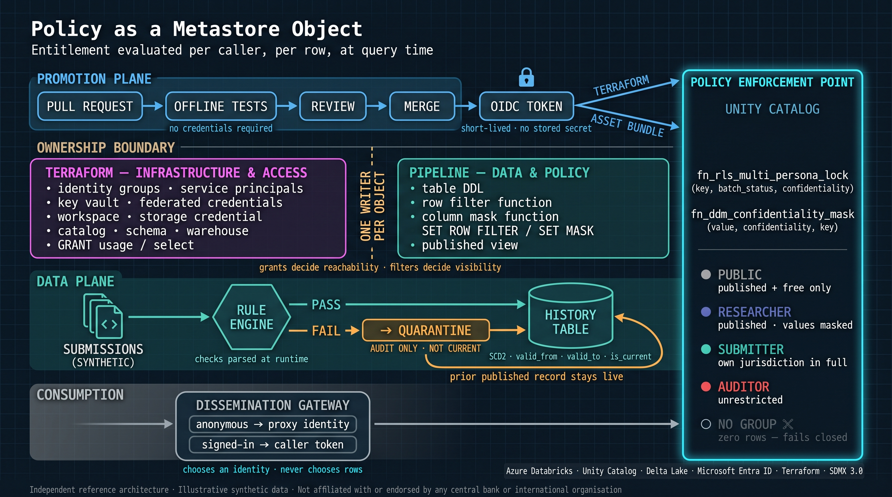

### Executive Whitepaper

# Bridging Public Dissemination and Protected Data: A Zero-Trust SDMx Architecture on Azure Databricks

**Author:** Botlhale Mosweu  
**Role:** Enterprise Data Platform Architect  
**Classification:** Public Reference Architecture  
**Standards:** SDMx 3.0 | BIS Locational Banking Statistics (LBS) | Azure Databricks Unity Catalog  

---

## 1. Executive Summary & The Contractor Dilemma

International financial institutions, central banks, and sovereign statistical bodies face a structural conflict between two fundamental institutional mandates:
1. **Public Statistical Transparency:** The imperative to disseminate macroeconomic and financial indicators openly to researchers, market participants, and member states.
2. **Confidential Sovereign Protection:** The statutory obligation to safeguard confidential, institution-level, and jurisdiction-restricted microdata under strict Zero-Trust governance.

Modernizing legacy statistical platforms to hyperscaler lakehouses typically stalls on **The Contractor Dilemma**: *How can an enterprise engage external systems integrators, specialized consultants, or autonomous engineering agents to build, tune, and test complex data governance and temporal merge engines without exposing confidential sovereign microdata or granting access to production environments?*



*Figure 1 — An external contractor zone holding only a synthetic dataset, separated by an OIDC-federated promotion path from the sovereign production plane, which in turn feeds a public dissemination gateway.*


```text
┌───────────────────────────────────────────────────────────────────────────────────────┐
│                          THE CONTRACTOR DILEMMA & THE AIR-GAP                         │
│                                                                                       │
│   EXTERNAL CONTRACTOR / AGENT DEV ZONE           SOVEREIGN PRODUCTION PLATFORM        │
│  ┌─────────────────────────────────────┐        ┌──────────────────────────────────┐  │
│  │ • Zero Access to Production         │        │ • Live Confidential Microdata    │  │
│  │ • Minimal Viable Synthetic Dataset  │        │ • Confidential Data Plane        │  │
│  │ • Local Tests & Synthetic Schemas   │        │ • Unity Catalog Governed Storage │  │
│  └──────────────────┬──────────────────┘        └──────────────────▲───────────────┘  │
│                     │ Pull Request (Code Only)                     │                  │
│                     ▼                                              │                  │
│  ┌─────────────────────────────────────────────────────────────────┴───────────────┐  │
│  │      OIDC WORKLOAD IDENTITY FEDERATION & SERVICE PRINCIPAL CI/CD ENGINE         │  │
│  │      • Zero Hardcoded Secrets     • Automated Policy Enforcement                │  │
│  └─────────────────────────────────────────────────────────────────────────────────┘  │
└───────────────────────────────────────────────────────────────────────────────────────┘

```

To resolve this bottleneck, I architected **Sovereign Shield**—an independent, open-source reference implementation combining **SDMx 3.0** open statistical standards with **Azure Databricks Unity Catalog**. 

Sovereign Shield demonstrates an end-to-end operating model where external engineering talent delivers audit-grade security controls, dynamic masking, and temporal merges against an authentic Minimal Viable Synthetic Dataset (MVSD). Deployment to the sovereign production plane is executed entirely through air-gapped CI/CD pipelines backed by Entra ID Workload Identity Federation—guaranteeing that zero contractor credentials touch production data.

---

<div style="page-break-after: always;"></div>

## 2. The Dual Consumption Model

International statistical organizations receive data across diverse cadences—ranging from Annual (`A`) and Semi-Annual (`S`) to Quarterly (`Q`) and Monthly (`M`) aggregations. When these feeds land, they contain a mixture of public macro-aggregates and institutionally confidential observations.

Rather than fragmenting data into separate physical databases for public and internal use, I implemented a **Unified Storage, Dual-Tier Consumption Model** powered by Unity Catalog and a decoupled gateway.

```text
                              ┌─────────────────────────────────┐
                              │   Incoming Multi-Frequency Feed │
                              │   (Annual, Quarterly, Monthly)  │
                              └────────────────┬────────────────┘
                                               │
                                               ▼
                              ┌─────────────────────────────────┐
                              │   Unified Governed Lakehouse    │
                              │   (Delta Lake / Unity Catalog)  │
                              └────────────────┬────────────────┘
                                               │
                     ┌─────────────────────────┴─────────────────────────┐
                     ▼                                                   ▼
   ┌───────────────────────────────────┐               ┌───────────────────────────────────┐
   │     ANONYMOUS PUBLIC TIER         │               │     AUTHENTICATED MEMBER TIER     │
   │  • No Credentials Required        │               │  • Entra ID Authenticated         │
   │  • Filtered: OBS_CONF = 'F'       │               │  • Dynamic RLS by REP_CTY         │
   │  • Public Portal Consumption      │               │  • Confidential Values -> NULL    │
   └───────────────────────────────────┘               └───────────────────────────────────┘
```

### The Perimeter Identity Problem
Databricks Apps enforce mandatory Entra ID Single Sign-On (SSO), making an anonymous, public-facing dissemination tier impossible to host natively inside the workspace. To bridge this boundary securely, I designed the **Public Dissemination Gateway & Multi-Tenant Consumer Tier**:
* **The Public Ingestion Route:** Unauthenticated researchers query the gateway via lightweight APIs, interacting with published, non-confidential observations (`OBS_CONF = 'F'`) served through high-concurrency Databricks SQL Serverless Warehouses.
* **The Member/Researcher Route:** Authenticated users pass OAuth2/JWT tokens through the gateway. Unity Catalog intercepts the session, dynamically evaluating user claims against session attributes and returning granular data without risk of cross-tenant leakage.

---

<div style="page-break-after: always;"></div>

## 3. The Triple-Lock Security Blueprint

At the core of the data plane sits the **Triple-Lock Governance Architecture**, implemented natively within Unity Catalog SQL functions and Entra ID security claims.



*Figure 2 — The Unity Catalog policy enforcement point: row filter and column mask signatures above the persona list, ending in "no group — zero rows, fails closed".*

```text
┌────────────────────────────────────────────────────────────────────────────────────────┐
│                          TRIPLE-LOCK SECURITY ARCHITECTURE                             │
│                                                                                        │
│   LOCK 1: ROW-LEVEL FILTER           LOCK 2: DYNAMIC COLUMN MASK     LOCK 3: ABAC TAGS │
│  ┌─────────────────────────┐        ┌─────────────────────────┐    ┌─────────────────┐ │
│  │ Is Regional Reporter?   │        │ Is Value Confidential?  │    │ Sovereign Tag   │ │
│  │   YES ──▶ Own Country   │        │   YES ──▶ Output NULL   │    │ Classification  │ │
│  │   NO  ──▶ Group Tier    │        │   NO  ──▶ Raw Value     │    │ Cryptographic   │ │
│  │ No group ──▶ ZERO ROWS  │        │ Central Auditor: RAW    │    │ Lineage Trace   │ │
│  └─────────────────────────┘        └─────────────────────────┘    └─────────────────┘ │
└────────────────────────────────────────────────────────────────────────────────────────┘

```

### The Persona Matrix
I established four entitled enterprise roles, mapped to Entra ID Security Groups and enforced at runtime — plus a fifth case that matters more than any of them:

1. **Anonymous Public Consumer (`sg-sovereignshield-public`):**  
   Access is restricted strictly to published observations explicitly marked free for publication (`OBS_CONF = 'F'`). All confidential rows are filtered out before the scan returns.
2. **Authenticated Researcher (`sg-sovereignshield-researchers`):**  
   Access extends across all published macro-aggregates. However, any record where `OBS_CONF` is `C` or `N` has its `OBS_VALUE` dynamically replaced with `NULL` — the universal statistical standard for redacted observations.
3. **Regional Reporting Submitter (`sg-sovereignshield-submitter-{cty}`):**  
   Row-Level Security grants full, unmasked access strictly to observations originating from the submitter's designated jurisdiction, read from segment 9 of the SDMx key. For foreign jurisdictions the submitter inherits the public tier: published, free-to-publish observations only.
4. **Central Auditor / Administrator (`sg-sovereignshield-admin`):**  
   Full, unmasked access across all jurisdictions and all lifecycle states, including quarantined batches, for regulatory oversight.
5. **No recognised membership — zero rows.**  
   Every branch of the filter grants on *positive* group membership and there is no `ELSE`. A principal in none of the groups matches nothing, the predicate is `FALSE`, and the query returns nothing. The public tier is an explicit group, not a fall-through default, which is why off-boarding a contractor and enforcing sovereignty between two nations are the same mechanism.

The implementation below is the one that ships, reproduced verbatim from
`src/unity_catalog_triple_lock.sql`:

```sql
-- Dynamic column mask.
--
-- time_series_code is an input, not decoration. Without it the function knows a
-- value is confidential but not *whose* it is, so any submitter would unmask
-- every other jurisdiction's restricted cells. Segment 9 is L_REP_CTY.
CREATE OR REPLACE FUNCTION fn_ddm_obs_conf_mask(
  obs_val DOUBLE,
  obs_conf STRING,
  time_series_code STRING
)
RETURNS DOUBLE
RETURN CASE
  WHEN is_account_group_member('sg-sovereignshield-admin') THEN obs_val
  WHEN is_account_group_member('sg-sovereignshield-submitter-ca')
    AND coalesce(try_element_at(split(time_series_code, '\\.'), 9) = 'CA', FALSE) THEN obs_val
  WHEN is_account_group_member('sg-sovereignshield-submitter-us')
    AND coalesce(try_element_at(split(time_series_code, '\\.'), 9) = 'US', FALSE) THEN obs_val
  WHEN upper(coalesce(obs_conf, '')) IN ('C', 'N') THEN NULL
  ELSE obs_val
END;

-- Multi-column row-level filter. Tiers are composed with OR rather than
-- CASE/WHEN so privileges are additive: a principal holding two memberships
-- receives the union, not whichever branch evaluates first.
CREATE OR REPLACE FUNCTION fn_rls_multi_persona_lock(
  time_series_code STRING,
  batch_status STRING,
  obs_conf STRING
)
RETURNS BOOLEAN
RETURN
  is_account_group_member('sg-sovereignshield-admin')
  OR (
    is_account_group_member('sg-sovereignshield-researchers')
    AND upper(coalesce(batch_status, '')) = 'PUBLISHED'
  )
  OR (
    (
      is_account_group_member('sg-sovereignshield-public')
      OR is_account_group_member('sg-sovereignshield-submitter-ca')
      OR is_account_group_member('sg-sovereignshield-submitter-us')
    )
    AND upper(coalesce(batch_status, '')) = 'PUBLISHED'
    AND upper(coalesce(obs_conf, '')) = 'F'
  )
  OR (
    is_account_group_member('sg-sovereignshield-submitter-ca')
    AND coalesce(try_element_at(split(time_series_code, '\\.'), 9) = 'CA', FALSE)
  )
  OR (
    is_account_group_member('sg-sovereignshield-submitter-us')
    AND coalesce(try_element_at(split(time_series_code, '\\.'), 9) = 'US', FALSE)
  );
```

Two details carry disproportionate weight. `try_element_at` is used instead of `element_at` because under ANSI mode an out-of-range index raises `INVALID_ARRAY_INDEX`, which would abort every query against the table if a malformed key were ever persisted; the `coalesce` turns the resulting `NULL` into `FALSE`, so a malformed row is invisible rather than universally visible. And the mask re-checks segment 9 rather than trusting the group name — an earlier draft of this function omitted that check, and the resulting cross-sovereign exposure is undetectable against a single-jurisdiction test corpus.

---

<div style="page-break-after: always;"></div>

## 4. Declarative Governance: Separation of Concerns

To prevent declarative state drift and pipeline locks, I enforced a strict architectural separation of concerns between infrastructure provisioning and data plane modeling.

```
┌────────────────────────────────────────────────────────────────────────────────────────┐
│                               SEPARATION OF CONCERNS                                   │
│                                                                                        │
│   TERRAFORM (Infrastructure Control Plane)     DATABRICKS ASSET BUNDLES (Policy Plane) │
│  ┌──────────────────────────────────────┐     ┌─────────────────────────────────────┐  │
│  │ • Storage Accounts & Metastore       │     │ • Table DDL & Schema Migrations     │  │
│  │ • Catalogs & Schemas                 │     │ • Policy UDF Functions              │  │
│  │ • Service Principals & Entra Groups  │     │ • ALTER TABLE SET ROW FILTER / MASK │  │
│  │ • High-Level Grants (USE_CATALOG)    │     │ • PySpark Pipeline Jobs & DABs      │  │
│  └──────────────────────────────────────┘     └─────────────────────────────────────┘  │
└────────────────────────────────────────────────────────────────────────────────────────┘

```

* **Terraform owns the Infrastructure Control Plane:** Metastore bindings, catalogs, schemas, storage credentials, external locations, SQL warehouses, Azure Key Vault, and broad identity grants (`USE CATALOG`, `USE SCHEMA`). Terraform never manages table-level row filters or column masks.
* **Databricks Asset Bundles (DABs) & SQL own the Data & Policy Plane:** Table DDL, policy UDF logic, row filter attachments (`SET ROW FILTER`), and column mask attachments (`SET MASK`) are version-controlled alongside pipeline logic in `unity_catalog_triple_lock.sql`.
* **Zero-Secret Decoupling:** The codebase contains zero client secrets, tokens, or private keys. GitHub Actions authenticates to Azure Entra ID using **OpenID Connect (OIDC)** and Workload Identity Federation. At runtime, Databricks accesses external keys through Azure Key Vault-backed secret scopes.

---

<div style="page-break-after: always;"></div>

## 5. Temporal Integrity & SDMx Compliance

Statistical reporting data is non-destructive; retrospective revisions are common as member institutions re-evaluate balance sheet exposure. A robust platform must maintain a complete historical audit trail without breaking downstream analytics.

```
┌───────────────────────────────────────────────────────────────────────────────────────┐
│                    DISTRIBUTED SCD TYPE 2 TEMPORAL MERGE ENGINE                       │
│                                                                                       │
│   Incoming Revision (2024-Q1, Obs: 120.5)                                             │
│   Existing Record:   [Key: CA-BANK | Valid: 2024-01-01 -> 9999-12-31 | Current: TRUE] │
│                                                                                       │
│                                      MERGE                                            │
│                                        ▼                                              │
│   Historical Record: [Key: CA-BANK | Valid: 2024-01-01 -> 2024-03-31 | Current: FALSE]│
│   Current Record:    [Key: CA-BANK | Valid: 2024-04-01 -> 9999-12-31 | Current: TRUE] │
└───────────────────────────────────────────────────────────────────────────────────────┘

```

* **Distributed Delta Merge:** The engine (`scd2_merge_engine.py`) executes high-efficiency PySpark Delta Lake `MERGE` operations, tracking temporal validity through `valid_from`, `valid_to`, and `is_current` flags without row duplication.
* **Domain Validation:** Ingested records are checked against the SDMx 3.0 Data Structure Definition (DSD) using `pysdmx` object models, validating mandatory dimensions (`FREQ`, `L_REP_CTY`, `L_POS_TYPE`, `L_MEASURE`, `L_TYPE`, `L_REP_BANK_TYPE`, `L_CP_SECTOR`, `L_CP_CTY`, `CURR_TYPE`) and observation attributes before data enters the Silver tier.

---

<div style="page-break-after: always;"></div>

## 6. Operational Playbook & Scale Strategy

```
┌────────────────────────────────────────────────────────────────────────────────────────┐
│                        THREE-PHASE AIR-GAPPED ONBOARDING                               │
│                                                                                        │
│   PHASE 1: CLIENT SETUP           PHASE 2: CONTRACTOR BUILD      PHASE 3: PROMOTION    │
│  ┌────────────────────────┐      ┌─────────────────────────┐    ┌───────────────────┐  │
│  │ Client defines schema  │─────▶│ Contractor receives     │───▶│ CI/CD deploys via │  │
│  │ metadata & generates   │      │ MVSD fixture and builds │    │ Service Principal │  │
│  │ synthetic MVSD fixture │      │ security/SCD2 logic     │    │ to Production     │  │
│  └────────────────────────┘      └─────────────────────────┘    └───────────────────┘  │
└────────────────────────────────────────────────────────────────────────────────────────┘

```

### The Minimal Viable Synthetic Dataset (MVSD) Protocol

Hiring organizations do not need to share internal records to initiate development:

1. The enterprise extracts structural metadata from its DSD or schema catalog.
2. The mock generator (`src/generate_sovereign_submissions.py`) produces an authentic synthetic fixture exercising all security branches: multi-country jurisdictions, public vs. confidential flags, revision cycles, and deliberately malformed rows.
3. External contractors build and validate all SQL, PySpark, and Terraform logic against the MVSD using local test harnesses.

### Cluster Sizing & Enterprise Scale

Single-node compute is a **cost choice, not an architectural constraint**. Row filters and column masks are evaluated inside the query engine, so the security model behaves identically at any cluster size.

* **Sandbox Evaluation:** The complete architecture runs on a single-node `USER_ISOLATION` cluster (`worker_count_max = 0`), keeping evaluation inexpensive for an organization or an external contractor assessing the controls.
* **Enterprise Production:** For international bodies processing high-volume feeds across dozens of jurisdictions, compute scales without code changes. Setting `worker_count_min`/`worker_count_max` (typically 2–16), `node_type_id` to a memory-optimised family such as `Standard_E8ds_v5`, and `enable_photon = true` widens the ingestion envelope through the Terraform-managed cluster policy.
* **Dissemination:** Databricks SQL Serverless scales independently, by size (Medium through 2X-Large) for heavy individual scans and by `sql_warehouse_max_clusters` for concurrent readers. Concurrency and scan cost are separate levers, and a public dissemination tier usually needs the second one first.
* **Stress Test Verification:** The platform includes a scale harness (`src/generate_stress_test_data.py`) that produces a reproducible 100,000+ observation corpus spanning seven jurisdictions and all four reporting cadences, with configurable confidentiality and revision rates. `tests/test_scale_and_stress.py` asserts that entitlement enforcement stays vectorised and roughly linear in row count, and that SCD2 interval integrity holds at volume.

> **Measurement note.** The published figures are the corpus shape and the linearity assertion, both reproducible offline. Latency under concurrent multi-user load on production-sized hardware has not been benchmarked here, and is not claimed.

---

<div style="page-break-after: always;"></div>

## Conclusion

Sovereign Shield resolves the fundamental trade-off between open data dissemination and sovereign microdata protection. By establishing a decoupled Dissemination Gateway, enforcing Triple-Lock access controls in Unity Catalog, and operationalizing an air-gapped synthetic delivery model, institutions can modernize their data platforms with external talent while maintaining complete mathematical and regulatory certainty over their sensitive assets.