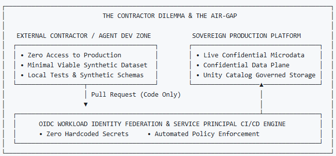
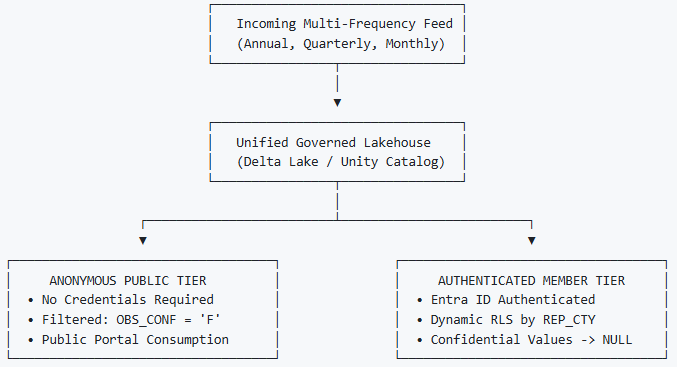
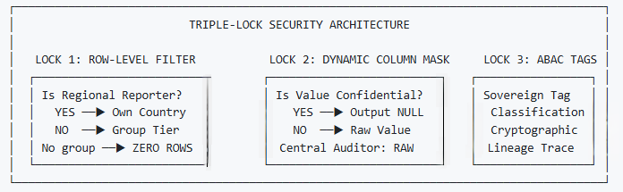
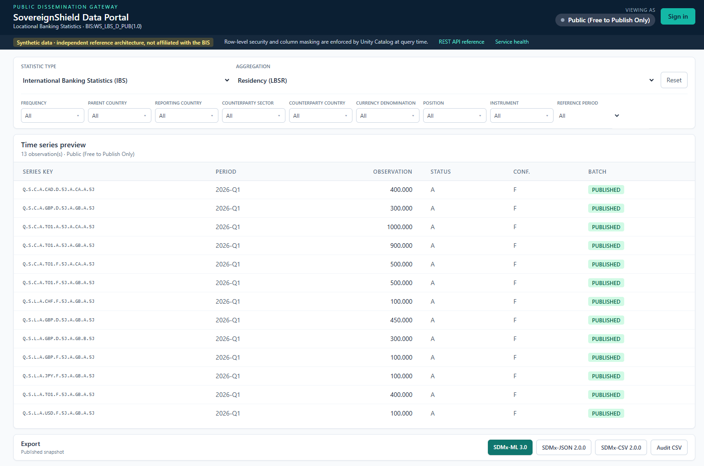
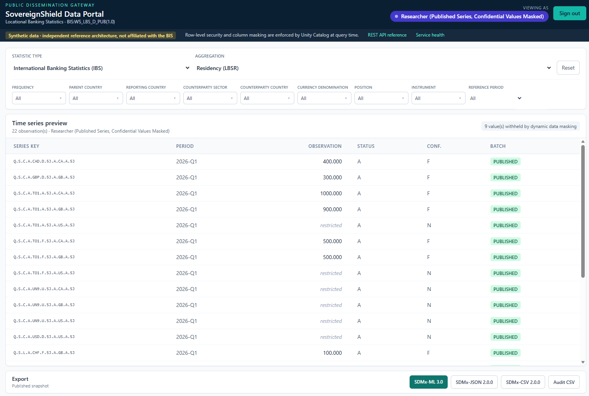
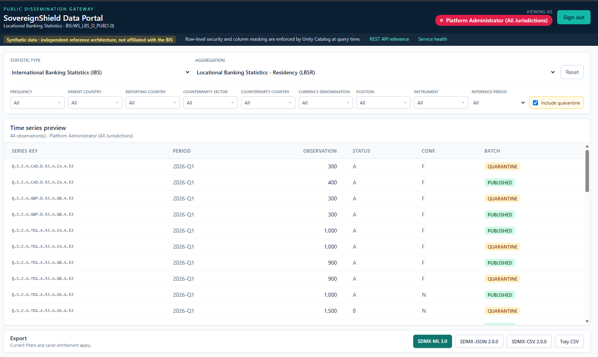
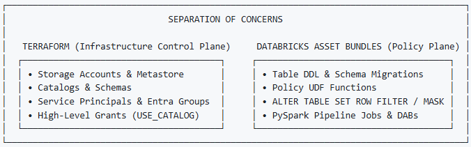
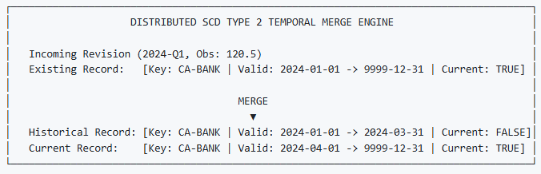
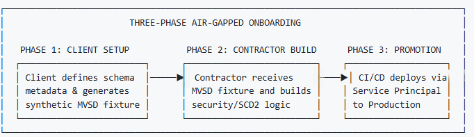

### Executive Whitepaper

# Bridging Public Dissemination and Protected Data: A Zero-Trust SDMx Architecture on Azure Databricks

**Author:** Botlhale Mosweu  
**Role:** Enterprise Data Platform Architect  
**Classification:** Public Reference Architecture  
**Standards:** SDMx 3.0 | BIS Locational Banking Statistics (LBS) | Azure Databricks Unity Catalog  
**Implementation status:** End-to-end reference deployment validated with synthetic data

---

## 1. Executive Summary & The Contractor Dilemma

International financial institutions, central banks, and sovereign statistical bodies face a structural conflict between two fundamental institutional mandates:
1. **Public Statistical Transparency:** The imperative to disseminate macroeconomic and financial indicators openly to researchers, market participants, and member states.
2. **Confidential Sovereign Protection:** The statutory obligation to safeguard confidential, institution-level, and jurisdiction-restricted microdata under strict Zero-Trust governance.

Modernizing legacy statistical platforms to hyperscaler lakehouses typically stalls on **The Contractor Dilemma**: *How can an enterprise engage external systems integrators, specialized consultants, or autonomous engineering agents to build, tune, and test complex data governance and temporal merge engines without exposing confidential sovereign microdata or granting access to production environments?*


*Figure 1 — An external contractor zone holding only a synthetic dataset, separated by an OIDC-federated promotion path from the sovereign production plane, which in turn feeds a public dissemination gateway.*





To resolve this bottleneck, I architected **Sovereign Shield**—an independent, open-source reference implementation combining **SDMx 3.0** open statistical standards with **Azure Databricks Unity Catalog**. 

Sovereign Shield demonstrates an end-to-end operating model where external engineering talent can deliver security controls, dynamic masking, and temporal merges against an authentic Minimal Viable Synthetic Dataset (MVSD). Promotion can use GitHub Actions with Entra ID Workload Identity Federation, while the evaluation deployment uses an authenticated operator and the same declarative Terraform and Asset Bundle definitions. The repository contains no credential literals; an institution still owns the administrative process that decides who may deploy and who may join each data-access group.

---

<div style="page-break-after: always;"></div>

## 2. The Dual Consumption Model

International statistical organizations receive data across diverse cadences—ranging from Annual (`A`) and Semi-Annual (`S`) to Quarterly (`Q`) and Monthly (`M`) aggregations. When these feeds land, they contain a mixture of public macro-aggregates and institutionally confidential observations.

Rather than fragmenting data into separate physical databases for public and internal use, I implemented a **Unified Storage, Dual-Tier Consumption Model** powered by Unity Catalog and a decoupled gateway.





### The Perimeter Identity Problem
Databricks Apps enforce workspace sign-in, so they cannot by themselves provide a genuinely anonymous public endpoint. Sovereign Shield therefore deploys the same FastAPI portal through two hosts:

* **Databricks App:** signed-in workspace users query with an on-behalf-of SQL token. The caller's Databricks account-group memberships reach Unity Catalog unchanged.
* **Azure Container Apps gateway:** anonymous requests query as `spn-sovereignshield-public`, an explicit service principal that belongs only to `sg-sovereignshield-public`. Optional Entra Easy Auth uses `AllowAnonymous`; after sign-in, the browser forwards the caller's Azure Databricks access token to the same API instead of using the public proxy identity.

The gateway chooses an identity, never rows. Unity Catalog applies `is_account_group_member()` at query time and returns only the rows and values allowed for that identity. The portal can export the governed result as SDMx-ML 3.0, SDMx-JSON 2.0.0, SDMx-CSV 2.0.0, or tidy CSV — and the export carries the caller's entitlement rather than a wider one, as the sample messages in §5 show.

---

<div style="page-break-after: always;"></div>

## 3. The Triple-Lock Security Blueprint

At the core of the data plane sits the **Triple-Lock Governance Architecture**, implemented natively within Unity Catalog SQL functions and Entra ID security claims.


*Figure 2 — The Unity Catalog policy enforcement point: row filter and column mask signatures above the persona list, ending in "no group — zero rows, fails closed".*





### The Persona Matrix
I established four entitled enterprise roles, mapped to Entra ID Security Groups and enforced at runtime — plus a fifth case that matters more than any of them:

1. **Public Consumer (`sg-sovereignshield-public`):**
  The anonymous browser is not itself a Databricks identity; the Container Apps gateway maps it to the dedicated public service principal. Access is restricted strictly to published observations explicitly marked free for publication (`OBS_CONF = 'F'`). Confidential rows are excluded from the query result by Unity Catalog.
2. **Authenticated Researcher (`sg-sovereignshield-researchers`):**  
   Access extends across all published macro-aggregates. However, any record where `OBS_CONF` is `C` or `N` has its `OBS_VALUE` dynamically replaced with `NULL` — the universal statistical standard for redacted observations.
3. **Regional Reporting Submitter (`sg-sovereignshield-submitter-{cty}`):**  
   Row-Level Security grants full, unmasked access strictly to observations originating from the submitter's designated jurisdiction, read from segment 9 of the SDMx key. For foreign jurisdictions the submitter inherits the public tier: published, free-to-publish observations only.
4. **Central Auditor / Administrator (`sg-sovereignshield-admin`):**  
   Full, unmasked access across all jurisdictions and all lifecycle states, including quarantined batches, for regulatory oversight.
5. **No recognised membership — zero rows.**  
   Every branch of the filter grants on *positive* group membership and there is no `ELSE`. A principal in none of the groups matches nothing, the predicate is `FALSE`, and the query returns nothing. The public tier is an explicit group, not a fall-through default, which is why off-boarding a contractor and enforcing sovereignty between two nations are the same mechanism.

The implementation below is the one that ships, reproduced verbatim from
`src/unity_catalog_triple_lock.sql`:

```sql
-- Dynamic column mask.
--
-- time_series_code is an input, not decoration. Without it the function knows a
-- value is confidential but not *whose* it is, so any submitter would unmask
-- every other jurisdiction's restricted cells. Segment 9 is L_REP_CTY.
CREATE OR REPLACE FUNCTION fn_ddm_obs_conf_mask(
  obs_val DOUBLE,
  obs_conf STRING,
  time_series_code STRING
)
RETURNS DOUBLE
RETURN CASE
  WHEN is_account_group_member('sg-sovereignshield-admin') THEN obs_val
  WHEN is_account_group_member('sg-sovereignshield-submitter-ca')
    AND coalesce(try_element_at(split(time_series_code, '\\.'), 9) = 'CA', FALSE) THEN obs_val
  WHEN is_account_group_member('sg-sovereignshield-submitter-us')
    AND coalesce(try_element_at(split(time_series_code, '\\.'), 9) = 'US', FALSE) THEN obs_val
  WHEN upper(coalesce(obs_conf, '')) IN ('C', 'N') THEN NULL
  ELSE obs_val
END;

-- Multi-column row-level filter. Tiers are composed with OR rather than
-- CASE/WHEN so privileges are additive: a principal holding two memberships
-- receives the union, not whichever branch evaluates first.
CREATE OR REPLACE FUNCTION fn_rls_multi_persona_lock(
  time_series_code STRING,
  batch_status STRING,
  obs_conf STRING
)
RETURNS BOOLEAN
RETURN
  is_account_group_member('sg-sovereignshield-admin')
  OR (
    is_account_group_member('sg-sovereignshield-researchers')
    AND upper(coalesce(batch_status, '')) = 'PUBLISHED'
  )
  OR (
    (
      is_account_group_member('sg-sovereignshield-public')
      OR is_account_group_member('sg-sovereignshield-submitter-ca')
      OR is_account_group_member('sg-sovereignshield-submitter-us')
    )
    AND upper(coalesce(batch_status, '')) = 'PUBLISHED'
    AND upper(coalesce(obs_conf, '')) = 'F'
  )
  OR (
    is_account_group_member('sg-sovereignshield-submitter-ca')
    AND coalesce(try_element_at(split(time_series_code, '\\.'), 9) = 'CA', FALSE)
  )
  OR (
    is_account_group_member('sg-sovereignshield-submitter-us')
    AND coalesce(try_element_at(split(time_series_code, '\\.'), 9) = 'US', FALSE)
  );
```

Two details carry disproportionate weight. `try_element_at` is used instead of `element_at` because under ANSI mode an out-of-range index raises `INVALID_ARRAY_INDEX`, which would abort every query against the table if a malformed key were ever persisted; the `coalesce` turns the resulting `NULL` into `FALSE`, so a malformed row is invisible rather than universally visible. And the mask re-checks segment 9 rather than trusting the group name — an earlier draft of this function omitted that check, and the resulting cross-sovereign exposure is undetectable against a single-jurisdiction test corpus.

Memberships compose additively. A principal who is both a submitter and a researcher receives the union of the matching row entitlements, while the mask still reveals restricted values only for the principal's own jurisdiction. This is why the functions use independent `OR` branches rather than a first-match `CASE` expression.

### Demonstrated Persona Outcomes

The screenshots below are from one deployed synthetic fixture, not design mock-ups. Every persona queries the same governed history table through the same API.



*Figure 3 — Anonymous public access resolves to the explicit public proxy identity and returns 13 published, free-to-publish observations.*



*Figure 4 — The researcher receives all 22 published series, while Unity Catalog masks nine restricted values.*



*Figure 5 — The administrator can include quarantine and inspect all 44 published and audit-only rows without changing what downstream personas receive.*

---

<div style="page-break-after: always;"></div>

## 4. Declarative Governance: Separation of Concerns

To prevent declarative state drift and pipeline locks, I enforced a strict architectural separation of concerns between infrastructure provisioning and data plane modeling.





* **Terraform owns the Infrastructure Control Plane:** Entra groups and deployment identities, Azure resources, the Databricks workspace, Unity Catalog storage credentials and external locations, catalogs, schemas, SQL warehouses, and grants. The workspace resolves its existing regional metastore attachment through the Databricks provider; this configuration does not create or bind an account-level metastore. Terraform never manages table DDL, row-filter bindings, or column-mask bindings.
* **Databricks Asset Bundles (DABs) & SQL own the Data & Policy Plane:** Table DDL, policy UDF logic, row filter attachments (`SET ROW FILTER`), and column mask attachments (`SET MASK`) are version-controlled alongside pipeline logic in `unity_catalog_triple_lock.sql`.
* **Zero-Secret Source:** The tracked codebase contains no client secrets, tokens, private keys, Terraform variable values, backend configuration, or state. GitHub Actions can authenticate through **OpenID Connect (OIDC)** and Workload Identity Federation. Local orchestration uses the operator's active Azure CLI session. Key Vault holds the public proxy credential and workspace URL; the Container App uses a managed identity to resolve Key Vault references, while the Databricks secret scope stores only a pointer to the vault.

---

<div style="page-break-after: always;"></div>

## 5. Temporal Integrity & SDMx Compliance

Statistical reporting data is non-destructive; retrospective revisions are common as member institutions re-evaluate balance sheet exposure. A robust platform must maintain a complete historical audit trail without breaking downstream analytics.

### Three Data Zones, Three Sensitivity Boundaries

The catalog is divided by what each object represents and who can safely
traverse it:

| Schema | Contents | Access boundary |
| --- | --- | --- |
| `sovereign_submissions` | Governed volume containing SDMx-ML filings and accompanying synthetic micro files | Administrator only; volumes cannot carry row filters or column masks |
| `sovereign_intake` | Institution-level transaction ledger before aggregation and confidentiality decisions | Administrator plus reporting submitters; `fn_rls_micro_country_lock` restricts each submitter to its own country |
| `sovereign_shield` | Macro SCD2 history, policy functions, and published view | All recognised personas can traverse; multi-column RLS and DDM determine rows and values |

This separation prevents a broad schema grant intended for disseminated
aggregates from accidentally making raw files or institution-identifying rows
reachable. The public portal and researcher persona never receive access to the
submission volume or micro ledger.





* **Distributed Delta Merge:** The engine (`scd2_merge_engine.py`) executes high-efficiency PySpark Delta Lake `MERGE` operations, tracking temporal validity through `valid_from`, `valid_to`, and `is_current` flags without row duplication.
* **Two Independent Verdicts:** Confidentiality and quality are decided by different parties, and the platform keeps them separate. The **reporting body** decides confidentiality from a configurable dominance threshold — where one institution contributes most of a series, the observation is marked `OBS_CONF = 'N'` before it ever leaves the jurisdiction. The **receiving organisation** decides acceptance, independently, by re-running the published consistency checks over the file it received. A dominant contributor makes an observation confidential; it does not make the submission wrong.
* **The Submission Is the Contract:** The reporting task authors an SDMx-ML 3.0 file per jurisdiction per cycle; the receiving task reads that file and rules on it. It deliberately does not re-derive the figures from the accompanying microdata — a hub that recomputes is checking its own arithmetic rather than the submission it was sent.
* **Rules Read, Not Transcribed:** `sdmx_rule_validator.py` parses the 21 BIS consistency checks directly from the published workbook (`checks_lbs.xls`) at runtime and evaluates each aggregate against the sum of its reported components. Transcribing them into code would make the platform's rulebook a fork of the standard, drifting silently from it at the next revision.
* **Atomic Verdict, Precise Attribution:** Acceptance is atomic per `(reporting country, reporting period)`. Partial publication is incoherent rather than merely undesirable: the aggregates that reconcile depend on the components that did not. Every observation in a broken batch is therefore withheld — but `FAILED_RULE_ID` names only the checks that observation itself broke, and is null for a series that reconciles. The verdict is collective; the accusation is not, so an investigator is pointed at the break rather than at every row that shares its quarter.
* **Structural Validation:** Submissions are parsed against the live BIS_LBS Data Structure Definition using `pysdmx` object models, resolving the eleven dimensions that compose the series key (`FREQ`, `L_MEASURE`, `L_POSITION`, `L_INSTR`, `L_DENOM`, `L_CURR_TYPE`, `L_PARENT_CTY`, `L_REP_BANK_TYPE`, `L_REP_CTY`, `L_CP_SECTOR`, `L_CP_COUNTRY`). A key of the wrong arity is rejected outright rather than silently misaligned against the dimension list.
* **Revision Without Regression:** A quarantined re-filing is written as a non-current audit record. The previously published version stays `IS_CURRENT` and continues to feed the public view, so a failed revision can never withdraw data that was already correct.

### Standards-Native Dissemination

Data arrives as SDMx and leaves as SDMx. The governed result of a query is serialised back into the same dataflow it was reported against — `BIS:WS_LBS_D_PUB(1.0)` — rather than into a portal-specific export shape that a receiving system would have to learn.

The samples in [`demo/sdmx/`](../../demo/sdmx) were produced by the deployed portal's exporter for the administrator persona, reference period `2026-Q1`. The same 22 observations are emitted in SDMx-ML 3.0, SDMx-JSON 2.0.0 and SDMx-CSV 2.0.0, plus a non-standard tidy CSV for analysts; the three standard formats are mutually equivalent observation-for-observation.

```xml
<Series FREQ="Q" L_MEASURE="S" L_POSITION="C" L_INSTR="A" L_DENOM="USD"
        L_CURR_TYPE="D" L_PARENT_CTY="5J" L_REP_BANK_TYPE="A" L_REP_CTY="US"
        L_CP_SECTOR="A" L_CP_COUNTRY="5J">
  <Obs TIME_PERIOD="2026-Q1" OBS_VALUE="400" OBS_STATUS="A" OBS_CONF="N" />
</Series>
```

Every dimension of the eleven-part key is written out, so the reporting jurisdiction the row filter keyed on (`L_REP_CTY="US"`, segment 9) is visible to the receiving system rather than implied. The SDMx-CSV rows carry the same structural identity on every line, which is what makes the file self-describing rather than order-dependent:

```text
STRUCTURE,STRUCTURE_ID,ACTION,FREQ,...,TIME_PERIOD,OBS_VALUE,OBS_STATUS,OBS_CONF
dataflow,BIS:WS_LBS_D_PUB(1.0),I,Q,...,2026-Q1,400,A,N
```

**The entitlement travels with the export.** These files are the strongest available evidence that the persona matrix is enforced below the presentation layer, because the payload changes with the caller and not with the format:

| Persona | Observations exported | Restricted values |
| --- | ---: | --- |
| Public proxy | 13 | none present — confidential rows never enter the result |
| Researcher | 22 | 9 serialised as **absent**, not zero |
| Administrator | 22 | 9 present, because `OBS_CONF = 'N'` is readable at this tier |

The distinction between an absent observation and a zero one is not cosmetic. Writing `0` for a redacted value would convert a confidentiality control into a false data point that reconciles incorrectly downstream; the exporter therefore omits the measure entirely, and `tests/test_sdmx_validation_rules.py` asserts that a masked value never serialises as `0`.

---

<div style="page-break-after: always;"></div>

## 6. Operational Playbook & Scale Strategy





### The Minimal Viable Synthetic Dataset (MVSD) Protocol

Hiring organizations do not need to share internal records to initiate development:

1. The enterprise extracts structural metadata from its DSD or schema catalog.
2. The mock generator (`src/generate_sovereign_submissions.py`) produces an authentic synthetic fixture exercising all security branches: multiple jurisdictions, free-to-publish and confidential observations, and a revision cycle whose figures break named checks in the published BIS workbook. The corrupted submissions use only real, permitted codelist values — the failures are genuine arithmetic inconsistencies a validator detects, not malformed records a parser would reject, because a fixture that fails at parse time never reaches the controls it is meant to test.
3. External contractors build and validate all SQL, PySpark, and Terraform logic against the MVSD using local test harnesses.

### Reproducible Deployment and Teardown

After the one-time remote-state backend and local configuration are prepared, `sh/sovereignshield_up.ps1` executes the validated sequence from Terraform foundation through Databricks account wiring, Asset Bundle deployment, ingestion, grants, both portal hosts, and readiness checks. Stages can be bounded or resumed after a cloud timeout. `sh/sovereignshield_down.ps1` deletes tables and policy functions before the schemas that contain them, destroys bundle and Azure resources through their owning paths, removes orphaned diagnostics, and verifies both empty Terraform state and an empty workload resource group. The backend and account-level identity records are deliberately retained for reliable reconstruction.

The reason each Azure and Databricks object exists, who creates it, and whether it is reused or deleted is documented in the [Systems Architect Resource Provenance Guide](../RESOURCE_PROVENANCE.md). The command sequence and recovery controls are in the [One-Command Operations Runbook](../AUTOMATION_RUNBOOK.md).

### Cluster Sizing & Enterprise Scale

Single-node compute is a **cost choice, not an architectural constraint**. Row filters and column masks are evaluated inside the query engine, so the security model behaves identically at any cluster size.

* **Sandbox Evaluation:** The complete architecture runs on a single-node `USER_ISOLATION` cluster (`worker_count_max = 0`), keeping evaluation inexpensive for an organization or an external contractor assessing the controls.
* **Enterprise Production:** For international bodies processing high-volume feeds across dozens of jurisdictions, compute scales without code changes. Setting `worker_count_min`/`worker_count_max` (typically 2–16), `node_type_id` to a memory-optimised family such as `Standard_E8ds_v5`, and `enable_photon = true` widens the ingestion envelope through the Terraform-managed cluster policy.
* **Dissemination:** Databricks SQL Serverless scales independently, by size (Medium through 2X-Large) for heavy individual scans and by `sql_warehouse_max_clusters` for concurrent readers. Concurrency and scan cost are separate levers, and a public dissemination tier usually needs the second one first.
* **Stress Test Verification:** The platform includes a scale harness (`src/generate_stress_test_data.py`) that produces a reproducible 100,000+ observation corpus spanning seven jurisdictions and all four reporting cadences, with configurable confidentiality and revision rates. `tests/test_scale_and_stress.py` asserts that entitlement enforcement stays vectorised and roughly linear in row count, and that SCD2 interval integrity holds at volume.

> **Measurement note.** The published figures are the corpus shape and the linearity assertion, both reproducible offline. Latency under concurrent multi-user load on production-sized hardware has not been benchmarked here, and is not claimed.

### What This Reference Architecture Does Not Prove

The deployment uses synthetic data and is not a production accreditation. It does not replace institutional threat modelling, privacy impact assessment, records-retention policy, penetration testing, disaster-recovery exercises, private-network design, or formal validation by the standards owner. It demonstrates that sovereignty, confidentiality, quality quarantine, and temporal continuity can be implemented and tested as platform-enforced constraints, with evidence that can be reproduced before production data is introduced.

---

<div style="page-break-after: always;"></div>

## Conclusion

Sovereign Shield provides a concrete way to manage the trade-off between open data dissemination and sovereign microdata protection. A decoupled dissemination gateway selects an identity, Unity Catalog enforces the resulting entitlement, the SDMx rule engine makes acceptance reproducible, and SCD2 preserves the last valid published state. Together with synthetic-first delivery and declarative lifecycle automation, those controls give institutions an inspectable starting point for modernization without claiming that a reference implementation alone supplies production accreditation or regulatory certainty.