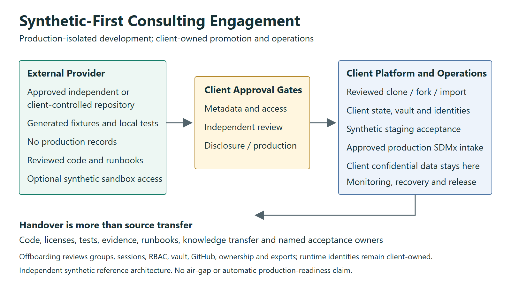
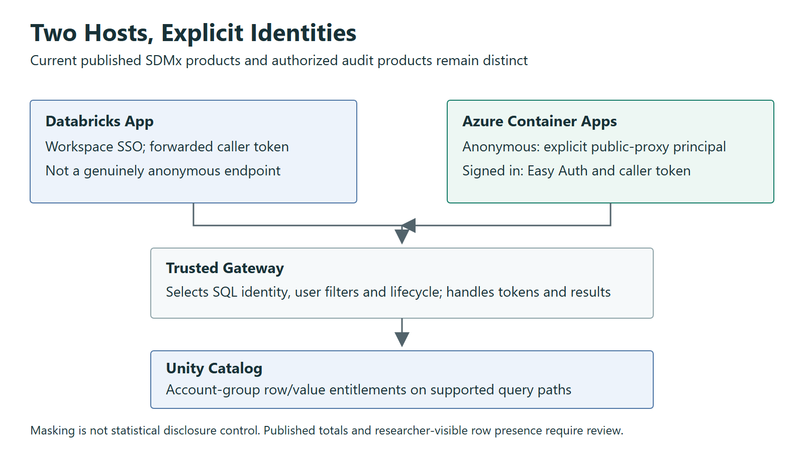
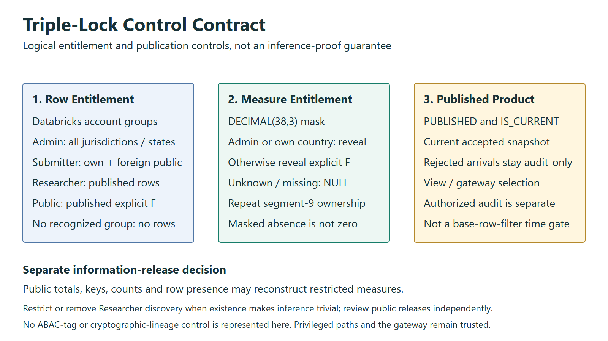
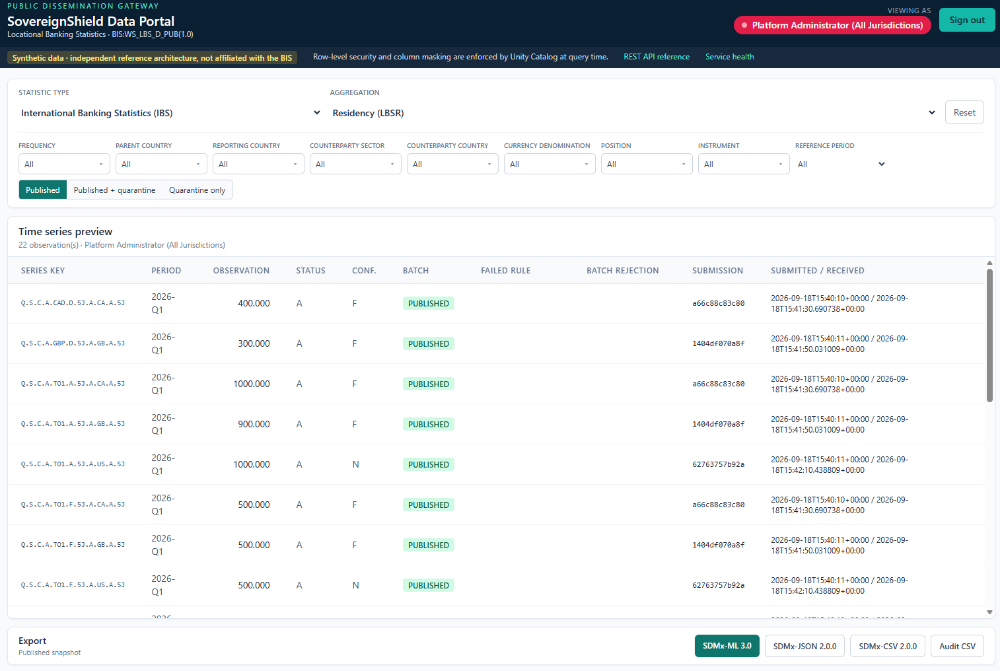
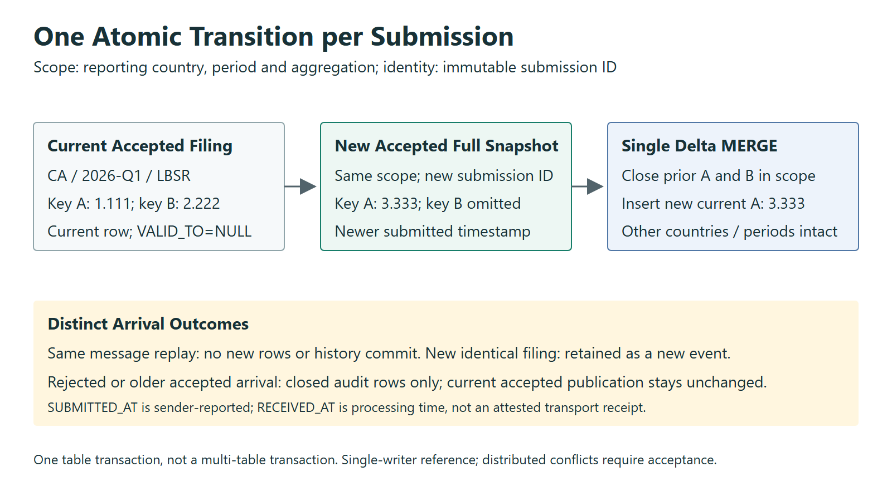
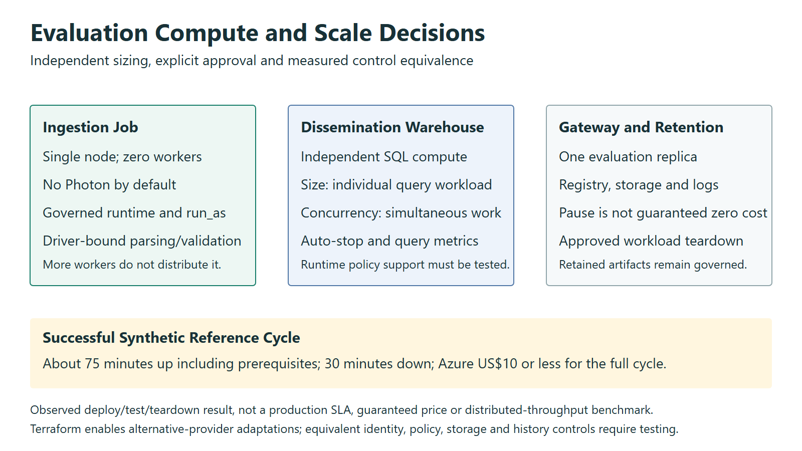

**White Paper**

# Bridging Public Dissemination and Protected Data: A Zero-Trust SDMx Architecture on Azure Databricks

**Author:** Botlhale Mosweu  
**Role:** Enterprise Data Platform Architect  
**Affiliation:** Independent Reference Architecture  
**Classification:** Public Reference Architecture  
**Standards:** SDMx 3.0 | BIS Locational Banking Statistics (LBS) | Azure Databricks Unity Catalog  
**Implementation status:** Synthetic provisioning, live control tests and workload teardown completed on Azure. The reference evaluation measured approximately 75 minutes to provision including prerequisites, 30 minutes to tear down, and US$10 or less in Azure charges for the deploy/test/teardown cycle. These are evaluation results, not production service levels; see [measurement scope](../RELEASE_EVIDENCE.md#reference-evaluation-metrics).

> **Independent Reference Architecture Notice:**  
> This publication and associated reference implementations were developed in a personal capacity using synthetic data fixtures and publicly available international statistical standards (SDMx 3.0, BIS Locational Banking Statistics). This work is not affiliated with, sponsored by, or representative of the Bank of Canada, the Federal Reserve System, the Bank for International Settlements, or any official statistical institution.

---

## 1. Executive Summary & The Contractor Dilemma

International financial institutions, central banks, and sovereign statistical bodies face a structural conflict between two fundamental institutional mandates:
1. **Public Statistical Transparency:** The imperative to disseminate macroeconomic and financial indicators openly to researchers, market participants, and member states.
2. **Confidential Statistical Protection:** The obligation to safeguard restricted observations, jurisdictional entitlements and the confidentiality of contributing institutions.

A synthetic-first delivery model enables external specialists to implement and test a statistical platform against approved structures and security boundaries without access to confidential production records. SovereignShield provides an Azure and Databricks reference implementation alongside established SDMx infrastructure and institutional controls.

<div style="page-break-inside: avoid;">


*Figure 1 — Executive Architecture: synthetic submissions, validation, governed storage, and differentiated consumer access.*

</div>

<div style="page-break-inside: avoid;">



*Figure 2 — Synthetic-First Consulting Engagement: approved metadata, provider development, client review, staging acceptance and client-controlled production. The boundary is production isolation, not an air gap.*

</div>


**SovereignShield** combines SDMx statistical contracts, submission-aware history and query-time entitlement enforcement. Azure Databricks Unity Catalog implements the policy controls in the demonstrated deployment.

Specialists implement against an approved synthetic contract, and client-controlled deployment identities remain independent of personnel changes. PR verification has no cloud credentials. Privileged planning and deployment require an explicit manual run on reviewed `main` and a protected GitHub environment. Runtime secrets, state and plans remain protected operational assets.

The companion [Executive Brief](../EXECUTIVE_BRIEF.md) carries the same title, **Bridging Public Dissemination and Protected Data: A Zero-Trust SDMx Architecture on Azure Databricks**, and summarizes the institutional decision. The [Nature of Engagement and Handover](../ENTERPRISE_ONBOARDING_PLAYBOOK.md) defines delivery responsibilities.

**Submission boundary:** the modeled international exchange accepts SDMx files, not bank micro-transactions. Synthetic bank micro-transactions exist solely as educational fixtures illustrating how realistic statistical observations and confidentiality flags are calculated. The demo ledger is not an institutional intake requirement or system deliverable. Domestic granular-data collections and other reporting regimes are outside this exchange contract.

---

<div style="page-break-after: always;"></div>

## 2. The Dual Consumption Model

Statistical platforms support multiple cadences. This reference submission profile demonstrates quarterly (`Q`) LBS data. The pinned BIS frequency list is authoritative: generic stress-fixture cadence labels must not be mistaken for validated LBS codes.

A **Unified Storage, Dual-Tier Consumption Model** provides public and entitled access through Unity Catalog and a decoupled gateway. Separate deployments or storage boundaries may be required where an institution mandates physical residency or stronger administrative isolation.


<div style="page-break-inside: avoid;">



*Figure 3 — The Dual Consumption Model: public and entitled consumers access one governed data platform.*

</div>


### The Perimeter Identity Problem
Databricks Apps enforce workspace sign-in, so they cannot by themselves provide a genuinely anonymous public endpoint. Sovereign Shield therefore deploys the same FastAPI portal through two hosts:

* **Databricks App:** signed-in workspace users query with an on-behalf-of SQL token. The caller's Databricks account-group memberships reach Unity Catalog unchanged.
* **Azure Container Apps gateway:** anonymous requests query as `spn-sovereignshield-public`, an explicit service principal that belongs only to `sg-sovereignshield-public`. Optional Entra Easy Auth uses `AllowAnonymous`; after sign-in, the browser forwards the caller's Azure Databricks access token to the same API instead of using the public proxy identity.

The gateway selects the SQL identity and lifecycle query. Unity Catalog applies caller-aware table policies. Standard SDMx exports contain only the current published snapshot; a separate audit CSV preserves rejected filings, submission identity, timestamps, and failure feedback. The gateway remains trusted because it handles bearer tokens and entitled results. A compromised gateway is not harmless.

---

<div style="page-break-after: always;"></div>

## 3. The Triple-Lock Security Blueprint

At the core of the data plane sits the **Triple-Lock Governance Architecture**, implemented natively within Unity Catalog SQL functions and Entra ID security claims.

<div style="page-break-inside: avoid;">



*Figure 4 — Triple-Lock Policy Enforcement Point: jurisdictional row filtering, confidentiality masking, and publication-state controls.*

</div>


### The Persona Matrix
Four entitled roles are evaluated through Databricks account-group membership, with a deny-by-default case. Setup reconciles selected Entra identities; it is not continuous directory synchronization:

1. **Public Consumer (`sg-sovereignshield-public`):**
  The anonymous browser is not itself a Databricks identity; the Container Apps gateway maps it to the dedicated public service principal. Access is restricted strictly to published observations explicitly marked free for publication (`OBS_CONF = 'F'`). Confidential rows are excluded from the query result by Unity Catalog.
2. **Authenticated Researcher (`sg-sovereignshield-researchers`):**  
  Access extends across published macro observations. Unless another membership authorizes the value, anything not explicitly free (`F`) is masked, including unknown or missing classifications. Discovery supports a subsequent request and separate agreement with the originating country; it does not authorize the underlying value. Row existence and dimensional structure can themselves disclose information, so this role requires a separate production disclosure decision.
3. **Regional Reporting Submitter (`sg-sovereignshield-submitter-{cty}`):**  
   Row-Level Security grants full, unmasked access strictly to observations originating from the submitter's designated jurisdiction, read from segment 9 of the SDMx key. For foreign jurisdictions the submitter inherits the public tier: published, free-to-publish observations only.
  The **Analyst View** is this submitter workflow, not a separate entitlement. It allows analysts to reconcile the latest filing they expect the international organization to hold with the submission IDs, timestamps, values and validation outcomes actually held in the system. The latest submitted filing may be rejected; it must not be confused with the current accepted publication.
4. **Central Auditor / Administrator (`sg-sovereignshield-admin`):**  
   Full, unmasked access across all jurisdictions and all lifecycle states, including quarantined batches, for regulatory oversight.
5. **No recognised membership — zero rows.**  
  Each entitlement requires positive membership. Removing all relevant account-group memberships removes this data entitlement, but complete offboarding also requires Entra and Databricks membership reconciliation, session/token revocation, Azure and GitHub access removal, and ownership review. A person with control-plane or ownership privileges remains a separate trust boundary.

The SQL examples are in Appendix A. The [deployment executor](../../src/apply_security.py) creates content-addressed functions, checks their definitions, changes bindings without a detach operation, and verifies binding metadata. It aborts on any error and does not automatically migrate legacy table types. A failed deployment can leave old and new protected bindings on different objects; this is not a cross-object atomic policy migration.

`try_element_at` prevents an out-of-range indexing exception; it does not by itself prove malformed keys are invisible through every branch. Strict input checks now verify canonical keys and pinned codelists before persistence. The mask independently checks segment 9 for own-country access.

Memberships compose additively. A principal who is both a submitter and a researcher receives the union of the matching row entitlements, while the mask still reveals restricted values only for the principal's own jurisdiction. This is why the functions use independent `OR` branches rather than a first-match `CASE` expression.

### Demonstrated Persona Outcomes

The screenshots below are the synthetic portal captures supplied on 18 September
2026. They retain the captured labels, values and filters unchanged. Public,
researcher, submitter and administrator screens illustrate different information
products over the same governed history. The [capture inventory](../../demo/README.md)
records each displayed state; screenshots alone are not independent identity or
disclosure-control acceptance evidence.

<div style="page-break-inside: avoid;">


*Figure 5 — Anonymous Public Portal View: the explicit public proxy identity receives 13 published, free-to-publish observations.*

</div>

<div style="page-break-inside: avoid;">


*Figure 6 — Authenticated Researcher View with Masking: 22 published observations are visible, with nine restricted values masked.*

</div>

<div style="page-break-inside: avoid;">


*Figure 7 — Analyst Reconciliation View: the Canadian Regional Submitter (CA) sees 18 observations in Published + quarantine mode, with submission identifiers, submitted/received timestamps and rejection feedback. Own filings remain distinguishable from foreign public observations.*

</div>

<div style="page-break-inside: avoid;">



*Figure 8 — Administrator Published View: the captured Published mode contains 22 observations, including restricted measures visible to the administrator. This image does not show the separate 44-row Published + quarantine mode.*

</div>

---

<div style="page-break-after: always;"></div>

## 4. Declarative Governance: Separation of Concerns

Infrastructure provisioning and data-plane policy have separate ownership to prevent competing writers and inconsistent deployment state.


* **Terraform owns the Infrastructure Control Plane:** Entra groups and deployment identities, Azure resources, the Databricks workspace, Unity Catalog storage credentials and external locations, catalogs, schemas, SQL warehouses, and grants. The workspace resolves its existing regional metastore attachment through the Databricks provider; this configuration does not create or bind an account-level metastore. Terraform never manages table DDL, row-filter bindings, or column-mask bindings.
* **Databricks Asset Bundles (DABs) & SQL own the Data & Policy Plane:** Table DDL, policy UDF logic, row filter attachments (`SET ROW FILTER`), and column mask attachments (`SET MASK`) are version-controlled alongside pipeline logic in `unity_catalog_triple_lock.sql`.
* **Secret Handling:** CI federation avoids a stored deployment client secret. The public SQL proxy still uses a secret resolved from Key Vault; managed identity retrieves that reference, not all downstream SQL credentials. Terraform state and saved plans contain sensitive credential values and require restricted storage, encryption, retention, and auditing. The 90-day rotation resource acts on a subsequent apply; consumer refresh must be verified. There is no independent scheduled rotation service in this release.

### Technology-Agnostic Pattern, Platform-Specific Controls

The core framework is technology-agnostic: versioned SDMx contracts, explicit entitlements, synthetic-first delivery, atomic submission transitions, separate publication/audit products and client-owned runtime identities. Azure and Databricks are the demonstrated implementation, not a requirement of those principles.

Terraform's provider and module boundaries support extension to AWS, GCP, Microsoft Fabric or an open-source software combination. Such extensions require platform-specific identity, storage, query-policy, transactional-history and deployment adapters. Unity Catalog functions, Databricks Apps and Azure authentication are not portable unchanged. Each implementation must pass equivalent persona, disclosure, lifecycle and recovery tests; Terraform does not establish control equivalence by itself.

---

<div style="page-break-after: always;"></div>

## 5. Temporal Integrity & SDMx Compliance

Statistical reporting data is non-destructive; retrospective revisions are common as member institutions re-evaluate balance sheet exposure. A robust platform must maintain a complete historical audit trail without breaking downstream analytics.

### Three Data Zones, Three Sensitivity Boundaries

The catalog is divided by what each object represents and who can safely
traverse it:

<div style="page-break-inside: avoid;">

| Schema | Contents | Access boundary |
| --- | --- | --- |
| `sovereign_submissions` | Governed SDMx-ML filing archive; the demonstration also retains educational synthetic micro files | Administrator only; volumes cannot carry row filters or column masks |
| `sovereign_intake` | Educational synthetic bank micro-transaction ledger illustrating aggregation and classification; not international intake | Administrator plus reporting submitters in the demo; `fn_rls_micro_country_lock` restricts each submitter to its own country |
| `sovereign_shield` | Macro SCD2 history, policy functions, and published view | All recognised personas can traverse; multi-column RLS and DDM determine rows and values |

</div>

This separation prevents a broad schema grant intended for disseminated
aggregates from accidentally making raw files or institution-identifying rows
reachable. The public portal and researcher persona never receive access to the
submission volume or micro ledger.


<div style="page-break-inside: avoid;">



*Figure 9 — Temporal SCD2 Delta Merge: accepted revisions update the current state; rejected revisions remain audit-only and preserve the last accepted observation.*

</div>


* **Atomic Submission Transition:** Accepted expiry and insertion occur in one Delta `MERGE`, using `VALID_FROM`, `VALID_TO`, and `IS_CURRENT`. Local Delta and live Databricks acceptance tests cover replay without row duplication and smaller full replacements. A new identical filing retains a distinct submission identity. The Spark job is single-writer; distributed concurrency and production throughput require separate acceptance.
* **Two Independent Verdicts:** The reporting authority owns confidentiality classification; the receiving organization validates the submitted SDMx file independently. The synthetic generator illustrates classification with a configurable 0.60 dominance threshold. That educational rule is neither a universal reporting requirement nor a complete disclosure-control method. A confidential observation can be arithmetically valid.
* **The Submission Is the Contract:** The reporting task authors an SDMx-ML 3.0 file per jurisdiction per cycle; the receiving task validates its contents. It does not recompute the submission from bank micro-transactions. The separate synthetic ledger only explains fixture construction and demonstrates an additional access boundary.
* **Rules Read, Coverage Stated:** The validator parses 21 within-dataset arithmetic rules from the workbook. Six further cross-collection entries (`LBS_CC:22` through `:27`) are explicitly reported as not implemented. Missing breakdowns are reported as not evaluated. The workbook interpreter, including its `ISO` placeholder handling, is an implementation that needs independent domain review; parsing a rule is not proof of its complete semantics.
* **Atomic Verdict, Precise Attribution:** Acceptance is scoped to a full `(reporting country, reporting period, aggregation)` submission. A failed submission is withheld as a batch. `FAILED_RULE_ID` identifies the checks failed by each observation; `BATCH_FAILED_RULE_ID` records the submission-wide reason. Analysts can distinguish rejected arrivals from the accepted data that remains published.
* **Four Validation Layers:** XML format validation uses pysdmx 1.18.0 with validation enabled; SDMx-JSON is tested against the official 2.0.0 JSON Schema. The reviewed BIS LBS 1.0 snapshot supplies required component names, order and codelists. The reference profile also checks sender-country consistency, duplicates, supported periods and full-snapshot actions. Arithmetic checks are a separate fourth layer. Full dataflow/provision-agreement content constraints and formal standards certification are not implemented.
* **Three-Place Measures:** This platform's explicit convention is decimal half-up rounding once at intake to `DECIMAL(38,3)`, with three decimal places retained through calculation, storage and export. JSON uses decimal-aware serialization; API measure text avoids browser-number conversion. This is a reference profile, not a universal SDMx requirement. Original arrivals remain the evidence of pre-normalized input; zero and masked/missing are distinct.
* **Revision Without Regression:** A quarantined re-filing is written as a non-current audit record. The previously published version stays `IS_CURRENT` and continues to feed the public view, so a failed revision can never withdraw data that was already correct.

### Standards-Native Dissemination

Data arrives as SDMx and leaves as SDMx. The governed result of a query is serialised back into the same dataflow it was reported against — `BIS:WS_LBS_D_PUB(1.0)` — rather than into a portal-specific export shape that a receiving system would have to learn.

The samples in [demo/sdmx](../../demo/sdmx) are historical administrator exports for `2026-Q1`, not current schema-conformance evidence. Current tests generate fresh messages with an explicit synthetic profile: `DECIMALS=3`, `UNIT_MEASURE=USD`, `UNIT_MULT=6`, `COLLECTION=E`, and frequency-derived `TIME_FORMAT`. `L_DENOM` classifies currency denomination; it does not change the observation's reporting unit. No currency conversion is performed.

These saved samples contain the published slice, not the 44-row quarantine-inclusive audit view. The JSON sample was regenerated locally from the same observations after a serializer correction; it is not an untouched browser capture. They demonstrate cross-format data equivalence, not independent verification of every persona or formal standards certification.

<div style="page-break-inside: avoid;">

```xml
<Series FREQ="Q" L_MEASURE="S" L_POSITION="C" L_INSTR="A" L_DENOM="USD"
        L_CURR_TYPE="D" L_PARENT_CTY="5J" L_REP_BANK_TYPE="A" L_REP_CTY="US"
        L_CP_SECTOR="A" L_CP_COUNTRY="5J">
  <Obs TIME_PERIOD="2026-Q1" OBS_VALUE="400.000" OBS_STATUS="A" OBS_CONF="N" />
</Series>
```

</div>

Every dimension of the eleven-part key is written out, so the reporting jurisdiction the row filter keyed on (`L_REP_CTY="US"`, segment 9) is visible to the receiving system rather than implied. The SDMx-CSV rows carry the same structural identity on every line, which is what makes the file self-describing rather than order-dependent:

<div style="page-break-inside: avoid;">

```text
STRUCTURE,STRUCTURE_ID,ACTION,FREQ,...,TIME_PERIOD,OBS_VALUE,OBS_STATUS,OBS_CONF
dataflow,BIS:WS_LBS_D_PUB(1.0),I,Q,...,2026-Q1,400.000,A,N
```

</div>

**Entitlement is enforced before serialization.** The expected published-slice outcomes are listed below; the saved admin artifacts alone do not prove the other two personas. Downloaded files do not themselves enforce continuing access restrictions.

<div style="page-break-inside: avoid;">

| Persona | Observations exported | Restricted values |
| --- | ---: | --- |
| Public proxy | 13 | none present — confidential rows never enter the result |
| Researcher | 22 | 9 serialised as **absent**, not zero |
| Administrator | 22 | 9 present, because `OBS_CONF = 'N'` is readable at this tier |

</div>

The distinction between an absent observation and a zero one is not cosmetic. Writing `0` for a redacted value would convert a confidentiality control into a false data point that reconciles incorrectly downstream; the exporter therefore omits the measure entirely, and `tests/test_sdmx_validation_rules.py` asserts that a masked value never serialises as `0`.

---

<div style="page-break-after: always;"></div>

## 6. Operational Playbook & Scale Strategy


<div style="page-break-inside: avoid;">



*Figure 10 — Scalability & Compute Strategy: ingestion and dissemination compute can be sized independently while preserving the configured policy model.*

</div>


### The Minimal Viable Synthetic Dataset (MVSD) Protocol

Hiring organizations do not need to share internal records to initiate development:

1. The enterprise extracts structural metadata from its DSD or schema catalog.
2. The mock generator (`src/generate_sovereign_submissions.py`) produces an authentic synthetic fixture exercising all security branches: multiple jurisdictions, free-to-publish and confidential observations, and a revision cycle whose figures break named checks in the published BIS workbook. The corrupted submissions use only real, permitted codelist values — the failures are genuine arithmetic inconsistencies a validator detects, not malformed records a parser would reject, because a fixture that fails at parse time never reaches the controls it is meant to test.
3. External contractors build and validate all SQL, PySpark, and Terraform logic against the MVSD using local test harnesses.

### Reproducible Deployment and Teardown

After the one-time remote-state backend and local configuration are prepared, `sh/sovereignshield_up.ps1` executes the validated sequence from Terraform foundation through Databricks account wiring, Asset Bundle deployment, ingestion, grants, both portal hosts, and readiness checks. Stages can be bounded or resumed after a cloud timeout. `sh/sovereignshield_down.ps1` deletes tables and policy functions before the schemas that contain them, destroys bundle and Azure resources through their owning paths, removes orphaned diagnostics, and verifies both empty Terraform state and an empty workload resource group. The backend and account-level identity records are deliberately retained for reliable reconstruction.

The successful reference evaluation took approximately **75 minutes to bring up the project, including prerequisite setup**, and **30 minutes for teardown**. The complete deploy, test and teardown cycle incurred **US$10 or less in Azure charges**. This supports a low-cost, bounded synthetic evaluation; it is not a guaranteed ceiling for other regions, subscriptions, durations or workloads. Retained backend resources remain separately governed. The [evaluation evidence](../RELEASE_EVIDENCE.md#reference-evaluation-metrics) defines measurement provenance and accounting limits.

The reason each Azure and Databricks object exists, who creates it, and whether it is reused or deleted is documented in the [Systems Architect Resource Provenance Guide](../RESOURCE_PROVENANCE.md). The command sequence and recovery controls are in the [One-Command Operations Runbook](../AUTOMATION_RUNBOOK.md).

### Cluster Sizing & Enterprise Scale

Single-node compute is an evaluation cost choice. Larger supported query engines must preserve the same entitlement contract, but runtime/access-mode support, performance and policy behavior require validation on each selected configuration.

* **Sandbox Evaluation:** The complete architecture runs on a single-node `USER_ISOLATION` cluster (`worker_count_max = 0`), keeping evaluation inexpensive for an organization or an external contractor assessing the controls.
* **Opt-In Compute:** Terraform now emits the job cluster specification, including its policy ID, and the bundle consumes it. Worker counts and Photon remain off by default and require explicit cost approval. Increasing workers does not distribute the pandas XML parsing and arithmetic-validation stages; end-to-end scale and efficiency require measurement and further engineering.
* **Dissemination:** Databricks SQL Serverless scales independently, by size (Medium through 2X-Large) for heavy individual scans and by `sql_warehouse_max_clusters` for concurrent readers. Concurrency and scan cost are separate levers, and a public dissemination tier usually needs the second one first.
* **Stress Test Verification:** The platform includes a scale harness (`src/generate_stress_test_data.py`) that produces a reproducible 100,000+ observation corpus spanning seven jurisdictions and all four reporting cadences, with configurable confidentiality and revision rates. `tests/test_scale_and_stress.py` asserts that entitlement enforcement stays vectorised and roughly linear in row count, and that SCD2 interval integrity holds at volume.

> **Measurement note.** The published figures are the corpus shape and the linearity assertion, both reproducible offline. Latency under concurrent multi-user load on production-sized hardware has not been benchmarked here, and is not claimed.

### Open Statistical Reconstruction Challenge

Masked values can be reconstructed from released totals, components, overlapping breakdowns or successive revisions. For example, the synthetic fixture permits a restricted component to be calculated as $1000-400-500=100$. Knowledge of the calculation method and the presence of a specific observation can make an otherwise hidden value identifiable. Researcher-visible keys, confidentiality flags and row counts therefore require information-disclosure review as well as value masking.

Community review is explicitly invited using synthetic examples: identify the released inputs, calculation, inferred value and affected persona. If observation existence makes reconstruction trivial, the Researcher role must be restricted or removed from a production design until an approved disclosure control is demonstrated. Disabling that role alone does not resolve reconstruction possible from public values. Secondary suppression, approved perturbation or a redesigned release product must be evaluated across dimensions, time and cumulative exports. The [security challenge](../../SECURITY.md#statistical-reconstruction-challenge) defines reporting and acceptance criteria.

### Production Acceptance Boundaries

The deployment uses synthetic data and is not a production accreditation. Logical country segregation in a shared Canadian workspace is not physical country residency. RLS/DDM enforces entitlements, not complete statistical disclosure control: published totals in the fixture can reconstruct a masked component. Secondary suppression or another approved disclosure method is required before treating that risk as controlled. The gateway, privileged operators, exported files, and source archives remain trust boundaries.

Institutional threat modelling, privacy review, retention, independent rule semantics, penetration testing, disaster recovery, private networking, legacy policy migration, and production cost/throughput measurements remain required. The [release evidence and migration guide](../RELEASE_EVIDENCE.md) records the reproducible methods, limitations, and promotion gates.

---

<div style="page-break-after: always;"></div>

## Conclusion

SovereignShield separates public dissemination from restricted statistical access through explicit information contracts and platform controls. The gateway selects identity and lifecycle scope, Unity Catalog enforces entitlements, SDMx validation determines acceptance, and submission-aware history preserves the current accepted publication. The Analyst View reconciles expected filings with the receiver's actual state. Synthetic-first delivery and client-owned runtime identities support implementation and handover, while disclosure control and institutional production approval remain explicit acceptance gates.

## Appendix A: Policy Examples

These are logical templates from the [policy source](../../src/unity_catalog_triple_lock.sql), not commands to replace a bound function manually. The executor gives functions content-addressed names; existing incompatible tables cause refusal before policy changes.

<div style="page-break-inside: avoid;">

```sql
CREATE OR REPLACE FUNCTION fn_ddm_obs_conf_mask(
  obs_val DECIMAL(38,3), obs_conf STRING, time_series_code STRING
)
RETURNS DECIMAL(38,3)
RETURN CASE
  WHEN is_account_group_member('sg-sovereignshield-admin') THEN obs_val
  WHEN is_account_group_member('sg-sovereignshield-submitter-ca')
    AND coalesce(try_element_at(split(time_series_code, '\\.'), 9) = 'CA', FALSE) THEN obs_val
  WHEN is_account_group_member('sg-sovereignshield-submitter-us')
    AND coalesce(try_element_at(split(time_series_code, '\\.'), 9) = 'US', FALSE) THEN obs_val
  WHEN upper(trim(coalesce(obs_conf, ''))) = 'F' THEN obs_val
  ELSE NULL
END;
```

</div>

<div style="page-break-inside: avoid;">

```sql
CREATE OR REPLACE FUNCTION fn_rls_multi_persona_lock(
  time_series_code STRING, batch_status STRING, obs_conf STRING
)
RETURNS BOOLEAN
RETURN
  is_account_group_member('sg-sovereignshield-admin')
  OR (
    is_account_group_member('sg-sovereignshield-researchers')
    AND upper(coalesce(batch_status, '')) = 'PUBLISHED'
  )
  OR (
    (is_account_group_member('sg-sovereignshield-public')
      OR is_account_group_member('sg-sovereignshield-submitter-ca')
      OR is_account_group_member('sg-sovereignshield-submitter-us'))
    AND upper(coalesce(batch_status, '')) = 'PUBLISHED'
    AND upper(trim(coalesce(obs_conf, ''))) = 'F'
  )
  OR (is_account_group_member('sg-sovereignshield-submitter-ca')
    AND coalesce(try_element_at(split(time_series_code, '\\.'), 9) = 'CA', FALSE))
  OR (is_account_group_member('sg-sovereignshield-submitter-us')
    AND coalesce(try_element_at(split(time_series_code, '\\.'), 9) = 'US', FALSE));
```

</div>

## Appendix B: Context and References

The bounded contribution is an inspectable integration of synthetic-first specialist delivery, company-controlled runtime identity, table-level entitlement policy, arrival-aware revision handling and separate dissemination/audit contracts. It does not claim global novelty, replace SDMx registries, or implement a complete statistical disclosure-control system.

Existing approaches include [SDMx Reference Infrastructure](https://sdmx.org/tools/), [Fusion Metadata Registry](https://www.bis.org/innovation/bis_open_tech_sdmx.htm), and [pysdmx](https://py.sdmx.io/). A registry maintains structural and provisioning metadata; the reference platform consumes a pinned subset and adds an Azure/Delta execution and access-control example. An institution may retain its current platform, extend existing SDMx tooling, or pilot this Azure integration after comparing operating burden, interoperability and residency requirements.

1. [SDMx naming evolution, 29 June 2026](https://sdmx.org/news/sdmx-evolves-into-sdmx-the-standard-for-statistical-data-and-metadata/). Display prose uses SDMx; protocol identifiers and published schema names retain their defined spelling.
2. [pysdmx structural validation guidance](https://py.sdmx.io/howto/validate.html). Format parsing, DSD requirements, codelists and provisioning constraints are distinct checks.
3. [BIS LBS 1.0 DSD and referenced structures](https://stats.bis.org/api/v1/datastructure/BIS/BIS_LBS/1.0?references=all). Snapshot source and digest are recorded in the repository.
4. [Unity Catalog dynamic views](https://learn.microsoft.com/en-us/azure/databricks/views/dynamic). Membership functions are caller-aware; underlying-object privileges are a separate concept.
5. [Row filters and masks](https://learn.microsoft.com/en-us/azure/databricks/data-governance/unity-catalog/filters-and-masks/). Runtime and access-mode limitations must be checked for the deployed engine.
6. [Terraform sensitive data](https://developer.hashicorp.com/terraform/language/manage-sensitive-data). Sensitive marking does not remove values from state or plan files.
7. [BIS terms of use](https://www.bis.org/terms_conditions.htm). Public availability is not a blanket redistribution licence; third-party artifacts are excluded from this project's Apache grant.