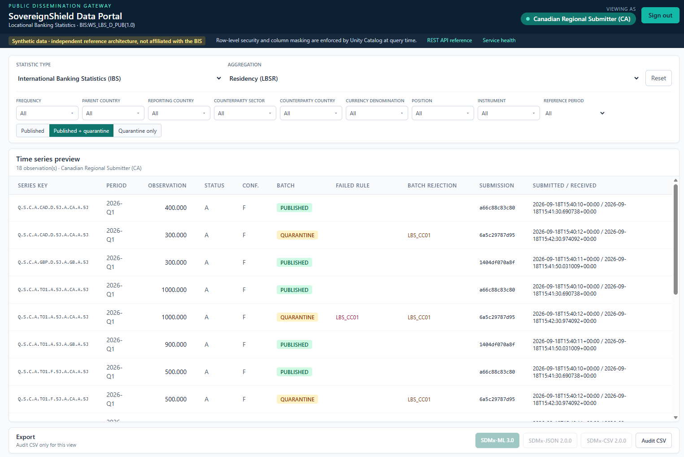

### Executive Whitepaper

# Bridging Public Dissemination and Protected Data: A Zero-Trust SDMx Architecture on Azure Databricks

**Author:** Botlhale Mosweu  
**Role:** Enterprise Data Platform Architect  
**Affiliation:** Independent Reference Architecture  
**Classification:** Public Reference Architecture  
**Standards:** SDMx 3.0 | BIS Locational Banking Statistics (LBS) | Azure Databricks Unity Catalog  
**Implementation status:** Current revision verified locally on synthetic data; historical cloud evidence is identified separately. Live release migration and acceptance are pending.

> **Independent Reference Architecture Notice:**  
> This publication and associated reference implementations were developed in a personal capacity using synthetic data fixtures and publicly available international statistical standards (SDMx 3.0, BIS Locational Banking Statistics). This work is not affiliated with, sponsored by, or representative of the Bank of Canada, the Federal Reserve System, the Bank for International Settlements, or any official statistical institution.

---

## 1. Executive Summary & The Contractor Dilemma

International financial institutions, central banks, and sovereign statistical bodies face a structural conflict between two fundamental institutional mandates:
1. **Public Statistical Transparency:** The imperative to disseminate macroeconomic and financial indicators openly to researchers, market participants, and member states.
2. **Confidential Sovereign Protection:** The statutory obligation to safeguard confidential, institution-level, and jurisdiction-restricted microdata under strict Zero-Trust governance.

A recurring delivery challenge is validating controls without sharing production records: *How can an enterprise engage external specialists to build and test a statistical platform using synthetic data with the same approved structure and security boundaries as the intended production service?* This study explores one Azure-native implementation, not a claim that institutions lack effective controls or have not adopted cloud platforms.

<div style="page-break-inside: avoid;">


*Figure 1 — Executive Architecture: synthetic submissions, validation, governed storage, and differentiated consumer access.*

</div>

<div style="page-break-inside: avoid;">


*Figure 2 — The Contractor Dilemma: specialist delivery without access to confidential production records.*

</div>


To resolve this bottleneck, I architected **Sovereign Shield**—an independent, open-source reference implementation combining **SDMx 3.0** open statistical standards with **Azure Databricks Unity Catalog**. 

SovereignShield demonstrates a delivery model where specialists implement against an approved synthetic contract, and company-controlled deployment identities outlast personnel changes. PR verification has no cloud credentials. Privileged planning and deployment require an explicit manual run on reviewed `main` and a protected GitHub environment. Historical source contained a bootstrap password; the author reports it is no longer used. Current source checks do not certify every historical credential or employment/IP boundary.

The [separate executive brief](../EXECUTIVE_BRIEF.md) is the short decision document. This whitepaper supplies technical evidence and references; it is not the proposed LinkedIn carousel itself.

---

<div style="page-break-after: always;"></div>

## 2. The Dual Consumption Model

Statistical platforms support multiple cadences. This reference submission profile demonstrates quarterly (`Q`) LBS data. The pinned BIS frequency list is authoritative: generic stress-fixture cadence labels must not be mistaken for validated LBS codes.

Rather than fragmenting data into separate physical databases for public and internal use, I implemented a **Unified Storage, Dual-Tier Consumption Model** powered by Unity Catalog and a decoupled gateway.


<div style="page-break-inside: avoid;">


*Figure 3 — The Dual Consumption Model: public and entitled consumers access one governed data platform.*

</div>


### The Perimeter Identity Problem
Databricks Apps enforce workspace sign-in, so they cannot by themselves provide a genuinely anonymous public endpoint. Sovereign Shield therefore deploys the same FastAPI portal through two hosts:

* **Databricks App:** signed-in workspace users query with an on-behalf-of SQL token. The caller's Databricks account-group memberships reach Unity Catalog unchanged.
* **Azure Container Apps gateway:** anonymous requests query as `spn-sovereignshield-public`, an explicit service principal that belongs only to `sg-sovereignshield-public`. Optional Entra Easy Auth uses `AllowAnonymous`; after sign-in, the browser forwards the caller's Azure Databricks access token to the same API instead of using the public proxy identity.

The gateway selects the SQL identity and lifecycle query. Unity Catalog applies caller-aware table policies. Standard SDMx exports contain only the current published snapshot; a separate audit CSV preserves rejected filings, submission identity, timestamps, and failure feedback. The gateway remains trusted because it handles bearer tokens and entitled results. A compromised gateway is not harmless.

---

<div style="page-break-after: always;"></div>

## 3. The Triple-Lock Security Blueprint

At the core of the data plane sits the **Triple-Lock Governance Architecture**, implemented natively within Unity Catalog SQL functions and Entra ID security claims.

<div style="page-break-inside: avoid;">


*Figure 4 — Triple-Lock Policy Enforcement Point: jurisdictional row filtering, confidentiality masking, and publication-state controls.*

</div>


### The Persona Matrix
I established four entitled enterprise roles, mapped to Entra ID Security Groups and enforced at runtime — plus a fifth case that matters more than any of them:

1. **Public Consumer (`sg-sovereignshield-public`):**
  The anonymous browser is not itself a Databricks identity; the Container Apps gateway maps it to the dedicated public service principal. Access is restricted strictly to published observations explicitly marked free for publication (`OBS_CONF = 'F'`). Confidential rows are excluded from the query result by Unity Catalog.
2. **Authenticated Researcher (`sg-sovereignshield-researchers`):**  
  Access extends across published macro observations. Unless another membership authorizes the value, anything not explicitly free (`F`) is masked, including unknown or missing classifications. Discovery supports a subsequent request and separate agreement with the originating country; it is not authorization to obtain the underlying value.
3. **Regional Reporting Submitter (`sg-sovereignshield-submitter-{cty}`):**  
   Row-Level Security grants full, unmasked access strictly to observations originating from the submitter's designated jurisdiction, read from segment 9 of the SDMx key. For foreign jurisdictions the submitter inherits the public tier: published, free-to-publish observations only.
4. **Central Auditor / Administrator (`sg-sovereignshield-admin`):**  
   Full, unmasked access across all jurisdictions and all lifecycle states, including quarantined batches, for regulatory oversight.
5. **No recognised membership — zero rows.**  
  Each entitlement requires positive membership. Removing all relevant account-group memberships removes this data entitlement, but complete offboarding also requires Entra and Databricks membership reconciliation, session/token revocation, Azure and GitHub access removal, and ownership review. A person with control-plane or ownership privileges remains a separate trust boundary.

The SQL examples are in Appendix A. The [deployment executor](../../src/apply_security.py) creates content-addressed functions, checks their definitions, changes bindings without a detach operation, and verifies binding metadata. It aborts on any error and does not automatically migrate legacy table types. A failed deployment can leave old and new protected bindings on different objects; this is not a cross-object atomic policy migration.

`try_element_at` prevents an out-of-range indexing exception; it does not by itself prove malformed keys are invisible through every branch. Strict input checks now verify canonical keys and pinned codelists before persistence. The mask independently checks segment 9 for own-country access.

Memberships compose additively. A principal who is both a submitter and a researcher receives the union of the matching row entitlements, while the mask still reveals restricted values only for the principal's own jurisdiction. This is why the functions use independent `OR` branches rather than a first-match `CASE` expression.

### Demonstrated Persona Outcomes

The screenshots below document one deployed synthetic fixture. Every persona queries the same governed history table through the same API. The regional submitter capture has been anonymized: only persona labels were changed, the image is marked accordingly, and displayed data is unchanged. It is historical evidence, not a new live verification.

<div style="page-break-inside: avoid;">


*Figure 5 — Anonymous Public Portal View: the explicit public proxy identity receives 13 published, free-to-publish observations.*

</div>

<div style="page-break-inside: avoid;">


*Figure 6 — Authenticated Researcher View with Masking: 22 published observations are visible, with nine restricted values masked.*

</div>

<div style="page-break-inside: avoid;">



*Figure 7 — Regional Submitter Jurisdictional Isolation View: the Canadian Regional Submitter (CA) sees 18 observations with quarantine enabled, combining its own published and rejected records with foreign public observations. Persona labels are anonymized; data is unchanged.*

</div>

<div style="page-break-inside: avoid;">


*Figure 8 — Central Administrator Audit & Quarantine View: 44 published and audit-only observations are available without widening downstream personas' access.*

</div>

---

<div style="page-break-after: always;"></div>

## 4. Declarative Governance: Separation of Concerns

To prevent declarative state drift and pipeline locks, I enforced a strict architectural separation of concerns between infrastructure provisioning and data plane modeling.


* **Terraform owns the Infrastructure Control Plane:** Entra groups and deployment identities, Azure resources, the Databricks workspace, Unity Catalog storage credentials and external locations, catalogs, schemas, SQL warehouses, and grants. The workspace resolves its existing regional metastore attachment through the Databricks provider; this configuration does not create or bind an account-level metastore. Terraform never manages table DDL, row-filter bindings, or column-mask bindings.
* **Databricks Asset Bundles (DABs) & SQL own the Data & Policy Plane:** Table DDL, policy UDF logic, row filter attachments (`SET ROW FILTER`), and column mask attachments (`SET MASK`) are version-controlled alongside pipeline logic in `unity_catalog_triple_lock.sql`.
* **Secret Handling:** CI federation avoids a stored deployment client secret. The public SQL proxy still uses a secret resolved from Key Vault; managed identity retrieves that reference, not all downstream SQL credentials. Terraform state and saved plans contain sensitive credential values and require restricted storage, encryption, retention, and auditing. The 90-day rotation resource acts on a subsequent apply; consumer refresh must be verified. There is no independent scheduled rotation service in this release.

---

<div style="page-break-after: always;"></div>

## 5. Temporal Integrity & SDMx Compliance

Statistical reporting data is non-destructive; retrospective revisions are common as member institutions re-evaluate balance sheet exposure. A robust platform must maintain a complete historical audit trail without breaking downstream analytics.

### Three Data Zones, Three Sensitivity Boundaries

The catalog is divided by what each object represents and who can safely
traverse it:

<div style="page-break-inside: avoid;">

| Schema | Contents | Access boundary |
| --- | --- | --- |
| `sovereign_submissions` | Governed volume containing SDMx-ML filings and accompanying synthetic micro files | Administrator only; volumes cannot carry row filters or column masks |
| `sovereign_intake` | Institution-level transaction ledger before aggregation and confidentiality decisions | Administrator plus reporting submitters; `fn_rls_micro_country_lock` restricts each submitter to its own country |
| `sovereign_shield` | Macro SCD2 history, policy functions, and published view | All recognised personas can traverse; multi-column RLS and DDM determine rows and values |

</div>

This separation prevents a broad schema grant intended for disseminated
aggregates from accidentally making raw files or institution-identifying rows
reachable. The public portal and researcher persona never receive access to the
submission volume or micro ledger.


<div style="page-break-inside: avoid;">


*Figure 9 — Temporal SCD2 Delta Merge: accepted revisions update the current state; rejected revisions remain audit-only and preserve the last accepted observation.*

</div>


* **Atomic Submission Transition:** Accepted expiry and insertion occur in one Delta `MERGE`, using `VALID_FROM`, `VALID_TO`, and `IS_CURRENT`. Local Delta tests demonstrate replay **without row duplication**, shorter full replacements, failure before commit, and serialized competing local writers. A new identical filing retains a distinct submission identity. The Spark job is single-writer; live concurrency and Unity Catalog execution of this revision remain release gates, not proven performance claims.
* **Two Independent Verdicts:** Confidentiality and quality are decided by different parties, and the platform keeps them separate. The **reporting body** decides confidentiality from a configurable dominance threshold — where one institution contributes most of a series, the observation is marked `OBS_CONF = 'N'` before it ever leaves the jurisdiction. The **receiving organisation** decides acceptance, independently, by re-running the published consistency checks over the file it received. A dominant contributor makes an observation confidential; it does not make the submission wrong.
* **The Submission Is the Contract:** The reporting task authors an SDMx-ML 3.0 file per jurisdiction per cycle; the receiving task reads that file and rules on it. It deliberately does not re-derive the figures from the accompanying microdata — a hub that recomputes is checking its own arithmetic rather than the submission it was sent.
* **Rules Read, Coverage Stated:** The validator parses 21 within-dataset arithmetic rules from the workbook. Six further cross-collection entries (`LBS_CC:22` through `:27`) are explicitly reported as not implemented. Missing breakdowns are reported as not evaluated. The workbook interpreter, including its `ISO` placeholder handling, is an implementation that needs independent domain review; parsing a rule is not proof of its complete semantics.
* **Atomic Verdict, Precise Attribution:** Acceptance is atomic per `(reporting country, reporting period)`. Partial publication is incoherent rather than merely undesirable: the aggregates that reconcile depend on the components that did not. Every observation in a broken batch is therefore withheld — but `FAILED_RULE_ID` names only the checks that observation itself broke, and is null for a series that reconciles. The verdict is collective; the accusation is not, so an investigator is pointed at the break rather than at every row that shares its quarter.
* **Four Validation Layers:** XML format validation uses pysdmx 1.18.0 with validation enabled; SDMx-JSON is tested against the official 2.0.0 JSON Schema. The reviewed BIS LBS 1.0 snapshot supplies required component names, order and codelists. The reference profile also checks sender-country consistency, duplicates, supported periods and full-snapshot actions. Arithmetic checks are a separate fourth layer. Full dataflow/provision-agreement content constraints and formal standards certification are not implemented.
* **Three-Place Measures:** This platform's explicit convention is decimal half-up rounding once at intake to `DECIMAL(38,3)`, with three decimal places retained through calculation, storage and export. JSON uses decimal-aware serialization; API measure text avoids browser-number conversion. This is a reference profile, not a universal SDMx requirement. Original arrivals remain the evidence of pre-normalized input; zero and masked/missing are distinct.
* **Revision Without Regression:** A quarantined re-filing is written as a non-current audit record. The previously published version stays `IS_CURRENT` and continues to feed the public view, so a failed revision can never withdraw data that was already correct.

### Standards-Native Dissemination

Data arrives as SDMx and leaves as SDMx. The governed result of a query is serialised back into the same dataflow it was reported against — `BIS:WS_LBS_D_PUB(1.0)` — rather than into a portal-specific export shape that a receiving system would have to learn.

The samples in [demo/sdmx](../../demo/sdmx) are historical administrator exports for `2026-Q1`, not current schema-conformance evidence. Current tests generate fresh messages with an explicit synthetic profile: `DECIMALS=3`, `UNIT_MEASURE=USD`, `UNIT_MULT=6`, `COLLECTION=E`, and frequency-derived `TIME_FORMAT`. `L_DENOM` classifies currency denomination; it does not change the observation's reporting unit. No currency conversion is performed.

These saved samples contain the published slice, not the 44-row quarantine-inclusive audit view. The JSON sample was regenerated locally from the same observations after a serializer correction; it is not an untouched browser capture. They demonstrate cross-format data equivalence, not independent verification of every persona or formal standards certification.

<div style="page-break-inside: avoid;">

```xml
<Series FREQ="Q" L_MEASURE="S" L_POSITION="C" L_INSTR="A" L_DENOM="USD"
        L_CURR_TYPE="D" L_PARENT_CTY="5J" L_REP_BANK_TYPE="A" L_REP_CTY="US"
        L_CP_SECTOR="A" L_CP_COUNTRY="5J">
  <Obs TIME_PERIOD="2026-Q1" OBS_VALUE="400" OBS_STATUS="A" OBS_CONF="N" />
</Series>
```

</div>

Every dimension of the eleven-part key is written out, so the reporting jurisdiction the row filter keyed on (`L_REP_CTY="US"`, segment 9) is visible to the receiving system rather than implied. The SDMx-CSV rows carry the same structural identity on every line, which is what makes the file self-describing rather than order-dependent:

<div style="page-break-inside: avoid;">

```text
STRUCTURE,STRUCTURE_ID,ACTION,FREQ,...,TIME_PERIOD,OBS_VALUE,OBS_STATUS,OBS_CONF
dataflow,BIS:WS_LBS_D_PUB(1.0),I,Q,...,2026-Q1,400,A,N
```

</div>

**Entitlement is enforced before serialization.** The expected published-slice outcomes are listed below; the saved admin artifacts alone do not prove the other two personas. Downloaded files do not themselves enforce continuing access restrictions.

<div style="page-break-inside: avoid;">

| Persona | Observations exported | Restricted values |
| --- | ---: | --- |
| Public proxy | 13 | none present — confidential rows never enter the result |
| Researcher | 22 | 9 serialised as **absent**, not zero |
| Administrator | 22 | 9 present, because `OBS_CONF = 'N'` is readable at this tier |

</div>

The distinction between an absent observation and a zero one is not cosmetic. Writing `0` for a redacted value would convert a confidentiality control into a false data point that reconciles incorrectly downstream; the exporter therefore omits the measure entirely, and `tests/test_sdmx_validation_rules.py` asserts that a masked value never serialises as `0`.

---

<div style="page-break-after: always;"></div>

## 6. Operational Playbook & Scale Strategy


<div style="page-break-inside: avoid;">


*Figure 10 — Scalability & Compute Strategy: ingestion and dissemination compute can be sized independently while preserving the configured policy model.*

</div>


### The Minimal Viable Synthetic Dataset (MVSD) Protocol

Hiring organizations do not need to share internal records to initiate development:

1. The enterprise extracts structural metadata from its DSD or schema catalog.
2. The mock generator (`src/generate_sovereign_submissions.py`) produces an authentic synthetic fixture exercising all security branches: multiple jurisdictions, free-to-publish and confidential observations, and a revision cycle whose figures break named checks in the published BIS workbook. The corrupted submissions use only real, permitted codelist values — the failures are genuine arithmetic inconsistencies a validator detects, not malformed records a parser would reject, because a fixture that fails at parse time never reaches the controls it is meant to test.
3. External contractors build and validate all SQL, PySpark, and Terraform logic against the MVSD using local test harnesses.

### Reproducible Deployment and Teardown

After the one-time remote-state backend and local configuration are prepared, `sh/sovereignshield_up.ps1` executes the validated sequence from Terraform foundation through Databricks account wiring, Asset Bundle deployment, ingestion, grants, both portal hosts, and readiness checks. Stages can be bounded or resumed after a cloud timeout. `sh/sovereignshield_down.ps1` deletes tables and policy functions before the schemas that contain them, destroys bundle and Azure resources through their owning paths, removes orphaned diagnostics, and verifies both empty Terraform state and an empty workload resource group. The backend and account-level identity records are deliberately retained for reliable reconstruction.

The reason each Azure and Databricks object exists, who creates it, and whether it is reused or deleted is documented in the [Systems Architect Resource Provenance Guide](../RESOURCE_PROVENANCE.md). The command sequence and recovery controls are in the [One-Command Operations Runbook](../AUTOMATION_RUNBOOK.md).

### Cluster Sizing & Enterprise Scale

Single-node compute is a **cost choice, not an architectural constraint**. Row filters and column masks are evaluated inside the query engine, so the security model behaves identically at any cluster size.

* **Sandbox Evaluation:** The complete architecture runs on a single-node `USER_ISOLATION` cluster (`worker_count_max = 0`), keeping evaluation inexpensive for an organization or an external contractor assessing the controls.
* **Opt-In Compute:** Terraform now emits the job cluster specification, including its policy ID, and the bundle consumes it. Worker counts and Photon remain off by default and require explicit cost approval. Increasing workers does not distribute the pandas XML parsing and arithmetic-validation stages; end-to-end scale and efficiency require measurement and further engineering.
* **Dissemination:** Databricks SQL Serverless scales independently, by size (Medium through 2X-Large) for heavy individual scans and by `sql_warehouse_max_clusters` for concurrent readers. Concurrency and scan cost are separate levers, and a public dissemination tier usually needs the second one first.
* **Stress Test Verification:** The platform includes a scale harness (`src/generate_stress_test_data.py`) that produces a reproducible 100,000+ observation corpus spanning seven jurisdictions and all four reporting cadences, with configurable confidentiality and revision rates. `tests/test_scale_and_stress.py` asserts that entitlement enforcement stays vectorised and roughly linear in row count, and that SCD2 interval integrity holds at volume.

> **Measurement note.** The published figures are the corpus shape and the linearity assertion, both reproducible offline. Latency under concurrent multi-user load on production-sized hardware has not been benchmarked here, and is not claimed.

### What This Reference Architecture Does Not Prove

The deployment uses synthetic data and is not a production accreditation. Logical country segregation in a shared Canadian workspace is not physical country residency. RLS/DDM enforces entitlements, not complete statistical disclosure control: published totals in the fixture can reconstruct a masked component. Secondary suppression or another approved disclosure method is required before treating that risk as controlled. The gateway, privileged operators, exported files, and source archives remain trust boundaries.

Institutional threat modelling, privacy review, retention, independent rule semantics, penetration testing, disaster recovery, private networking, live policy migration, and measured cost/throughput are still required. The [release evidence and migration guide](../RELEASE_EVIDENCE.md) records the reproducible methods, limitations, and promotion gates.

---

<div style="page-break-after: always;"></div>

## Conclusion

Sovereign Shield provides a concrete way to manage the trade-off between open data dissemination and sovereign microdata protection. A decoupled dissemination gateway selects an identity, Unity Catalog enforces the resulting entitlement, the SDMx rule engine makes acceptance reproducible, and SCD2 preserves the last valid published state. Together with synthetic-first delivery and declarative lifecycle automation, those controls give institutions an inspectable starting point for modernization without claiming that a reference implementation alone supplies production accreditation or regulatory certainty.

## Appendix A: Policy Examples

These are logical templates from the [policy source](../../src/unity_catalog_triple_lock.sql), not commands to replace a bound function manually. The executor gives functions content-addressed names; existing incompatible tables cause refusal before policy changes.

<div style="page-break-inside: avoid;">

```sql
CREATE OR REPLACE FUNCTION fn_ddm_obs_conf_mask(
  obs_val DECIMAL(38,3), obs_conf STRING, time_series_code STRING
)
RETURNS DECIMAL(38,3)
RETURN CASE
  WHEN is_account_group_member('sg-sovereignshield-admin') THEN obs_val
  WHEN is_account_group_member('sg-sovereignshield-submitter-ca')
    AND coalesce(try_element_at(split(time_series_code, '\\.'), 9) = 'CA', FALSE) THEN obs_val
  WHEN is_account_group_member('sg-sovereignshield-submitter-us')
    AND coalesce(try_element_at(split(time_series_code, '\\.'), 9) = 'US', FALSE) THEN obs_val
  WHEN upper(trim(coalesce(obs_conf, ''))) = 'F' THEN obs_val
  ELSE NULL
END;
```

</div>

<div style="page-break-inside: avoid;">

```sql
CREATE OR REPLACE FUNCTION fn_rls_multi_persona_lock(
  time_series_code STRING, batch_status STRING, obs_conf STRING
)
RETURNS BOOLEAN
RETURN
  is_account_group_member('sg-sovereignshield-admin')
  OR (
    is_account_group_member('sg-sovereignshield-researchers')
    AND upper(coalesce(batch_status, '')) = 'PUBLISHED'
  )
  OR (
    (is_account_group_member('sg-sovereignshield-public')
      OR is_account_group_member('sg-sovereignshield-submitter-ca')
      OR is_account_group_member('sg-sovereignshield-submitter-us'))
    AND upper(coalesce(batch_status, '')) = 'PUBLISHED'
    AND upper(trim(coalesce(obs_conf, ''))) = 'F'
  )
  OR (is_account_group_member('sg-sovereignshield-submitter-ca')
    AND coalesce(try_element_at(split(time_series_code, '\\.'), 9) = 'CA', FALSE))
  OR (is_account_group_member('sg-sovereignshield-submitter-us')
    AND coalesce(try_element_at(split(time_series_code, '\\.'), 9) = 'US', FALSE));
```

</div>

## Appendix B: Context and References

The bounded contribution is an inspectable integration of synthetic-first specialist delivery, company-controlled runtime identity, table-level entitlement policy, arrival-aware revision handling and separate dissemination/audit contracts. It does not claim global novelty, replace SDMx registries, or implement a complete statistical disclosure-control system.

Existing approaches include [SDMx Reference Infrastructure](https://sdmx.org/tools/), [Fusion Metadata Registry](https://www.bis.org/innovation/bis_open_tech_sdmx.htm), and [pysdmx](https://py.sdmx.io/). A registry maintains structural and provisioning metadata; the reference platform consumes a pinned subset and adds an Azure/Delta execution and access-control example. An institution may retain its current platform, extend existing SDMx tooling, or pilot this Azure integration after comparing operating burden, interoperability and residency requirements.

1. [SDMx naming evolution, 29 June 2026](https://sdmx.org/news/sdmx-evolves-into-sdmx-the-standard-for-statistical-data-and-metadata/). Display prose uses SDMx; protocol identifiers and published schema names retain their defined spelling.
2. [pysdmx structural validation guidance](https://py.sdmx.io/howto/validate.html). Format parsing, DSD requirements, codelists and provisioning constraints are distinct checks.
3. [BIS LBS 1.0 DSD and referenced structures](https://stats.bis.org/api/v1/datastructure/BIS/BIS_LBS/1.0?references=all). Snapshot source and digest are recorded in the repository.
4. [Unity Catalog dynamic views](https://learn.microsoft.com/en-us/azure/databricks/views/dynamic). Membership functions are caller-aware; underlying-object privileges are a separate concept.
5. [Row filters and masks](https://learn.microsoft.com/en-us/azure/databricks/data-governance/unity-catalog/filters-and-masks/). Runtime and access-mode limitations must be checked for the deployed engine.
6. [Terraform sensitive data](https://developer.hashicorp.com/terraform/language/manage-sensitive-data). Sensitive marking does not remove values from state or plan files.
7. [BIS terms of use](https://www.bis.org/terms_conditions.htm). Public availability is not a blanket redistribution licence; third-party artifacts are excluded from this project's Apache grant.